Walkthrough of the model fitting procedure
================
Maarten van der Velde
Last updated: 2026-01-16

- [Introduction](#introduction)
  - [The data](#the-data)
  - [The challenge](#the-challenge)
  - [The memory model](#the-memory-model)
    - [How do these parameters affect the
      model?](#how-do-these-parameters-affect-the-model)
    - [Retrieval threshold $\tau$:](#retrieval-threshold-tau)
    - [Decay $d$:](#decay-d)
    - [Scaling factor $h$:](#scaling-factor-h)
- [Model fitting](#model-fitting)
  - [Finding the optimal parameters](#finding-the-optimal-parameters)
    - [Retrieval threshold $\tau$](#retrieval-threshold-tau-1)
    - [Decay $d$](#decay-d-1)
    - [Scaling factor $h$](#scaling-factor-h-1)
  - [Including different between-session
    intervals](#including-different-between-session-intervals)
    - [Retrieval threshold $\tau$](#retrieval-threshold-tau-2)
    - [Decay $d$](#decay-d-2)
    - [Scaling factor $h$](#scaling-factor-h-2)
  - [Time-variant parameters](#time-variant-parameters)
    - [Retrieval threshold $\tau$](#retrieval-threshold-tau-3)
    - [Decay $d$](#decay-d-3)
    - [Scaling factor $h$](#scaling-factor-h-3)
  - [Scaling up to multiple learners](#scaling-up-to-multiple-learners)
    - [Retrieval threshold $\tau$](#retrieval-threshold-tau-4)
    - [Decay $d$](#decay-d-4)
    - [Scaling factor $h$](#scaling-factor-h-4)
- [Model comparison](#model-comparison)
- [Data codebook](#data-codebook)

<style type="text/css">
&#10;body, td {
   font-size: 16px;
}
&#10;</style>

# Introduction

**This notebook provides a walkthrough of the data and model fitting
procedure described in the paper “Explaining forgetting at different
timescales requires a time-variant forgetting function”.**

## The data

We have naturalistic response data from learners on a multi-session
retrieval practice task. The same items can be repeated multiple times
within a session, and across multiple sessions. The spacing of
repetitions during practice was determined by an adaptive algorithm.
However, learners themselves decided *when* to practice, how long to
practice, and which items to practice. The spacing between consecutive
sessions of the same items therefore ranges from a few minutes to
multiple weeks.

## The challenge

We would like to capture learners’ performance across sessions with the
ACT-R memory model, which is normally only suitable for fitting data on
a single timescale, depending on its parameter settings: e.g., either
within a single 10-minute session, or across multiple days/weeks/months.
To capture multiple timescales simultaneously, we extend the model by
allowing parameters to change as a function of the interval rather than
being static: a *time-variant* forgetting function. The parameters that
we consider are the **retrieval threshold $\tau$**, the **activation
decay $d$**, and the **scaling factor $h$**.

## The memory model

The ACT-R memory model itself is agnostic to the timescale on which
performance is measured, but has to be restricted to a particular
timescale through the choice of parameters. Recall probability is
expressed through a logistic function, which considers the activation
$A$ of a memory chunk relative to a retrieval threshold $\tau$, taking
into account some activation noise $s$:

$$p = \frac{1}{1 + e^{-(A - \tau)/s}}$$ Activation is typically
determined by the history of encounters of the item during practice, and
declines over time (see below). The **threshold $\tau$** determines how
much activation a chunk needs to be retrievable: the lower the
threshold, the easier it is for a chunk to be retrievable. This is one
parameter that can be adjusted to properly capture behaviour on a
particular timescale: a high threshold is appropriate for modelling
behaviour on short timescales, while a low threshold can capture
behaviour on long timescales.

The **activation $A$** is calculated from the summed *traces* associated
with each past encounter $j$ of a chunk that occurred $t_j$ seconds ago,
which decay at a rate $d$:

$$A = \ln \left( \sum_j t_j^{-d} \right)$$ The **decay $d$** is another
parameter that can be adjusted to properly capture behaviour on a
particular timescale: a high decay rate means that activation decays
quickly and is appropriate for modelling behaviour on short timescales,
while a low decay rate means that activation decays slowly and is
suitable for long timescales.

The activation equation above can be extended to include a **scaling
factor $h$**, which represents *psychological time*: a compression of
the true clock time that elapses between sessions. This scaling factor
applies only to time *between* sessions ($t_b$), and does not affect
time *within* a session ($t_w$):

$$A = \ln \left( \sum_j (t_{wj} + h * t_{b})^{-d} \right)$$ The scaling
factor is bounded between 0 and 1, where 0 means that between-session
time is completely ignored (i.e., the memory system “freezes” outside of
practice) and 1 means that between-session time is treated the same as
within-session time. This is another parameter that can be adjusted to
capture performance on a particular timescale: higher values of $h$ are
appropriate for modelling behaviour on short timescales, while lower
values of $h$ are suitable for long timescales.

### How do these parameters affect the model?

We’ll use an example sequence of trials from a learner encountering a
single item four times: three times in an initial practice session, and
once more in a second session that occurs after an interval of about 15
minutes. The figure below shows the response accuracy on these four
trials. Sessions are indicated by the shaded areas.

``` r
d_example <- fread(here("data", "example_sequence.csv"))

p <- ggplot(d_example, aes(x = presentation_start_time, y = as.logical(correct))) +
  annotate(geom = "rect", xmin = -Inf, xmax = d_example[1, time_until_session_end], ymin = -Inf, ymax = Inf, fill = "#6699cc75") +
  annotate(geom = "rect", xmin = d_example[.N, presentation_start_time - time_since_session_start], xmax = Inf, ymin = -Inf, ymax = Inf, fill = "#6699cc75") +
  geom_point(size = 3, aes(colour = as.logical(correct))) +
  geom_line(lty = 2, aes(group = 0)) +
  labs(x = "Time (s)",
       y = "Correct") +
  guides(colour = "none") +
  theme_bw(base_size = 14) +
  scale_x_continuous(breaks = seq(0, 1500, by = 100)) +
  theme(plot.margin = margin(7, 14, 7, 7),
        panel.grid.major.x = element_blank(),
        panel.grid.minor = element_blank(),
        panel.border = element_blank())

ggsave(plot = p, filename = here("output", "walkthrough", "example_sequence.png"), width = 10, height = 5)
```


By changing one of the parameters of the model at a time while keeping
the others constant, we can understand how each parameter affects the
model’s predicted recall probability over time. The figures below show
that increasing the retrieval threshold, the decay, or the scaling
factor all lead to the model predicting more forgetting by the time the
learner has reached the second session, though there are differences in
the exact shape of the forgetting curve.

### Retrieval threshold $\tau$:

``` r
act_tau <- calculate_activation_over_time(d_example, tau = c(-5, -4, -3, -2, -1), s = .5)

p <- ggplot(act_tau, aes(x = time, y = p_recall)) +
  facet_grid(~ tau, labeller = "label_both") +
  annotate(geom = "rect", xmin = -Inf, xmax = d_example[1, time_until_session_end], ymin = -Inf, ymax = Inf, fill = "#6699cc75") +
  annotate(geom = "rect", xmin = d_example[.N, presentation_start_time - time_since_session_start], xmax = Inf, ymin = -Inf, ymax = Inf, fill = "#6699cc75") +
  geom_line(alpha = .8) +
  geom_point(data = d_example, aes(x = presentation_start_time, y = correct, colour = as.factor(correct)), size = 3, alpha = .8) +
  labs(x = "Time (s)",
       y = "P(recall)",
       colour = "Correct",
       caption = "h = 1.0; decay = 0.5; s = 0.5") +
  scale_y_continuous(limits = c(0, 1), labels = scales::percent_format()) +
  theme_bw(base_size = 14) +
  theme(plot.margin = margin(7, 14, 7, 7),
        panel.grid.major.x = element_blank(),
        panel.grid.minor = element_blank(),
        panel.border = element_blank(),
        legend.position = "bottom")

ggsave(plot = p, filename = here("output", "walkthrough", "effect_of_tau.png"), width = 10, height = 5)
```

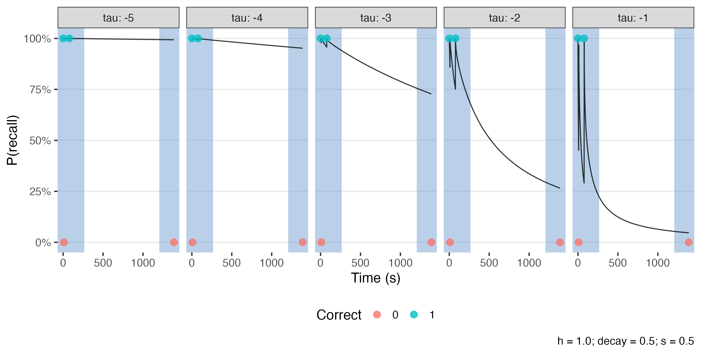

### Decay $d$:

``` r
act_decay <- calculate_activation_over_time(d_example, decay = c(.3, .4, .5, .6, .7), s = .5)

p <- ggplot(act_decay, aes(x = time, y = p_recall)) +
  facet_grid(~ decay, labeller = "label_both") +
  annotate(geom = "rect", xmin = -Inf, xmax = d_example[1, time_until_session_end], ymin = -Inf, ymax = Inf, fill = "#6699cc75") +
  annotate(geom = "rect", xmin = d_example[.N, presentation_start_time - time_since_session_start], xmax = Inf, ymin = -Inf, ymax = Inf, fill = "#6699cc75") +
  geom_line(alpha = .8) +
  geom_point(data = d_example, aes(x = presentation_start_time, y = correct, colour = as.factor(correct)), size = 3, alpha = .8) +
  labs(x = "Time (s)",
       y = "P(recall)",
       colour = "Correct",
       caption = "h = 1.0, tau = -3.0, s = 0.5") +
  scale_y_continuous(limits = c(0, 1), labels = scales::percent_format()) +
  theme_bw(base_size = 14) +
  theme(plot.margin = margin(7, 14, 7, 7),
        panel.grid.major.x = element_blank(),
        panel.grid.minor = element_blank(),
        panel.border = element_blank(),
        legend.position = "bottom")

ggsave(plot = p, filename = here("output", "walkthrough", "effect_of_decay.png"), width = 10, height = 5)
```

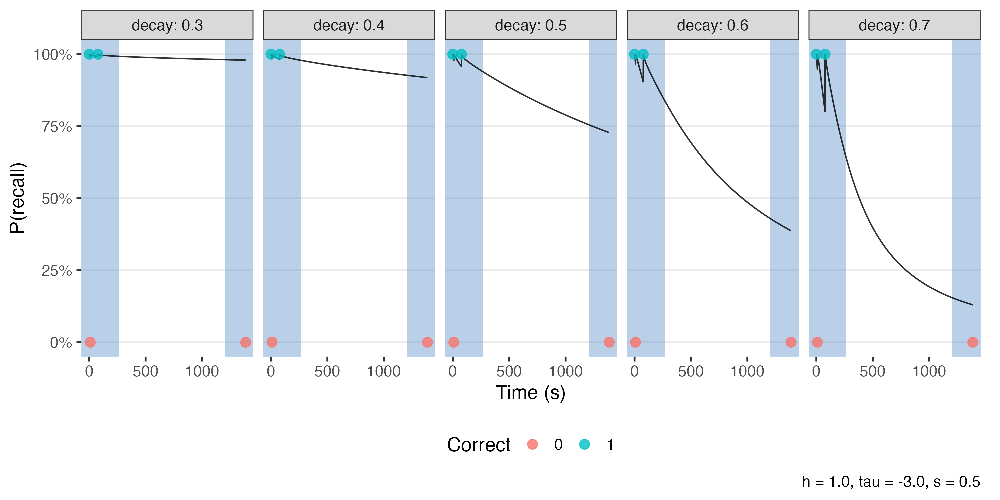

### Scaling factor $h$:

``` r
# Use a slightly higher retrieval threshold to make the effect of h easier to see
act_h <- calculate_activation_over_time(d_example, tau = -2.0, h = c(.001, .01, .1, .5, 1), s = .5)

p <- ggplot(act_h, aes(x = time, y = p_recall)) +
  facet_grid(~ h, labeller = "label_both") +
  annotate(geom = "rect", xmin = -Inf, xmax = d_example[1, time_until_session_end], ymin = -Inf, ymax = Inf, fill = "#6699cc75") +
  annotate(geom = "rect", xmin = d_example[.N, presentation_start_time - time_since_session_start], xmax = Inf, ymin = -Inf, ymax = Inf, fill = "#6699cc75") +
  geom_line(alpha = .8) +
  geom_point(data = d_example, aes(x = presentation_start_time, y = correct, colour = as.factor(correct)), size = 3, alpha = .8) +
  labs(x = "Time (s)",
       y = "P(recall)",
       colour = "Correct",
       caption = "decay = 0.5; tau = -2.0; s = 0.5") +
  scale_y_continuous(limits = c(0, 1), labels = scales::percent_format()) +
  theme_bw(base_size = 14) +
  theme(plot.margin = margin(7, 14, 7, 7),
        panel.grid.major.x = element_blank(),
        panel.grid.minor = element_blank(),
        panel.border = element_blank(),
        legend.position = "bottom")

ggsave(plot = p, filename = here("output", "walkthrough", "effect_of_h.png"), width = 10, height = 5)
```

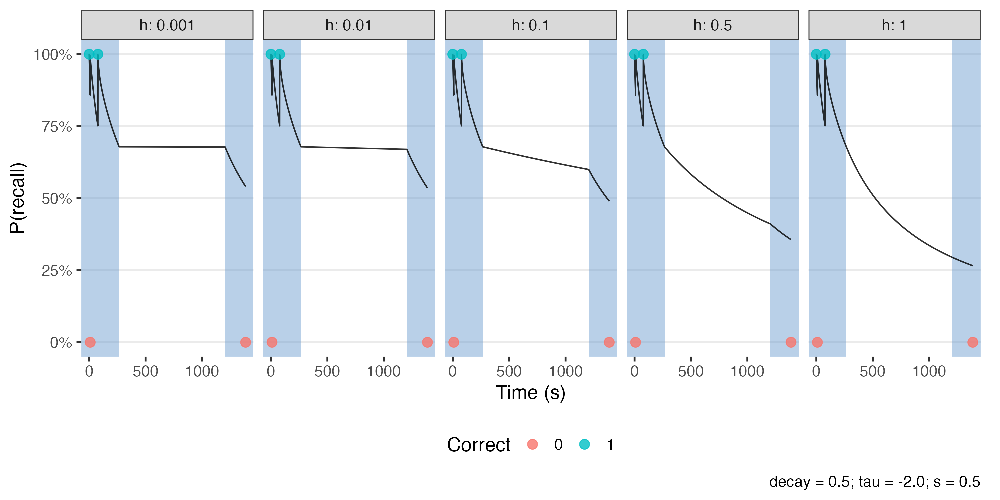

# Model fitting

We can find the optimal parameter configuration of the model that best
fits the data. In this case, we’ll evaluate the fit of the model by how
well it predicts the final trial in a fact learning sequence, i.e., the
one that occurs after the between-session interval.

Since a single fact learning sequence only gives us one data point,
we’ll include all other fact learning sequences of this learner that had
the same between-session interval of about 15 minutes.

``` r
d_f <- fread(file.path("..", "data", "cogpsych_data_formatted.csv"))
d_i <- d_f[user == "17_18_EN_anon-013" & round(time_between) == 939]

# Select the final response from each sequence
d_i_last <- d_i[, .SD[.N], by = id]
```

In this case, the learner practiced 8 different facts, with 75% accuracy
after the interval:

``` r
d_i_last[, .N, by = .(correct)]
```

    ##    correct     N
    ##      <int> <int>
    ## 1:       1     6
    ## 2:       0     2

## Finding the optimal parameters

When optimising for one parameter, we’ll keep the other parameters
constant at reasonable values.

``` r
model_params <- list(
  tau = -3.0,
  s = .5,
  decay = .5,
  h = 1
)
```

### Retrieval threshold $\tau$

We can then find the best-fitting retrieval threshold by calculating the
activation of each item at the time it is tested, and then fitting a
logistic regression model to find $\tau$.

``` r
# Add marker to identify each fact learning sequence
d_i_last[, sequence := 1:.N]
d_i <- d_i[d_i_last[, .(id, sequence)], on = .(id)]

# Convert sequences to a format suitable for model fitting
d_i[, window := 1]
d_seq_list <- generate_seq_list(d_i)

# Extract accuracy of the final response in each sequence
correct <- map_int(d_seq_list, ~.$correct)
      
# Calculate activation at the time of the final response in each sequence
ac <- map_dbl(d_seq_list, function (x) {
  activation(x$time_within, x$time_between, model_params$h, model_params$decay)
})

# Fit a logistic regression model to find the best-fitting retrieval threshold
m <- glm(correct ~ 1 + offset((1/model_params$s) * ac),
         family = binomial)
tau <- - coef(m)[[1]] * model_params$s
```

The fitted retrieval threshold is -2.77. The corresponding predicted
probability of recall for each item in the set looks as follows:

``` r
d_i_split <- split(d_i, by = "id")

d_i_act <- map(d_i_split, function (d) {
  a <- calculate_activation_over_time(
    d = d,
    h = model_params$h,
    decay = model_params$decay,
    tau = tau,
    s = model_params$s
  )
  a[, id := d$id[1]]
  
  # Disalign start times, so that we get original timings
  time_shift <- d[1, time_since_session_start]
  a[, time_shifted := time + time_shift]
}) |>
  rbindlist()

# Disalign start times, so that we get original timings
d_i[, time_shift := time_since_session_start[1], by = .(id)]
d_i[, presentation_start_time_shift := presentation_start_time + time_shift]

s1_end <- d_i[time_since_session_start == 0 & presentation_start_time == 0, time_until_session_end + presentation_start_time]
s2_start <- d_i[time_since_session_start == 0 & presentation_start_time != 0, presentation_start_time_shift]


p <- ggplot(d_i_act, aes(x = time_shifted, y = p_recall, group = id)) +
  annotate(geom = "rect", xmin = -Inf, xmax = s1_end, ymin = -Inf, ymax = Inf, fill = "#6699cc75") +
  annotate(geom = "rect", xmin = s2_start, xmax = Inf, ymin = -Inf, ymax = Inf, fill = "#6699cc75") +
  geom_line(alpha = .5) +
  geom_point(data = d_i, aes(x = presentation_start_time_shift, y = correct, colour = as.factor(correct)), size = 3, alpha = .8) +
  labs(x = "Time (s)",
       y = "P(recall)",
       colour = "Correct",
       caption = paste0("fitted tau = ", round(tau, digits = 2), "\nh = 1.0, decay = 0.5, s = 0.5")) +
  scale_y_continuous(limits = c(0, 1), labels = scales::percent_format()) +
  theme_bw(base_size = 14) +
  theme(plot.margin = margin(7, 14, 7, 7),
        panel.grid.major.x = element_blank(),
        panel.grid.minor = element_blank(),
        panel.border = element_blank(),
        legend.position = "bottom")

ggsave(plot = p, filename = here("output", "walkthrough", "fitted_tau.png"), width = 10, height = 5)
```

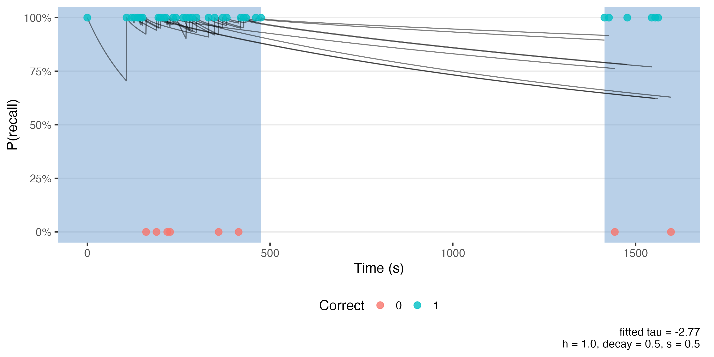

### Decay $d$

Finding the best-fitting decay $d$ or scaling factor $h$ works in much
the same way. Instead of solving for $\tau$, we fix $\tau$ and find the
best-fitting activation, from which we can derive the optimal decay
through a binary search:

``` r
tau_fixed <- rep(model_params$tau, length(correct))

m <- glm(correct ~ 1 + offset((-1/model_params$s) * tau_fixed),
         family = binomial)

ac_fitted <- coef(m)[[1]] * model_params$s

d_bs <- map_dfr(d_seq_list, function (x) {
  
  d_i <- 1
  d_upper <- 2
  d_lower <- 0
  
  # Binary search
  for (i in 1:100) {
    ac <- activation(x$time_within, x$time_between, model_params$h, d_i)
    
    ac_diff <- ac - ac_fitted
    
    if (ac_diff > 0) { # Predicted activation too high, so d is too small
      d_lower <- d_i
    } else { # Predicted activation too low, so d is too large
      d_upper <- d_i
    }
    
    d_i <- (d_lower + d_upper) / 2
    
  }
  
  return(list(id = x$id, decay = d_i))
})
setDT(d_bs)

d_bs
```

    ##                          id     decay
    ##                      <char>     <num>
    ## 1: 17_18_EN_anon-013_1570_1 0.6248026
    ## 2: 17_18_EN_anon-013_1571_1 0.5366839
    ## 3: 17_18_EN_anon-013_1572_1 0.4902482
    ## 4: 17_18_EN_anon-013_1575_1 0.4900800
    ## 5: 17_18_EN_anon-013_1576_1 0.4920408
    ## 6: 17_18_EN_anon-013_1577_1 0.6076021
    ## 7: 17_18_EN_anon-013_1578_1 0.5398650
    ## 8: 17_18_EN_anon-013_1579_1 0.5449804

Notice that this produces a slightly different result: we find the decay
rate per item that results in the same activation at the time of the
last retrieval attempt, so that predicted recall is the same across
items:

``` r
d_i_decay_act <- map(d_i_split, function (d) {
  a <- calculate_activation_over_time(
    d = d,
    h = model_params$h,
    decay = d_bs[id == d$id[1], decay],
    tau = model_params$tau,
    s = model_params$s
  )
  a[, id := d$id[1]]
  
  # Disalign start times, so that we get original timings
  time_shift <- d[1, time_since_session_start]
  a[, time_shifted := time + time_shift]
}) |>
  rbindlist()

p <- ggplot(d_i_decay_act, aes(x = time_shifted, y = p_recall, group = id)) +
  annotate(geom = "rect", xmin = -Inf, xmax = s1_end, ymin = -Inf, ymax = Inf, fill = "#6699cc75") +
  annotate(geom = "rect", xmin = s2_start, xmax = Inf, ymin = -Inf, ymax = Inf, fill = "#6699cc75") +
  geom_line(alpha = .5) +
  geom_point(data = d_i, aes(x = presentation_start_time_shift, y = correct, colour = as.factor(correct)), size = 3, alpha = .8) +
  labs(x = "Time (s)",
       y = "P(recall)",
       colour = "Correct",
       caption = paste0("fitted decay (mean) = ", round(mean(d_bs$d), digits = 2), "\nh = 1.0, tau = -2.0, s = 0.5")) +
  scale_y_continuous(limits = c(0, 1), labels = scales::percent_format()) +
  theme_bw(base_size = 14) +
  theme(plot.margin = margin(7, 14, 7, 7),
        panel.grid.major.x = element_blank(),
        panel.grid.minor = element_blank(),
        panel.border = element_blank(),
        legend.position = "bottom")

ggsave(plot = p, filename = here("output", "walkthrough", "fitted_decay.png"), width = 10, height = 5)
```

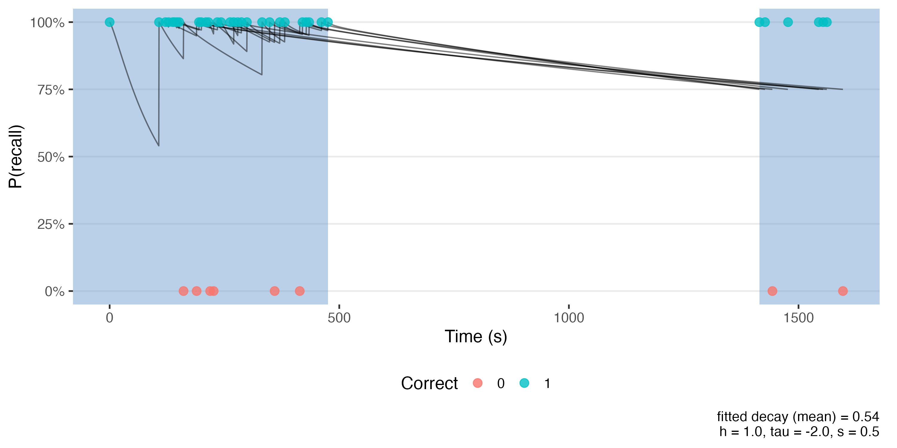

### Scaling factor $h$

In the same way, we can find $h$. Notice that $h$ is constrained to
values between 0 (complete compression of between-session interval) and
1 (no compression of between-session interval), which means that in some
cases the model will over- or underpredict the data. Here, several of
the items run into the upper bound of $h = 1$. This explains the
discrepancy in predictions with the model where we fitted the decay
parameter.

``` r
h_bs <- map_dfr(d_seq_list, function (x) {
  
  h_i <- .5
  h_upper <- 1
  h_lower <- 0
  
  # Binary search
  for (i in 1:100) {
    ac <- activation(x$time_within, x$time_between, h_i, model_params$decay)
    
    ac_diff <- ac - ac_fitted
    
    if (ac_diff > 0) { # Predicted activation too high, so h is too small
      h_lower <- h_i
    } else { # Predicted activation too low, so h is too large
      h_upper <- h_i
    }
    
    h_i <- (h_lower + h_upper) / 2
    
  }
  
  return(list(id = x$id, h = h_i))
  
})
setDT(h_bs)
h_bs
```

    ##                          id         h
    ##                      <char>     <num>
    ## 1: 17_18_EN_anon-013_1570_1 1.0000000
    ## 2: 17_18_EN_anon-013_1571_1 1.0000000
    ## 3: 17_18_EN_anon-013_1572_1 0.8046769
    ## 4: 17_18_EN_anon-013_1575_1 0.8009903
    ## 5: 17_18_EN_anon-013_1576_1 0.8433335
    ## 6: 17_18_EN_anon-013_1577_1 1.0000000
    ## 7: 17_18_EN_anon-013_1578_1 1.0000000
    ## 8: 17_18_EN_anon-013_1579_1 1.0000000

``` r
d_i_h_act <- map(d_i_split, function (d) {
  a <- calculate_activation_over_time(
    d = d,
    h = h_bs[id == d$id[1], h],
    decay = model_params$decay,
    tau = model_params$tau,
    s = model_params$s
  )
  a[, id := d$id[1]]
  
  # Disalign start times, so that we get original timings
  time_shift <- d[1, time_since_session_start]
  a[, time_shifted := time + time_shift]
}) |>
  rbindlist()


p <- ggplot(d_i_h_act, aes(x = time_shifted, y = p_recall, group = id)) +
  annotate(geom = "rect", xmin = -Inf, xmax = s1_end, ymin = -Inf, ymax = Inf, fill = "#6699cc75") +
  annotate(geom = "rect", xmin = s2_start, xmax = Inf, ymin = -Inf, ymax = Inf, fill = "#6699cc75") +
  geom_line(alpha = .5) +
  geom_point(data = d_i, aes(x = presentation_start_time_shift, y = correct, colour = as.factor(correct)), size = 3, alpha = .8) +
  labs(x = "Time (s)",
       y = "P(recall)",
       colour = "Correct",
       caption = paste0("fitted h (median) = ", round(median(h_bs$h), digits = 2), "\ndecay = 0.5, tau = -2.0, s = 0.5")) +
  scale_y_continuous(limits = c(0, 1), labels = scales::percent_format()) +
  theme_bw(base_size = 14) +
  theme(plot.margin = margin(7, 14, 7, 7),
        panel.grid.major.x = element_blank(),
        panel.grid.minor = element_blank(),
        panel.border = element_blank(),
        legend.position = "bottom")

ggsave(plot = p, filename = here("output", "walkthrough", "fitted_h.png"), width = 10, height = 5)
```

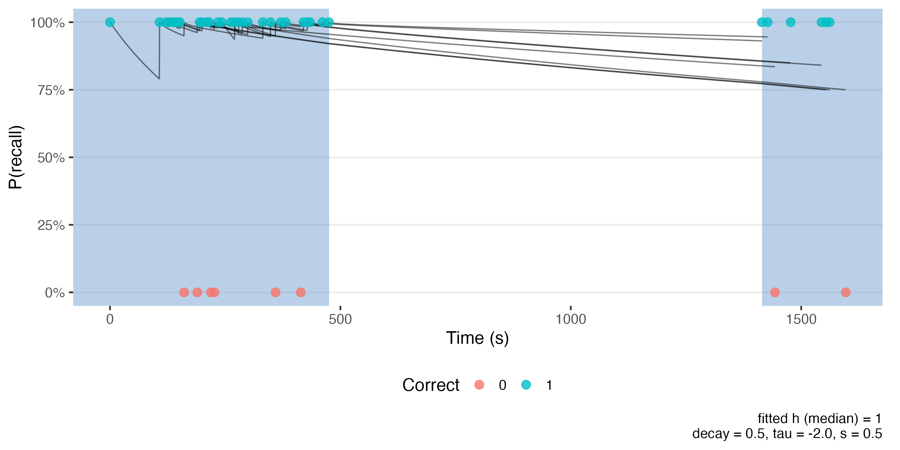

## Including different between-session intervals

This learner also has learning sequences that feature shorter or longer
between-session intervals.

``` r
d_l <- d_f[user == "17_18_EN_anon-013"]
d_l_last <- d_l[, .SD[.N], by = id]
```

Distribution of between-session intervals for this learner:

``` r
# Do some general plot setup for figures that show a logarithmic time axis
label_x <- c(1, 10, 60, 6*60, 24*60, 7*24*60, 7*7*24*60)
label_y <- 1.09
label_txt <- c("1 min", "10 min", "1 h", "6 h", "24 h", "1 wk", "7 wks")

plot_timescales <- function () {
  list(
    scale_x_log10(
      breaks = scales::trans_breaks("log10", function(x) 10^x),
      labels = scales::trans_format("log10", scales::math_format(10^.x)),
      expand = c(0, 0),
      sec.axis = sec_axis(~.x, breaks = label_x, labels = label_txt)
    ),
    annotation_logticks(sides = "b", outside = T),
    coord_cartesian(xlim = c(min(label_x)/2, max(label_x)*2), clip = "off"),
    theme_bw(base_size = 14),
    theme(plot.margin = margin(7, 14, 7, 7),
          panel.grid.major.x = element_blank(),
          panel.grid.minor = element_blank(),
          panel.border = element_blank())
  )
}
  
p <- ggplot(d_l_last, aes(x = time_between/60)) +
  geom_histogram(colour = "white", binwidth = .2) +
  labs(x = "Between-session interval (min)",
       y = "Sequences") +
  plot_timescales()

ggsave(plot = p, filename = here("output", "walkthrough", "between_session_intervals.png"), width = 10, height = 5)
```

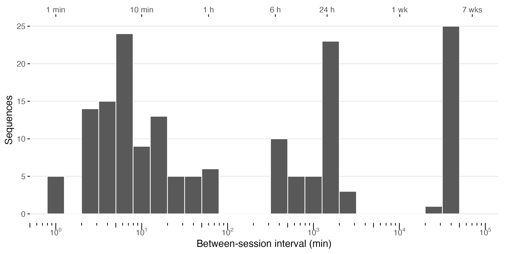

In general, we expect that response accuracy after an interval depends
on the duration of that interval: the longer it has been since the last
practice session, the higher the probability should be that the learner
has forgotten the fact. This does indeed seem to be the case for this
learner: recall accuracy shows a more or less linear decline on a
logarithmic time axis, which resembles the classic exponential
forgetting curve (note that the points are jittered to make it easier to
see the distribution of responses; the fitted curve is a GAM smooth):

``` r
p <- ggplot(d_l_last, aes(x = time_between/60, y = correct)) +
  geom_smooth(method = "gam", formula = y ~ s(x, bs = "cs")) +
  geom_jitter(width = .025, height = .025, alpha = .5) +
  plot_timescales() +
  scale_y_continuous(labels = scales::percent_format()) +
  coord_cartesian(xlim = c(min(label_x)/2, max(label_x)*2), ylim = c(0, 1), clip = "off") +
  labs(x = "Between-session interval (min)",
       y = "Correct")
```

    ## Coordinate system already present. Adding new coordinate system, which will
    ## replace the existing one.

``` r
ggsave(plot = p, filename = here("output", "walkthrough", "accuracy_by_interval.png"), width = 10, height = 5)
```

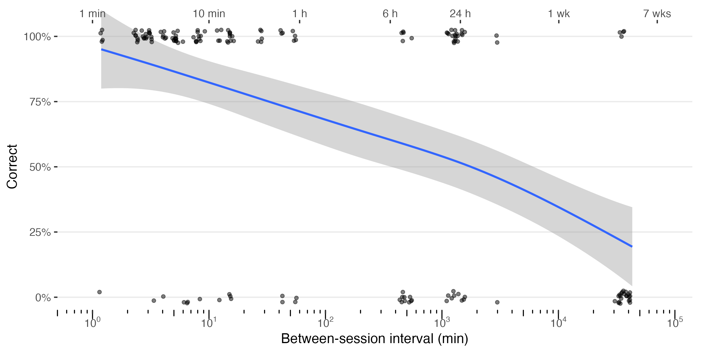

We can try to fit all of these 168 sequences with a single parameter
configuration, as before.

``` r
n_windows <- c(1)
window_range <- map_dfr(n_windows, function (n_w) {

  d_windows <- copy(d_l_last)
  
  if (n_w == 1) {
    d_windows[, window := 1]
  } else {
    d_windows[, window := cut(log(time_between), breaks = n_w, labels = FALSE)]
  }
  
  # Get the window range(s)
  window_range <- d_windows[, .(start = min(time_between), end = max(time_between)), by = .(window)]
  window_range[, geom_mean := sqrt(start*end), by = .(window)]
  setorder(window_range, window)
  window_range[, window := window]
  window_range[, n_windows := n_w]

  return (window_range)
})


predict_recall <- function (seq_list, h = model_params$h, decay = model_params$decay, tau, s = model_params$s, windows = 1) {
  
  pred_correct <- map_dbl(seq_list, function (x) {
    
    seq_d <- ifelse(is.data.table(decay), decay[id == x$id, d], decay)
    seq_h <- ifelse(is.data.table(h), h[id == x$id, h], h)
    
    if(is.data.table(tau)) {
      if("id" %in% names(tau)) seq_tau <- tau[id == x$id, tau]
      if("n_windows" %in% names(tau)) seq_tau <- tau[n_windows == windows & window == x$window, tau]
    } else {
      seq_tau <- tau
    }
    
    ac <- activation(x$time_within, x$time_between, seq_h, seq_d)
    p_recall(ac, seq_tau, s)
    
  })
  
  pred <- data.table(id = map_chr(seq_list, ~.$id), pred_correct = pred_correct)
  
  return (pred)
}

pred_col <- "#CC3311"    # red
obs_col <- "#000000"     # black
window_col <- "#33BBEE"  # blue
section_col <- "#FD520F" # orange

plot_comparison <- function (d_model,
                             d_last,
                             n_w = 1,
                             label_pos = list(data = list(x = 35000, y = .54), 
                                              model = list(x = 35000, y = .46)),
                             print_plot = TRUE) {
  
  
  plot_dodge <- function(y, dodge = .1) {
    return (y * (1 + dodge) - dodge/2)
  }
  
  p <- ggplot() +
    # Window background
    geom_rect(data = window_range[n_windows == n_w],
              aes(xmin = start/60, xmax = ifelse(is.na(shift(start, -1)), end, shift(start, -1))/60,
                  ymin = -Inf, ymax = Inf, alpha = as.factor(window)),
              fill = window_col) +
    # Jittered observations along edges
    geom_point(data = d_last, 
               aes(x = time_between/60, y = plot_dodge(correct, .05)),
               position = position_jitter(width = 0, height = .025, seed = 123),
               colour = obs_col, alpha = .1) +
    # Predictions of the model
    geom_point(data = d_model, 
               aes(x = time_between/60, y = pred_correct),
               colour = pred_col, alpha = .25) +
    # GAM: data
    geom_smooth(data = d_last,
                aes(x = time_between/60, y = correct),
                method = "gam", formula = y ~ s(x, bs = "cs"),
                colour = obs_col, lty = 1, lwd = 1) +
    # GAM: model
    geom_smooth(data = d_model, 
                aes(x = time_between/60, y = pred_correct),
                method = "gam", formula = y ~ s(x, bs = "cs"), 
                colour = pred_col, fill = pred_col, lty = 1, lwd = .75) +
    # Labels
    annotate("text", x = label_pos$data$x, y = label_pos$data$y,
             label = "Data", colour = obs_col) +
    annotate("text", x = label_pos$model$x, y = label_pos$model$y,
             label = "Model", colour = pred_col) +
    # Plot setup
    scale_x_log10(
      breaks = scales::trans_breaks("log10", function(x) 10^x),
      labels = scales::trans_format("log10", scales::math_format(10^.x)),
      expand = c(0, 0),
      sec.axis = sec_axis(~.x, breaks = label_x, labels = label_txt)
    ) +
    scale_y_continuous(breaks = seq(0, 1, by = .25), labels = scales::percent_format()) +
    scale_alpha_manual(values = rep(c(.1, .25), ceiling(n_w/2))) +
    guides(colour = "none",
           alpha = "none") +
    labs(x = "Between-session interval (minutes)",
         y = "Response accuracy") +
    annotation_logticks(sides = "b", outside = T) +
    coord_cartesian(ylim = c(0, 1), xlim = c(window_range[1, start], window_range[.N, end])/60, clip = "off") +
    theme_bw(base_size = 14) +
    theme(plot.margin = margin(7, 14, 7, 7),
          panel.grid.major.x = element_blank(),
          panel.grid.minor = element_blank(),
          panel.border = element_blank())
  
  if (print_plot) print(p)
  return (p)
    
}
```

### Retrieval threshold $\tau$

``` r
# Add marker to identify each fact learning sequence
d_l_last[, sequence := 1:.N]
d_l <- d_l[d_l_last[, .(id, sequence)], on = .(id)]

# Convert sequences to a format suitable for model fitting
d_l[, window := 1]
d_l_seq_list <- generate_seq_list(d_l)

# Extract accuracy of the final response in each sequence
correct <- map_int(d_l_seq_list, ~.$correct)
      
# Calculate activation at the time of the final response in each sequence
ac <- map_dbl(d_l_seq_list, function (x) {
  activation(x$time_within, x$time_between, model_params$h, model_params$decay)
})

# Fit a logistic regression model to find the best-fitting retrieval threshold
m <- glm(correct ~ 1 + offset((1/model_params$s) * ac),
         family = binomial)
tau_l <- - coef(m)[[1]] * model_params$s
```

The fitted retrieval threshold is -3.63. This is a lower value than
before, which makes sense as we are now including mainly longer
intervals.

The corresponding predicted probability of recall for each item in the
set looks as follows:

``` r
pred_single_tau <- predict_recall(seq_list = d_l_seq_list, tau = tau_l)
d_single_tau <- d_l_last[pred_single_tau, on = .(id)]

p_single_tau <- plot_comparison(d_model = d_single_tau, 
                                d_last = d_l_last,
                                n_w = 1, 
                                label_pos = list(data = list(x = 20000, y = .5), 
                                                 model = list(x = 3000, y = .29)),
                                print_plot = FALSE)

ggsave(plot = p_single_tau, filename = here("output", "walkthrough", "fitted_single_tau.png"), width = 10, height = 5)
```

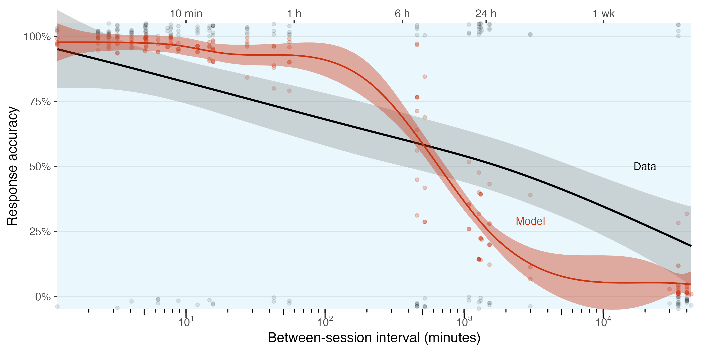

It is clear that the model is struggling to predict response accuracy
across the range of intervals: at shorter intervals, the model is too
optimistic by predicting almost perfect retention, while at longer
intervals it predicts much more forgetting than actually occurs.

### Decay $d$

``` r
tau_fixed <- rep(model_params$tau, length(correct))

m <- glm(correct ~ 1 + offset((-1/model_params$s) * tau_fixed),
         family = binomial)

ac_fitted <- coef(m)[[1]] * model_params$s

d_bs <- map_dfr(d_l_seq_list, function (x) {
  
  d_i <- 1
  d_upper <- 2
  d_lower <- 0
  
  # Binary search
  for (i in 1:100) {
    ac <- activation(x$time_within, x$time_between, model_params$h, d_i)
    
    ac_diff <- ac - ac_fitted
    
    if (ac_diff > 0) { # Predicted activation too high, so d is too small
      d_lower <- d_i
    } else { # Predicted activation too low, so d is too large
      d_upper <- d_i
    }
    
    d_i <- (d_lower + d_upper) / 2
    
  }
  
  return(list(id = x$id, d = d_i))
})
setDT(d_bs)
```

To optimise decay, we find the best-fitting activation across all
sequences, and then derive the decay that results in the same activation
at the time of the last retrieval attempt. The median decay across all
items is 0.56.

``` r
hist(d_bs$d, breaks = 20, main = "Distribution of decay values", xlab = "Decay", ylab = "Frequency")
```

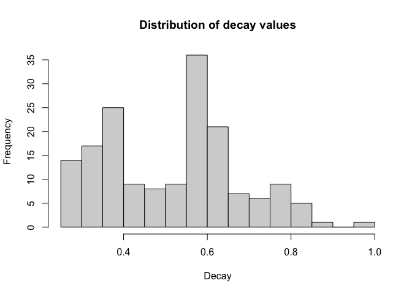<!-- -->

Since activation (and the threshold) are constant across the range, the
predicted recall is also simply the best-fitting horizontal line through
the data, initially underpredicting and then overpredicting recall.

``` r
pred_single_d <- predict_recall(d_l_seq_list,
                                decay = d_bs, 
                                tau = model_params$tau)
d_single_d <- d_l_last[pred_single_d, on = .(id)]

p_single_d <- plot_comparison(d_model = d_single_d, 
                              d_last = d_l_last,
                              n_w = 1, 
                              label_pos = list(data = list(x = 35000, y = .5), 
                                               model = list(x = 35000, y = .78)),
                              print_plot = FALSE)

ggsave(plot = p_single_d, filename = here("output", "walkthrough", "fitted_single_decay.png"), width = 10, height = 5)
```

    ## Warning in newton(lsp = lsp, X = G$X, y = G$y, Eb = G$Eb, UrS = G$UrS, L = G$L,
    ## : Fitting terminated with step failure - check results carefully

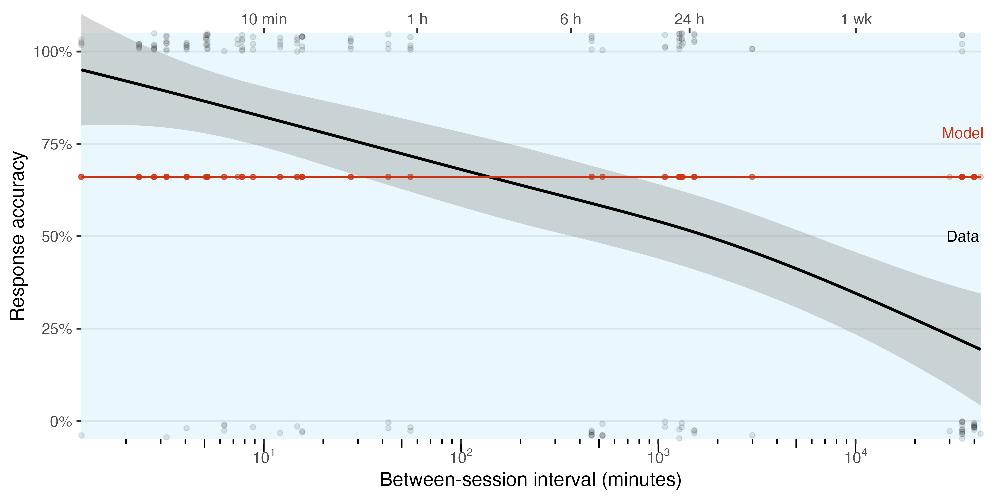

### Scaling factor $h$

``` r
h_bs <- map_dfr(d_l_seq_list, function (x) {
  
  h_i <- .5
  h_upper <- 1
  h_lower <- 0
  
  # Binary search
  for (i in 1:100) {
    ac <- activation(x$time_within, x$time_between, h_i, model_params$decay)
    
    ac_diff <- ac - ac_fitted
    
    if (ac_diff > 0) { # Predicted activation too high, so h is too small
      h_lower <- h_i
    } else { # Predicted activation too low, so h is too large
      h_upper <- h_i
    }
    
    h_i <- (h_lower + h_upper) / 2
    
  }
  
  return(list(id = x$id, h = h_i))
  
})
setDT(h_bs)
```

The median scaling factor is 1.

``` r
hist(h_bs$h, breaks = 20, main = "Distribution of h values", xlab = "h", ylab = "Frequency")
```

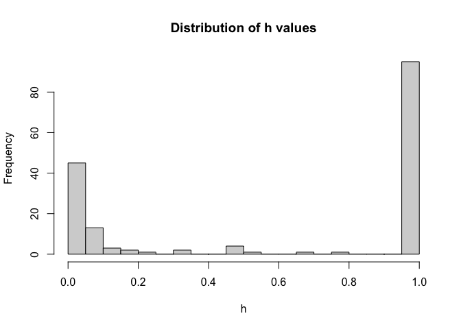<!-- -->

Like the decay, the optimal scaling factor was derived from the
best-fitting activation across all intervals. In principle this should
again produce a horizontal line. However, the limits on the range of $h$
mean that the model can only compress time to a certain extent in both
directions. This is visible at short intervals, where predicted accuracy
is too high because $h$ hits the upper bound of 1, meaning that
activation cannot decay enough to match the data.

``` r
pred_single_h <- predict_recall(d_l_seq_list,
                                h = h_bs, 
                                tau = model_params$tau)
d_single_h <- d_l_last[pred_single_h, on = .(id)]

p_single_h <- plot_comparison(d_model = d_single_h, 
                              d_last = d_l_last,
                              n_w = 1, 
                              label_pos = list(data = list(x = 35000, y = .5), 
                                               model = list(x = 35000, y = .78)),
                              print_plot = FALSE)

ggsave(plot = p_single_h, filename = here("output", "walkthrough", "fitted_single_h.png"), width = 10, height = 5)
```

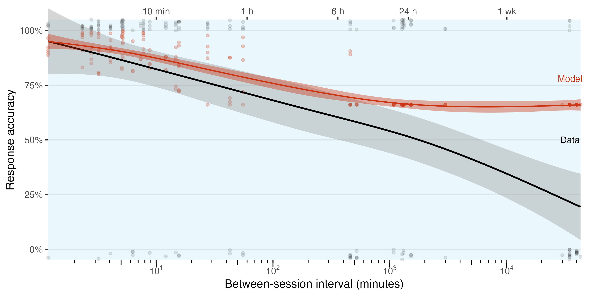

## Time-variant parameters

``` r
plot_parameter <- function(d_parameter,
                           parameter_name = "",
                           n_w = 1,
                           log_x = TRUE,
                           log_y = FALSE,
                           print_plot = TRUE) {
  
  # Calculate R-squared
  x <- d_parameter[n_windows == n_w, geom_mean]/60
  y <- d_parameter[n_windows == n_w, parameter]
  if (log_x) x <- log(x)
  if (log_y) y <- log(y)
  
  m <- lm(y ~ x)

  eq <- substitute(parameter_name == a-b %*% ln(italic(t)), 
                   list(parameter_name = parameter_name,
                        a = format(unname(coef(m)[1]), digits = 3),
                        b = format(abs(unname(coef(m)[2])), digits = 3)))
  
  eq <- as.character(as.expression(eq))
  
  rsq <- paste("R^2 ==", scales::number(summary(m)$r.squared, accuracy = .01))

  p <- ggplot() +
    # Window background
    geom_rect(data = window_range[n_windows == n_w],
              aes(xmin = start/60, xmax = ifelse(is.na(shift(start, -1)), end, shift(start, -1))/60,
                  ymin = ifelse(log_y, 0, -Inf), ymax = Inf, alpha = as.factor(window)),
              fill = window_col) +
    # Regression line
    geom_smooth(data = d_parameter[n_windows == n_w], 
                aes(y = parameter, x = geom_mean/60), 
                method = "lm", formula = y ~ x, 
                colour = pred_col, fill = pred_col) +
    # Parameter values
    geom_point(data = d_parameter[n_windows == n_w],
               aes(y = parameter, x = geom_mean/60)) +
    scale_alpha_manual(values = rep(c(.1, .25), ceiling(n_w/2))) +
    # R-squared
    geom_label(aes(x = Inf, y = Inf, label = rsq),
              label.padding = unit(.5, "lines"),
              label.size = NA,
              fill = NA,
              hjust = "inward", vjust = "inward",
              parse = TRUE) +
    geom_label(aes(x = ifelse(log_x, 0, -Inf), y = ifelse(log_y, 0, -Inf), label = eq),
              label.padding = unit(.5, "lines"),
              label.size = NA,
              fill = NA,
              hjust = "inward", vjust = "inward",
              parse = TRUE) +
    # Plot setup
    guides(alpha = "none") +
    labs(x = "Between-session interval (minutes)",
         y = "Fitted parameter") +
    scale_x_continuous(sec.axis = sec_axis(~.x, breaks = label_x, labels = label_txt)) +
    coord_cartesian(xlim = c(window_range[1, start], window_range[.N, end])/60,
                    ylim = c(min(y) - .1*diff(range(y)), max(y) + .1*diff(range(y))),
                    clip = "off") +
    theme_bw(base_size = 14) +
    theme(plot.margin = margin(7, 14, 7, 7),
          panel.grid.major.x = element_blank(),
          panel.grid.minor = element_blank(),
          panel.border = element_blank())
  
  
  # Transform scales if required
  if (log_x) {
    p <- p +
      scale_x_log10(
        breaks = scales::trans_breaks("log10", function(x) 10^x),
        labels = scales::trans_format("log10", scales::math_format(10^.x)),
        expand = c(0, 0),
        sec.axis = sec_axis(~.x, breaks = label_x, labels = label_txt)
      ) +
      annotation_logticks(sides = "b", outside = T)
  }
  
  if (log_y) {
    p <- p +
      scale_y_log10() +
      annotation_logticks(sides = "l", outside = T)
  }

  if (print_plot) print(p)
  return (p)

}
```

Rather than fitting a single parameter for the whole range of
between-session intervals, we can also fit a different parameter for
each set of similar intervals. We’ll divide the intervals into 20 bins
or windows, which are evenly sized on a logarithmic scale, and then fit
a separate parameter for each bin.

``` r
# Bin the response into one of n_w windows
n_w <- 20
d_f[, window := cut(log(time_between), breaks = n_w, labels = FALSE)]

window_range <- d_f[, .(start = min(time_between), end = max(time_between)), by = window][order(window)]
window_range[, geom_mean := sqrt(start*end), by = .(window)]
window_range[, n_windows := n_w]
window_range
```

    ##     window       start         end    geom_mean n_windows
    ##      <int>       <num>       <num>        <num>     <num>
    ##  1:      1      38.363      68.673 5.132740e+01        20
    ##  2:      2      68.949     121.254 9.143491e+01        20
    ##  3:      3     123.599     220.979 1.652658e+02        20
    ##  4:      4     224.688     395.179 2.979798e+02        20
    ##  5:      5     398.261     713.152 5.329359e+02        20
    ##  6:      6     719.106    1281.285 9.598853e+02        20
    ##  7:      7    1285.922    2299.810 1.719702e+03        20
    ##  8:      8    2304.114    4117.753 3.080223e+03        20
    ##  9:      9    4159.798    7391.788 5.545119e+03        20
    ## 10:     10    7453.841   13238.121 9.933521e+03        20
    ## 11:     11   13371.307   23490.675 1.772290e+04        20
    ## 12:     12   24164.364   42791.651 3.215638e+04        20
    ## 13:     13   42824.538   76709.850 5.731548e+04        20
    ## 14:     14   76959.026  137553.313 1.028881e+05        20
    ## 15:     15  138609.908  247039.671 1.850463e+05        20
    ## 16:     16  247494.955  441248.032 3.304643e+05        20
    ## 17:     17  444687.072  792104.104 5.934968e+05        20
    ## 18:     18  808071.110 1410000.229 1.067418e+06        20
    ## 19:     19 1458368.507 2566018.703 1.934477e+06        20
    ## 20:     20 2573482.617 4605678.952 3.442766e+06        20
    ##     window       start         end    geom_mean n_windows

The example learner’s data gets assigned to bins as follows:

``` r
d_l <- d_f[user == "17_18_EN_anon-013"]
d_l_last <- d_l[, .SD[.N], by = id]
# Add marker to identify each fact learning sequence
d_l_last[, sequence := 1:.N]
d_l <- d_l[d_l_last[, .(id, sequence)], on = .(id)]
# Generate sequence list
d_l_seq_list <- generate_seq_list(d_l)

p <- ggplot(d_l_last, aes(x = time_between/60)) +
  geom_histogram(aes(fill = as.factor(window)), colour = "white", binwidth = .2) +
    labs(x = "Between-session interval (min)",
       y = "Sequences",
       fill = "Window") +
  scale_x_log10(
    breaks = scales::trans_breaks("log10", function(x) 10^x),
    labels = scales::trans_format("log10", scales::math_format(10^.x)),
    expand = c(0, 0),
    sec.axis = sec_axis(~.x, breaks = label_x, labels = label_txt)
  ) +
  annotation_logticks(sides = "b", outside = T) +
  coord_cartesian(xlim = c(min(label_x)/2, max(label_x)*2), clip = "off") +
  theme_bw(base_size = 14) +
  theme(plot.margin = margin(7, 14, 7, 7),
        panel.grid.major.x = element_blank(),
        panel.grid.minor = element_blank(),
        panel.border = element_blank())

ggsave(plot = p, filename = here("output", "walkthrough", "between_session_intervals_binned.png"), width = 10, height = 5)
```

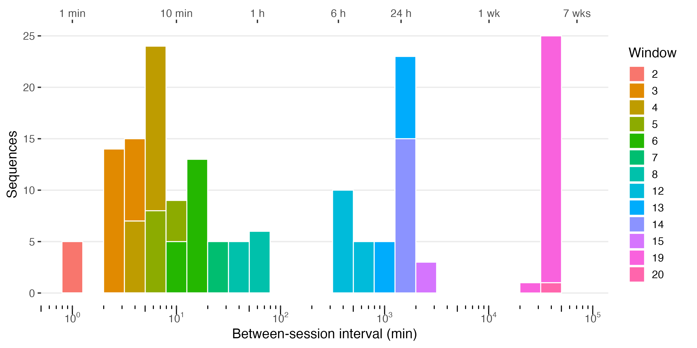

Accuracy per bin:

``` r
d_l_accuracy <- d_l_last[, .(accuracy = mean(correct)), by = .(window)][window_range, on = .(window)][!is.na(accuracy)]

p <- ggplot(d_l_accuracy, aes(x = geom_mean/60, y = accuracy, colour = as.factor(window))) +
  # Jitter raw data points
  geom_jitter(data = d_l_last, aes(x = time_between/60, y = correct), alpha = .1, width = 0, height = 0.05) +
  # Mean accuracy per window
  geom_segment(aes(x = start/60, xend = end/60, yend = accuracy), linewidth = 2) +
  geom_text(aes(x = geom_mean/60, y = accuracy, label = window), colour = "black", vjust = -.5) +
  labs(x = "Between-session interval (min)",
       y = "Accuracy") +
  guides(colour = "none") +
  scale_x_log10(
    breaks = scales::trans_breaks("log10", function(x) 10^x),
    labels = scales::trans_format("log10", scales::math_format(10^.x)),
    expand = c(0, 0),
    sec.axis = sec_axis(~.x, breaks = label_x, labels = label_txt)
  ) +
  annotation_logticks(sides = "b", outside = T) +
  scale_y_continuous(labels = scales::percent_format()) +
  coord_cartesian(xlim = c(min(label_x)/2, max(label_x)*2), clip = "off") +
  theme_bw(base_size = 14) +
  theme(plot.margin = margin(7, 14, 7, 7),
        panel.grid.major.x = element_blank(),
        panel.grid.minor = element_blank(),
        panel.border = element_blank())

ggsave(plot = p, filename = here("output", "walkthrough", "accuracy_by_interval_binned.png"), width = 10, height = 5)
```

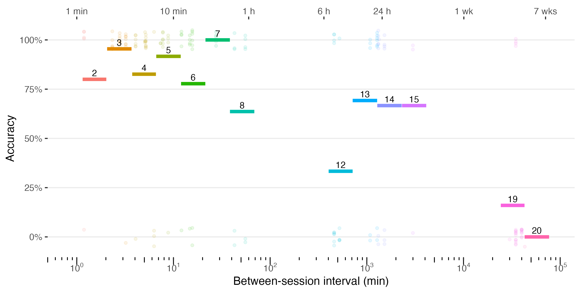

### Retrieval threshold $\tau$

We can find the best-fitting retrieval threshold for each bin. However,
notice that some bins have very few observations in them, which will
make it harder to find a reliable fit:

``` r
d_l_windows_split <- split(d_l, d_l$window)

# Within each window, find the optimal retrieval threshold
tau_tv <- imap(d_l_windows_split, function (w, n) {
  
  w[, sequence := .GRP, by = .(id)]
  d_seq_list <- generate_seq_list(w)
  
  correct <- map_int(d_seq_list, ~.$correct)
  
  ac <- map_dbl(d_seq_list, function (x) {
    activation(x$time_within, x$time_between, model_params$h, model_params$decay)
  })
  
  m <- glm(correct ~ 1 + offset((1/model_params$s) * ac),
           family = binomial)
  tau <- - coef(m)[[1]] * model_params$s
  
  return (list(n_windows = 20, window = as.integer(n), tau = tau, n_obs = length(correct)))
}) |>
  rbindlist()

tau_tv
```

    ##     n_windows window        tau n_obs
    ##         <num>  <int>      <num> <int>
    ##  1:        20      2  -2.488284     5
    ##  2:        20      3  -3.295577    22
    ##  3:        20      4  -2.550293    23
    ##  4:        20      5  -3.057776    12
    ##  5:        20      6  -2.815196    18
    ##  6:        20      7 -14.350845     5
    ##  7:        20      8  -2.654794    11
    ##  8:        20     12  -2.819837    15
    ##  9:        20     13  -4.597810    13
    ## 10:        20     14  -4.546648    15
    ## 11:        20     15  -4.917797     3
    ## 12:        20     19  -4.406806    25
    ## 13:        20     20   5.286894     1

Looking only at fitted values of $\tau$ based on at least 10
observations, the pattern over time is as follows. While it’s noisy, the
overall trend of $\tau$ decreasing as the interval increases is visible.

``` r
tau_tv_viz <- tau_tv[n_obs >= 10][window_range, on = .(n_windows, window)]
setnames(tau_tv_viz, "tau", "parameter")

p_tau_tv <- plot_parameter(d_parameter = tau_tv_viz,
                             parameter_name = quote(tau),
                             n_w = 20,
                           print_plot = FALSE)
```

    ## Scale for x is already present.
    ## Adding another scale for x, which will replace the existing scale.

``` r
ggsave(plot = p_tau_tv, filename = here("output", "walkthrough", "fitted_tau_by_interval.png"), width = 10, height = 5)
```

    ## Warning in scale_x_log10(breaks = scales::trans_breaks("log10", function(x)
    ## 10^x), : log-10 transformation introduced infinite values.

    ## Warning: Removed 11 rows containing non-finite outside the scale range
    ## (`stat_smooth()`).

    ## Warning: Removed 11 rows containing missing values or values outside the scale
    ## range (`geom_point()`).

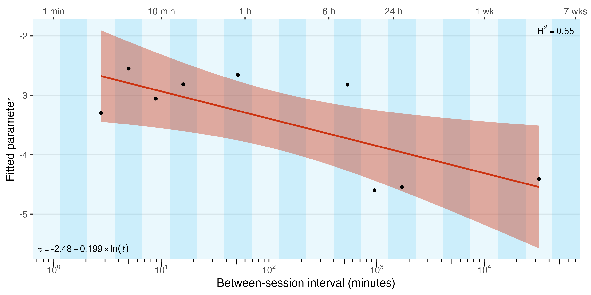

The resulting model predictions are shown below. Given the relatively
small number of observations in some of the windows, it’s not surprising
that there seems to be some trouble capturing the shape of the data very
precisely (and the GAMs is having some trouble with the lack of
observations in some windows). Nevertheless, we do see the model
reproduce the overall negative trend in recall accuracy over time, even
at the level of this single learner.

``` r
pred_tau_tv <- predict_recall(seq_list = d_l_seq_list, tau = tau_tv, windows = 20)
d_tau_tv <- d_l_last[pred_tau_tv, on = .(id)]

p_tau_tv <- plot_comparison(d_model = d_tau_tv,
                            d_last = d_l_last,
                            n_w = 20, 
                            label_pos = list(data = list(x = 35000, y = .35), 
                                             model = list(x = 35000, y = .5)),
                            print_plot = FALSE)

ggsave(plot = p_tau_tv, filename = here("output", "walkthrough", "fitted_tau_recall_by_interval.png"), width = 10, height = 5)
```

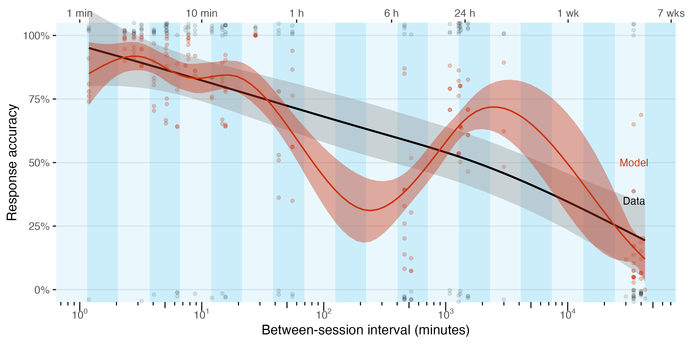

#### Parametric version

Instead of directly using the parameters estimated for each bin, we can
also approximate them from a linear model fitted on the parameter
estimates. This model (which is shown in the fitted parameter plot
above) takes the form of $\tau(t) = \beta_0 + \beta_1\ln(t)$, where $t$
is the geometric mean of the start and end of the bin. This approach
reduces the number of parameters to 2 (intercept and slope) and also
smooths out the predictions:

``` r
# Fit the linear model
m_tau <- lm(parameter ~ log(geom_mean), data = tau_tv_viz)
d_tau_lm <- map(d_l_seq_list, function(x) {
  list(id = x$id, geom_mean = x$time_between)
}) |>
  rbindlist()
# Predict tau from the linear model for each sequence
d_tau_lm$tau <- predict(m_tau, newdata = d_tau_lm)

# Predict recall
pred_tau_lm <- predict_recall(seq_list = d_l_seq_list, tau = d_tau_lm)
d_tau_lm <- d_l_last[pred_tau_lm, on = .(id)]

p_tau_lm <- plot_comparison(d_model = d_tau_lm,
                            d_last = d_l_last,
                            n_w = 20, 
                            label_pos = list(data = list(x = 35000, y = .35), 
                                             model = list(x = 35000, y = .5)),
                            print_plot = FALSE)

ggsave(plot = p_tau_lm, filename = here("output", "walkthrough", "fitted_tau_lm_recall_by_interval.png"), width = 10, height = 5)
```

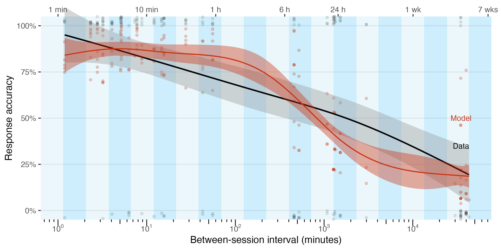

### Decay $d$

Next, we can find the best-fitting decay for each bin.

``` r
# Within each window, find the optimal activation
d_tv <- imap(d_l_windows_split, function (w, n) {
  
  w[, sequence := .GRP, by = .(id)]
  d_seq_list <- generate_seq_list(w)
  
  correct <- map_int(d_seq_list, ~.$correct)
  
  tau_fixed <- rep(model_params$tau, length(correct))
  
  m <- glm(correct ~ 1 + offset((-1/model_params$s) * tau_fixed),
           family = binomial)
  
  ac_fitted <- coef(m)[[1]] * model_params$s
  
  
  d_bs <- map_dfr(d_seq_list, function (x) {
    d_i <- 1
    d_upper <- 2
    d_lower <- 0
    
    # Binary search
    for (i in 1:100) {
      ac <- activation(x$time_within, x$time_between, model_params$h, d_i)
      
      ac_diff <- ac - ac_fitted
      
      if (ac_diff > 0) { # Predicted activation too high, so d is too small
        d_lower <- d_i
      } else { # Predicted activation too low, so d is too large
        d_upper <- d_i
      }
      
      d_i <- (d_lower + d_upper) / 2
      
    }
    
    return(list(n_windows = 20, window = as.integer(n), id = x$id, d = d_i))
  })
}) |>
  rbindlist()

d_tv
```

    ##      n_windows window                       id         d
    ##          <num>  <int>                   <char>     <num>
    ##   1:        20      2 17_18_EN_anon-013_1251_1 0.6793322
    ##   2:        20      2 17_18_EN_anon-013_1252_1 0.5762875
    ##   3:        20      2 17_18_EN_anon-013_1253_1 0.5664051
    ##   4:        20      2 17_18_EN_anon-013_1254_1 0.5942620
    ##   5:        20      2 17_18_EN_anon-013_1255_1 0.5558331
    ##  ---                                                    
    ## 164:        20     19 17_18_EN_anon-013_1246_1 0.4445554
    ## 165:        20     19 17_18_EN_anon-013_1247_1 0.4816043
    ## 166:        20     19 17_18_EN_anon-013_1248_1 0.4060916
    ## 167:        20     19 17_18_EN_anon-013_1249_1 0.3863216
    ## 168:        20     20 17_18_EN_anon-013_1527_1 1.0612575

Looking only at fitted values of $d$ based on at least 10 observations,
we see some evidence of the expected pattern of lower decay over longer
intervals:

``` r
d_tv_viz <- d_tv[window_range, on = .(n_windows, window)][!is.na(d), .(d = median(d), n_obs = .N), by = .(n_windows, window, start, end, geom_mean)][n_obs >= 10]
setnames(d_tv_viz, "d", "parameter")

p_d_tv <- plot_parameter(d_parameter = d_tv_viz,
                           parameter_name = quote(italic(d)),
                           n_w = 20,
                         print_plot = FALSE)
```

    ## Scale for x is already present.
    ## Adding another scale for x, which will replace the existing scale.

``` r
ggsave(plot = p_d_tv, filename = here("output", "walkthrough", "fitted_decay_by_interval.png"), width = 10, height = 5)
```

    ## Warning in scale_x_log10(breaks = scales::trans_breaks("log10", function(x)
    ## 10^x), : log-10 transformation introduced infinite values.

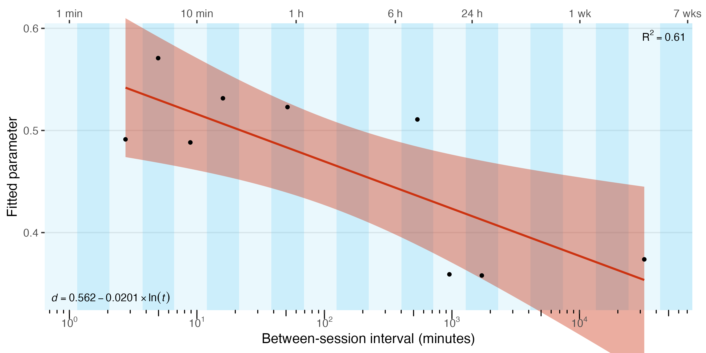

The resulting predictions are shown below. Notice again that the decay
is calculated for each item individually, such that all items in a bin
have the same activation at the time of recall.

``` r
pred_d_tv <- predict_recall(seq_list = d_l_seq_list, d = d_tv, tau = model_params$tau, windows = 20)
d_d_tv <- d_l_last[pred_d_tv, on = .(id)]

p_d_tv <- plot_comparison(d_model = d_d_tv,
                          d_last = d_l_last,
                          n_w = 20, 
                          label_pos = list(data = list(x = 35000, y = .35), 
                                           model = list(x = 35000, y = .5)),
                          print_plot = FALSE)

ggsave(plot = p_d_tv, filename = here("output", "walkthrough", "fitted_decay_recall_by_interval.png"), width = 10, height = 5)
```

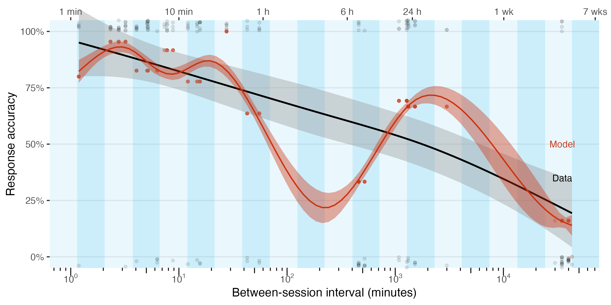

### Scaling factor $h$

Finally, we can find the best-fitting scaling factor for each bin.

``` r
# Within each window, find the optimal scaling factor
h_tv <- imap(d_l_windows_split, function (w, n) {
  
  w[, sequence := .GRP, by = .(id)]
  d_seq_list <- generate_seq_list(w)
  
  correct <- map_int(d_seq_list, ~.$correct)
  
  tau_fixed <- rep(model_params$tau, length(correct))
  
  m <- glm(correct ~ 1 + offset((-1/model_params$s) * tau_fixed),
           family = binomial)
  
  ac_fitted <- coef(m)[[1]] * model_params$s
  
  
  h_bs <- map_dfr(d_seq_list, function (x) {
    h_i <- .5
    h_upper <- 1
    h_lower <- 0
    
    # Binary search
    for (i in 1:100) {
      ac <- activation(x$time_within, x$time_between, h_i, model_params$decay)
      
      ac_diff <- ac - ac_fitted
      
      if (ac_diff > 0) { # Predicted activation too high, so h is too small
        h_lower <- h_i
      } else { # Predicted activation too low, so h is too large
        h_upper <- h_i
      }
      
      h_i <- (h_lower + h_upper) / 2
      
    }
    
    return(list(n_windows = 20, window = as.integer(n), id = x$id, h = h_i))
    
  })
}) |>
  rbindlist()

h_tv
```

    ##      n_windows window                       id          h
    ##          <num>  <int>                   <char>      <num>
    ##   1:        20      2 17_18_EN_anon-013_1251_1 1.00000000
    ##   2:        20      2 17_18_EN_anon-013_1252_1 1.00000000
    ##   3:        20      2 17_18_EN_anon-013_1253_1 1.00000000
    ##   4:        20      2 17_18_EN_anon-013_1254_1 1.00000000
    ##   5:        20      2 17_18_EN_anon-013_1255_1 1.00000000
    ##  ---                                                     
    ## 164:        20     19 17_18_EN_anon-013_1246_1 0.19895693
    ## 165:        20     19 17_18_EN_anon-013_1247_1 0.58541040
    ## 166:        20     19 17_18_EN_anon-013_1248_1 0.06469746
    ## 167:        20     19 17_18_EN_anon-013_1249_1 0.03631735
    ## 168:        20     20 17_18_EN_anon-013_1527_1 1.00000000

Looking only at fitted values of $h$ based on at least 10 observations,
here we see that the scaling factor is more difficult to estimate with
so little data as a result of the limits on the range of $h$.

``` r
h_tv_viz <- h_tv[window_range, on = .(n_windows, window)][!is.na(h), .(h = median(h), n_obs = .N), by = .(n_windows, window, start, end, geom_mean)][n_obs >= 10]
setnames(h_tv_viz, "h", "parameter")

p_h_tv <- plot_parameter(d_parameter = h_tv_viz,
                         parameter_name = quote(italic(h)),
                         log_y = TRUE,
                         n_w = 20,
                         print_plot = FALSE) +
  coord_cartesian(xlim = c(window_range[1, start], window_range[.N, end])/60, ylim = c(1e-3, 1.2), clip = "off") +
  theme(axis.text.y = element_text(margin = margin(r = 8)))
```

    ## Scale for x is already present.
    ## Adding another scale for x, which will replace the existing scale.
    ## Coordinate system already present. Adding new coordinate system, which will replace the existing one.

``` r
ggsave(plot = p_h_tv, filename = here("output", "walkthrough", "fitted_h_by_interval.png"), width = 10, height = 5)
```

    ## Warning in scale_y_log10(): log-10 transformation introduced infinite values.

    ## Warning in scale_x_log10(breaks = scales::trans_breaks("log10", function(x)
    ## 10^x), : log-10 transformation introduced infinite values.

    ## Warning in scale_y_log10(): log-10 transformation introduced infinite values.


In particular, the lower limit on $h$ is an issue at short timescales,
where the model’s predicted recall accuracy lies below the actual
accuracy. The predictions look more similar to the time-variant decay
model at longer timescales. (As long as they don’t run into the limits
of their parameter space, both methods should produce exactly the same
predictions.)

``` r
pred_h_tv <- predict_recall(seq_list = d_l_seq_list, h = h_tv, tau = model_params$tau, windows = 20)
d_h_tv <- d_l_last[pred_h_tv, on = .(id)]

p_h_tv <- plot_comparison(d_model = d_h_tv,
                          d_last = d_l_last,
                          n_w = 20, 
                          label_pos = list(data = list(x = 35000, y = .35), 
                                           model = list(x = 35000, y = .5)),
                          print_plot = FALSE)

ggsave(plot = p_h_tv, filename = here("output", "walkthrough", "fitted_h_recall_by_interval.png"), width = 10, height = 5)
```

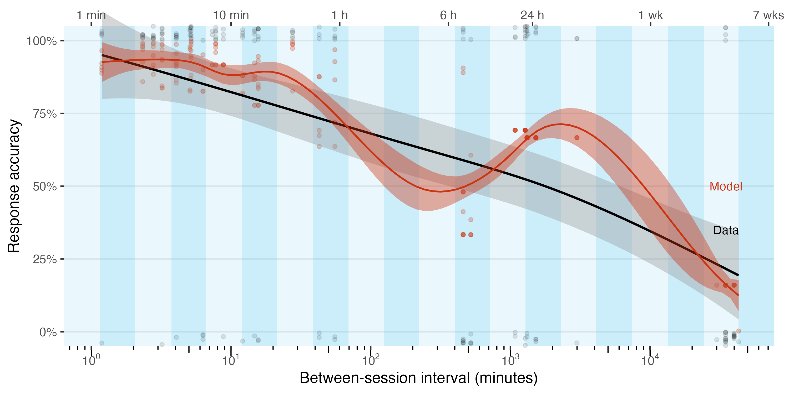

## Scaling up to multiple learners

The same methodology can be applied to data from multiple learners.
Having more observations in each time bin will help to improve the
reliability of the parameter estimates. We’ll take a sample of 50
learners at random, and fit the time-variant model to their data.

``` r
set.seed(0)
d_m <- d_f[user %in% sample(unique(d_f$user), 100)]
d_m_last <- d_m[, .SD[.N], by = id]

# Add marker to identify each fact learning sequence
d_m_last[, sequence := 1:.N]
d_m <- d_m[d_m_last[, .(id, sequence)], on = .(id)]
# Generate sequence list
d_m_seq_list <- generate_seq_list(d_m)
```

The distribution of intervals in the sample is as follows:

``` r
p <- ggplot(d_m_last, aes(x = time_between/60)) +
  geom_histogram(colour = "white", binwidth = .2) +
  labs(x = "Between-session interval (min)",
       y = "Sequences") +
  plot_timescales()

ggsave(plot = p, filename = here("output", "walkthrough", "between_session_intervals_multiple_learners.png"), width = 10, height = 5)
```

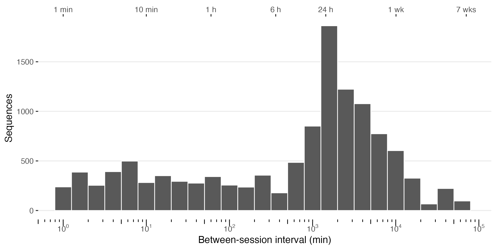

Statistics on the number of sequences per bin:

``` r
summary(d_m_last[, .N, by = window][, N])
```

    ##    Min. 1st Qu.  Median    Mean 3rd Qu.    Max. 
    ##    80.0   319.0   421.0   596.4   586.2  1918.0

Accuracy per bin:

``` r
d_m_accuracy <- d_m_last[, .(accuracy = mean(correct)), by = .(window)][window_range, on = .(window)][!is.na(accuracy)]

p <- ggplot(d_m_accuracy, aes(x = geom_mean/60, y = accuracy, colour = as.factor(window))) +
  # Jitter raw data points
  geom_jitter(data = d_m_last, aes(x = time_between/60, y = correct), alpha = .1, width = 0, height = 0.05) +
  # Mean accuracy per window
  geom_segment(aes(x = start/60, xend = end/60, yend = accuracy), linewidth = 2) +
  geom_text(aes(x = geom_mean/60, y = accuracy, label = window), colour = "black", vjust = -.5) +
  labs(x = "Between-session interval (min)",
       y = "Accuracy") +
  guides(colour = "none") +
  scale_x_log10(
    breaks = scales::trans_breaks("log10", function(x) 10^x),
    labels = scales::trans_format("log10", scales::math_format(10^.x)),
    expand = c(0, 0),
    sec.axis = sec_axis(~.x, breaks = label_x, labels = label_txt)
  ) +
  annotation_logticks(sides = "b", outside = T) +
  scale_y_continuous(labels = scales::percent_format()) +
  coord_cartesian(xlim = c(min(label_x)/2, max(label_x)*2), clip = "off") +
  theme_bw(base_size = 14) +
  theme(plot.margin = margin(7, 14, 7, 7),
        panel.grid.major.x = element_blank(),
        panel.grid.minor = element_blank(),
        panel.border = element_blank())

ggsave(plot = p, filename = here("output", "walkthrough", "accuracy_by_interval_multiple_learners.png"), width = 10, height = 5)
```

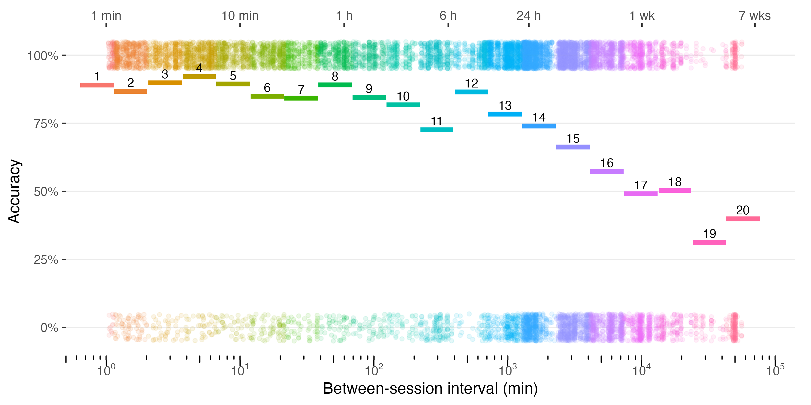

### Retrieval threshold $\tau$

``` r
d_m_windows_split <- split(d_m, d_m$window)

# Within each window, find the optimal retrieval threshold
tau_m_tv <- imap(d_m_windows_split, function (w, n) {
  
  w[, sequence := .GRP, by = .(id)]
  d_seq_list <- generate_seq_list(w)
  
  correct <- map_int(d_seq_list, ~.$correct)
  
  ac <- map_dbl(d_seq_list, function (x) {
    activation(x$time_within, x$time_between, model_params$h, model_params$decay)
  })
  
  m <- glm(correct ~ 1 + offset((1/model_params$s) * ac),
           family = binomial)
  tau <- - coef(m)[[1]] * model_params$s
  
  return (list(n_windows = 20, window = as.integer(n), tau = tau, n_obs = length(correct)))
}) |>
  rbindlist()

tau_m_tv
```

    ##     n_windows window       tau n_obs
    ##         <num>  <int>     <num> <int>
    ##  1:        20      1 -2.708442   110
    ##  2:        20      2 -2.665421   529
    ##  3:        20      3 -2.886900   386
    ##  4:        20      4 -3.064815   551
    ##  5:        20      5 -3.120993   418
    ##  6:        20      6 -3.090457   498
    ##  7:        20      7 -3.236336   324
    ##  8:        20      8 -3.707184   424
    ##  9:        20      9 -3.758634   324
    ## 10:        20     10 -3.783806   253
    ## 11:        20     11 -3.875456   457
    ## 12:        20     12 -4.701673   372
    ## 13:        20     13 -4.623051  1037
    ## 14:        20     14 -4.726959  1918
    ## 15:        20     15 -4.831594  1751
    ## 16:        20     16 -4.873230  1216
    ## 17:        20     17 -4.979206   692
    ## 18:        20     18 -5.255716   304
    ## 19:        20     19 -5.345151    80
    ## 20:        20     20 -5.778144   283
    ##     n_windows window       tau n_obs

``` r
tau_m_tv_viz <- tau_m_tv[window_range, on = .(n_windows, window)]
setnames(tau_m_tv_viz, "tau", "parameter")

p_tau_m_tv <- plot_parameter(d_parameter = tau_m_tv_viz,
                             parameter_name = quote(tau),
                             n_w = 20,
                             print_plot = FALSE)
```

    ## Scale for x is already present.
    ## Adding another scale for x, which will replace the existing scale.

``` r
ggsave(plot = p_tau_m_tv, filename = here("output", "walkthrough", "fitted_tau_by_interval_multiple_learners.png"), width = 10, height = 5)
```

    ## Warning in scale_x_log10(breaks = scales::trans_breaks("log10", function(x)
    ## 10^x), : log-10 transformation introduced infinite values.

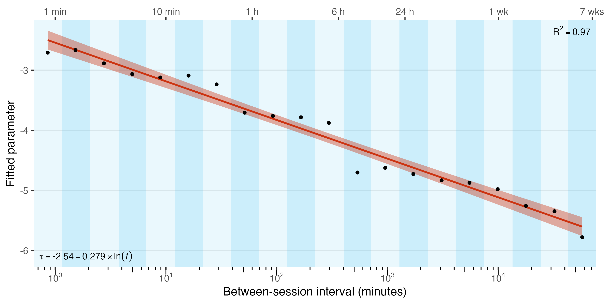

``` r
pred_tau_m_tv <- predict_recall(seq_list = d_m_seq_list, tau = tau_m_tv, windows = 20)
d_tau_m_tv <- d_m_last[pred_tau_m_tv, on = .(id)]

p_tau_m_tv <- plot_comparison(d_model = d_tau_m_tv,
                              d_last = d_m_last,
                              n_w = 20, 
                              label_pos = list(data = list(x = 35000, y = .35), 
                                               model = list(x = 35000, y = .5)),
                              print_plot = FALSE)

ggsave(plot = p_tau_m_tv, filename = here("output", "walkthrough", "fitted_tau_recall_by_interval_multiple_learners.png"), width = 10, height = 5)
```

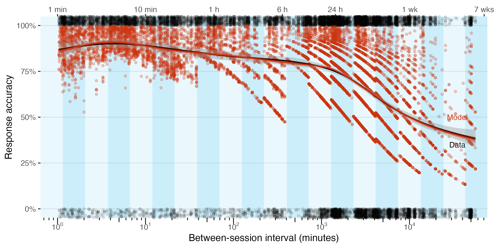

### Decay $d$

``` r
d_m_tv <- imap(d_m_windows_split, function (w, n) {
  
  w[, sequence := .GRP, by = .(id)]
  d_seq_list <- generate_seq_list(w)
  
  correct <- map_int(d_seq_list, ~.$correct)
  
  tau_fixed <- rep(model_params$tau, length(correct))

  m <- glm(correct ~ 1 + offset((-1/model_params$s) * tau_fixed),
           family = binomial)
  
  ac_fitted <- coef(m)[[1]] * model_params$s
  
  
  d_bs <- map_dfr(d_seq_list, function (x) {
    d_i <- 1
    d_upper <- 2
    d_lower <- 0
    
    # Binary search
    for (i in 1:100) {
      ac <- activation(x$time_within, x$time_between, model_params$h, d_i)
      
      ac_diff <- ac - ac_fitted
      
      if (ac_diff > 0) { # Predicted activation too high, so d is too small
        d_lower <- d_i
      } else { # Predicted activation too low, so d is too large
        d_upper <- d_i
      }
      
      d_i <- (d_lower + d_upper) / 2
      
    }
    
    return(list(n_windows = 20, window = as.integer(n), id = x$id, d = d_i))
  })
}) |>
  rbindlist()
```

``` r
d_m_tv_viz <- d_m_tv[window_range, on = .(n_windows, window)][!is.na(d), .(d = median(d), n_obs = .N), by = .(n_windows, window, start, end, geom_mean)]
setnames(d_m_tv_viz, "d", "parameter")

p_d_m_tv <- plot_parameter(d_parameter = d_m_tv_viz,
                           parameter_name = quote(italic(d)),
                           n_w = 20,
                           print_plot = FALSE)
```

    ## Scale for x is already present.
    ## Adding another scale for x, which will replace the existing scale.

``` r
ggsave(plot = p_d_m_tv, filename = here("output", "walkthrough", "fitted_decay_by_interval_multiple_learners.png"), width = 10, height = 5)
```

    ## Warning in scale_x_log10(breaks = scales::trans_breaks("log10", function(x)
    ## 10^x), : log-10 transformation introduced infinite values.

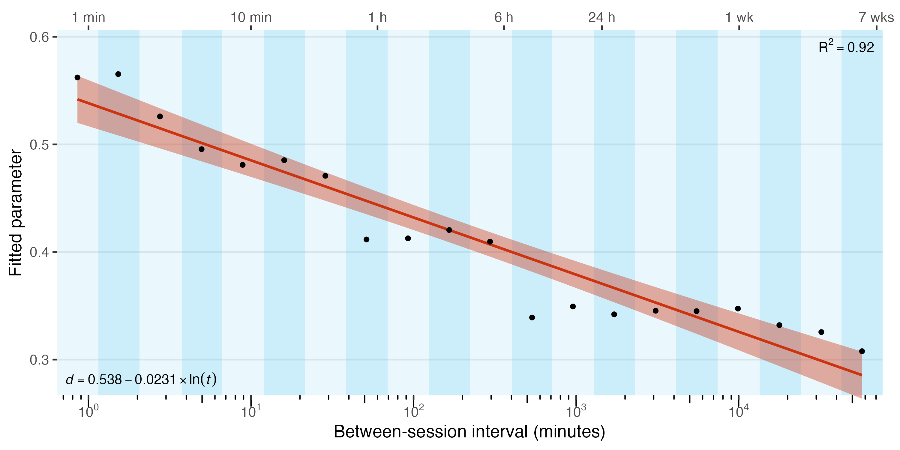

``` r
pred_d_m_tv <- predict_recall(seq_list = d_m_seq_list, d = d_m_tv, tau = model_params$tau, windows = 20)
d_d_m_tv <- d_m_last[pred_d_m_tv, on = .(id)]

p_d_m_tv <- plot_comparison(d_model = d_d_m_tv,
                            d_last = d_m_last,
                            n_w = 20, 
                            label_pos = list(data = list(x = 35000, y = .35), 
                                             model = list(x = 35000, y = .5)),
                            print_plot = FALSE)

ggsave(plot = p_d_m_tv, filename = here("output", "walkthrough", "fitted_decay_recall_by_interval_multiple_learners.png"), width = 10, height = 5)
```

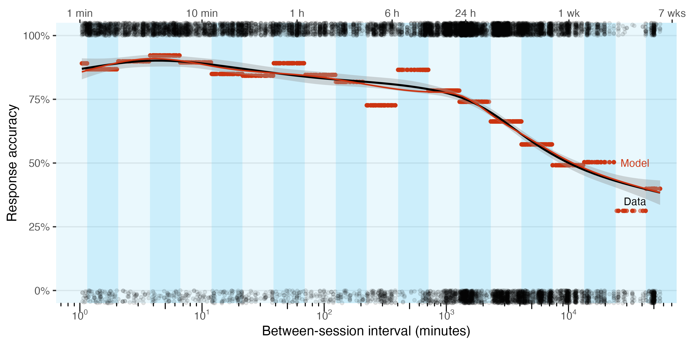

### Scaling factor $h$

``` r
h_m_tv <- imap(d_m_windows_split, function (w, n) {
  
  w[, sequence := .GRP, by = .(id)]
  d_seq_list <- generate_seq_list(w)
  
  correct <- map_int(d_seq_list, ~.$correct)
  
  # tau_fixed <- rep(model_params$tau, length(correct))
  tau_fixed <- rep(-3.0, length(correct))
  
  m <- glm(correct ~ 1 + offset((-1/model_params$s) * tau_fixed),
           family = binomial)
  
  ac_fitted <- coef(m)[[1]] * model_params$s
  
  
  h_bs <- map_dfr(d_seq_list, function (x) {
    h_i <- .5
    h_upper <- 1
    h_lower <- 0
    
    # Binary search
    for (i in 1:100) {
      ac <- activation(x$time_within, x$time_between, h_i, model_params$decay)
      
      ac_diff <- ac - ac_fitted
      
      if (ac_diff > 0) { # Predicted activation too high, so h is too small
        h_lower <- h_i
      } else { # Predicted activation too low, so h is too large
        h_upper <- h_i
      }
      
      h_i <- (h_lower + h_upper) / 2
      
    }
    
    return(list(n_windows = 20, window = as.integer(n), id = x$id, h = h_i))
    
  })
}) |>
  rbindlist()
```

``` r
h_m_tv_viz <- h_m_tv[window_range, on = .(n_windows, window)][!is.na(h), .(h = median(h), n_obs = .N), by = .(n_windows, window, start, end, geom_mean)]
setnames(h_m_tv_viz, "h", "parameter")

p_h_m_tv <- plot_parameter(d_parameter = h_m_tv_viz,
                           parameter_name = quote(italic(h)),
                           log_y = TRUE,
                           n_w = 20,
                           print_plot = FALSE) +
  coord_cartesian(xlim = c(window_range[1, start], window_range[.N, end])/60, ylim = c(NA, 1.2), clip = "off") +
  theme(axis.text.y = element_text(margin = margin(r = 8)))
```

    ## Scale for x is already present.
    ## Adding another scale for x, which will replace the existing scale.
    ## Coordinate system already present. Adding new coordinate system, which will replace the existing one.

``` r
ggsave(plot = p_h_m_tv, filename = here("output", "walkthrough", "fitted_h_by_interval_multiple_learners.png"), width = 10, height = 5)
```

    ## Warning in scale_y_log10(): log-10 transformation introduced infinite values.

    ## Warning in scale_x_log10(breaks = scales::trans_breaks("log10", function(x)
    ## 10^x), : log-10 transformation introduced infinite values.

    ## Warning in scale_y_log10(): log-10 transformation introduced infinite values.

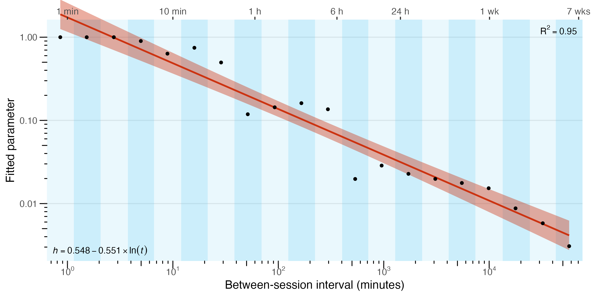

``` r
pred_h_m_tv <- predict_recall(seq_list = d_m_seq_list, h = h_m_tv, tau = model_params$tau, windows = 20)
d_h_m_tv <- d_m_last[pred_h_m_tv, on = .(id)]

p_h_m_tv <- plot_comparison(d_model = d_h_m_tv,
                            d_last = d_m_last,
                            n_w = 20, 
                            label_pos = list(data = list(x = 35000, y = .35), 
                                             model = list(x = 35000, y = .5)),
                            print_plot = FALSE)

ggsave(plot = p_h_m_tv, filename = here("output", "walkthrough", "fitted_h_recall_by_interval_multiple_learners.png"), width = 10, height = 5)
```

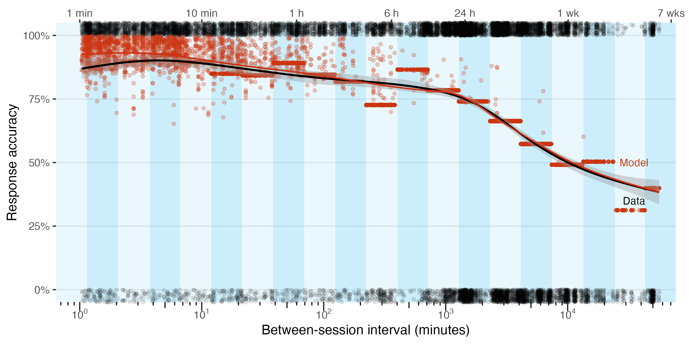

# Model comparison

Models with time-variant parameters tend to yield better fits to the
data than models with a single parameter configuration, but at the cost
of additional degrees of freedom and an increased risk of overfitting.
We can quantify this trade-off using a metric like the Akaike
Information Criterion (AIC), which evaluates the goodness of fit of a
model while penalising for the number of parameters. To determine the
relative support for each model, we calculate Akaike weights
([Wagenmakers & Farrell, 2004](https://doi.org/10.3758/BF03206482))
based on the AIC values. These sum to 1 and show the relative likelihood
of each model given the data.

``` r
log_likelihood <- function(y, p) {
  d <- data.table(y, p)
  return (sum(y * log(p) + (1 - y) * log(1 - p)))
}

aic <- function(k, ll) {
  return(2 * k - 2 * ll)
}

akaike_weights <- function(aic) {
  delta_aic <- aic - min(aic)
  return (exp(-delta_aic / 2) / sum(exp(-delta_aic / 2)))
}
```

Higher is better:

``` r
# Single parameter models
ll_single_tau <- log_likelihood(d_single_tau$correct, d_single_tau$pred_correct)
ll_single_d <- log_likelihood(d_single_d$correct, d_single_d$pred_correct)
ll_single_h <- log_likelihood(d_single_h$correct, d_single_h$pred_correct)
aic_single_tau <- aic(1, ll_single_tau)
aic_single_d <- aic(1, ll_single_d)
aic_single_h <- aic(1, ll_single_h)

# Time-variant models
ll_tau_tv <- log_likelihood(d_tau_tv$correct, d_tau_tv$pred_correct)
ll_d_tv <- log_likelihood(d_d_tv$correct, d_d_tv$pred_correct)
ll_h_tv <- log_likelihood(d_h_tv$correct, d_h_tv$pred_correct)
aic_tau_tv <- aic(uniqueN(tau_tv$window), ll_tau_tv)
aic_d_tv <- aic(uniqueN(d_tv$window), ll_d_tv)
aic_h_tv <- aic(uniqueN(h_tv$window), ll_h_tv)


model_comp <- data.table(
  model = c("Single tau", "Single d", "Single h", 
            "Time-variant tau", "Time-variant d", "Time-variant h"),
  k = c(1, 1, 1,
        uniqueN(tau_tv$window), uniqueN(d_tv$window), uniqueN(h_tv$window)),
  ll = c(ll_single_tau, ll_single_d, ll_single_h, 
         ll_tau_tv, ll_d_tv, ll_h_tv),
  aic = c(aic_single_tau, aic_single_d, aic_single_h,
          aic_tau_tv, aic_d_tv, aic_h_tv)
)

model_comp[, akaike_weights := akaike_weights(aic)]

p <- ggplot(model_comp, aes(x = reorder(model, -akaike_weights), y = akaike_weights, colour = as.factor(k))) +
  geom_point() +
  scale_y_log10(
    limits = c(NA, 10),
    breaks = scales::trans_breaks("log10", function(x) 10^x),
    labels = scales::trans_format("log10", scales::math_format(10^.x)),
    expand = c(0, 0)
  ) +
  labs(x = "Model", y = "Relative likelihood", colour = "Parameters") +
  theme(axis.text.x = element_text(angle = 90, hjust = 1, vjust = .5))

ggsave(plot = p, filename = here("output", "walkthrough", "model_comparison_akaike_weights.png"), width = 10, height = 5)
```

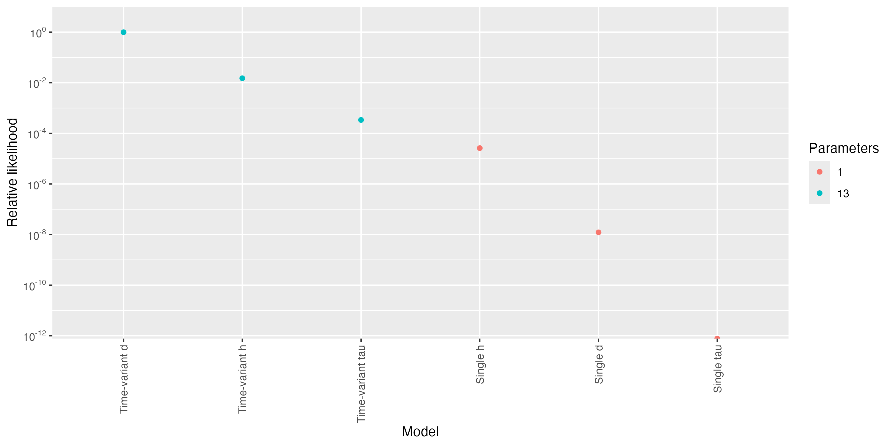

# Data codebook

``` r
d_f <- fread(file.path("..", "data", "cogpsych_data_formatted.csv"))
head(d_f)
```

    ##                          id              user   fact                time
    ##                      <char>            <char> <char>              <POSc>
    ## 1: 17_18_EN_anon-001_1174_1 17_18_EN_anon-001 1174_1 2017-10-14 14:59:39
    ## 2: 17_18_EN_anon-001_1174_1 17_18_EN_anon-001 1174_1 2017-10-14 14:59:47
    ## 3: 17_18_EN_anon-001_1174_1 17_18_EN_anon-001 1174_1 2017-10-14 15:00:50
    ## 4: 17_18_EN_anon-001_1174_1 17_18_EN_anon-001 1174_1 2017-10-23 13:38:26
    ## 5: 17_18_EN_anon-001_1175_1 17_18_EN_anon-001 1175_1 2017-10-14 14:59:53
    ## 6: 17_18_EN_anon-001_1175_1 17_18_EN_anon-001 1175_1 2017-10-14 15:00:03
    ##    presentation_start_time time_since_session_start time_until_session_end
    ##                      <num>                    <num>                  <num>
    ## 1:                   0.000                   22.902                270.124
    ## 2:                   6.025                   28.927                264.099
    ## 3:                  69.202                   92.104                200.922
    ## 4:              772723.277                   83.507                156.135
    ## 5:                   0.000                   38.021                255.005
    ## 6:                   6.204                   44.225                248.801
    ##    correct    rt time_between time_within
    ##      <int> <int>        <num>       <num>
    ## 1:       1  6018     772369.6     353.631
    ## 2:       1  4442     772369.6     347.606
    ## 3:       1  3418     772369.6     284.429
    ## 4:       1  4002     772369.6     239.642
    ## 5:       1  4790     772369.6     326.961
    ## 6:       1  2592     772369.6     320.757

The formatted data consists of fact learning sequences: sets of trials
by the same learner practicing a particular fact. The included sequences
all fit the following format: all $n$ trials involving that fact in the
first practice session, and the first trial involving that fact in the
subsequent practice session.

For each trial, the following information is available:

| Variable | Type | Description |
|----|----|----|
| `id` | character | Unique identifier for the fact learning sequence |
| `user` | character | Unique identifier for the learner |
| `fact` | character | Unique identifier for the fact |
| `time` | POSIXct | Timestamp of the trial onset |
| `presentation_start_time` | numeric | Timestamp of the trial onset, relative to the first trial within a sequence (in seconds) |
| `time_since_session_start` | numeric | Time since the start of the practice session in which the trial occurs (in seconds) |
| `time_until_session_end` | numeric | Time until the end of the practice session in which the trial occurs (in seconds) |
| `correct` | numeric | Whether the response was correct (1) or incorrect (0) |
| `rt` | numeric | Response time (in milliseconds) |
| `time_between` | numeric | Time between the two sessions in the fact sequence (in seconds) |
| `time_within` | numeric | Within-session time between the current trial and the final trial in the fact sequence (in seconds) |
