# Outline

This notebook fits various configurations of the memory model to the retrieval practice data, using k-fold cross-validation to evaluate predictive performance.

We vary the following factors:

  - **Subset**: fit all data, fit by learner, fit by amount of practice
  - **Temporal scope**: fit all intervals, only short intervals (0-10 min), only intervals around 24 h, different numbers of time bins
  - **Parameter**: fit retrieval threshold $\tau$, decay $d$, scaling factor $h$
  

# Setup

```{r setup}
library(data.table)
library(purrr)
library(furrr)
library(here)
library(caret)
library(ggplot2)
library(patchwork)
library(ggtext)

source("00_helper_funs.R")

pred_col <- "#CC3311"    # red
obs_col <- "#000000"     # black
window_col <- "#33BBEE"  # blue
section_col <- "#FD520F" # orange

future::plan("multisession", workers = 8) # Set to desired number of cores

set.seed(0)
```


## Model fitting setup

Set default parameters for the ACT-R memory model.
These values are used whenever a parameter is not fitted.
```{r model-parameters}
model_params <- list(
  tau = -3.0, # Retrieval threshold
  s = .5, # Activation noise
  decay = .5, # Decay
  h = 1 # Scaling factor
)
```

We want to try different splits of the data, ranging from a single window that includes everything to 20 windows. Once we go beyond 20 windows, we run into the issues that certain windows end up empty in some of the cross-validation folds, which makes it impossible to fit and evaluate the model.
```{r n-windows}
n_windows <- c(1, 2, 5, 10, 20)
```


## Data setup

```{r load-data}
d_f <- fread(file.path("..", "data", "cogpsych_data_formatted.csv"))
head(d_f)
```

Each user-fact pair has a single learning sequence associated with it, consisting of three or more trials in one session and the first trial in the next session.
The total number of trials in the sequence varies across sequences:
```{r}
trials_by_id <- d_f[, .(trials = .N), by = .(id)]
trials_by_id[, trials := factor(ifelse(trials < 21, trials, "21+"),
                                levels = c(4:20, "21+"))]

d_f <- d_f[trials_by_id, on = "id"]

p_seq_length <- ggplot(trials_by_id, aes(x = trials)) +
  geom_bar(fill = window_col) +
  labs(x = "Number of trials in the sequence", y = "Number of sequences")

ggsave(here("output", "sequence_length_distribution.png"), p_seq_length, width = 6, height = 4)
```

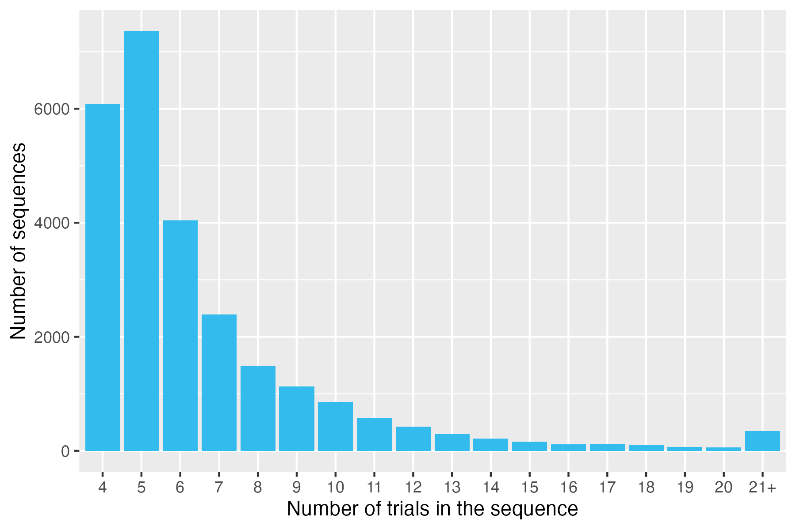


Isolate the last observation per learning sequence (i.e., the one after the between-session interval).
This is the observation that the model has to predict, given all prior observations in the sequence.
```{r last-observation}
d_last <- d_f[, .SD[.N], by = id]
head(d_last)
```

Define the time windows for all splits of the data (time values are in seconds).
```{r}
window_range <- map_dfr(n_windows, function (n_w) {

  d_windows <- copy(d_last)
  
  if (n_w == 1) {
    d_windows[, window := 1]
  } else {
    d_windows[, window := cut(log(time_between), breaks = n_w, labels = FALSE)]
  }
  
  # Get the window range(s)
  window_range <- d_windows[, .(start = min(time_between), end = max(time_between)), by = .(window)]
  window_range[, geom_mean := sqrt(start*end), by = .(window)]
  setorder(window_range, window)
  window_range[, window := window]
  window_range[, n_windows := n_w]

  return (window_range)
})

window_range[, window_type := "regular"]
```

We'll also include a "short" window (0-10 min) and a "24h" window (23.5-24.5h), to see how well the model performs if fitted only to these intervals.
```{r short-and-24h}
window_range <- rbind(window_range,
                      list(window = 1,
                           start = window_range[, min(start)],
                           end = 10*60,
                           geom_mean = sqrt((window_range[, min(start)]) * (10*60)),
                           n_windows = 1, 
                           window_type = "short"),
                      list(window = 1,
                           start = 23.5*60*60,
                           end = 24.5*60*60,
                           geom_mean = sqrt(23.5*24.5)*60*60,
                           n_windows = 1,
                           window_type = "24h"))

window_range[, window_id := 1:.N]
```

The resulting window ranges:
```{r window-ranges}
window_range
```

The distribution of between-session intervals looks as follows:
```{r}
p_histogram <- ggplot() +
  # Window background
  geom_rect(data = window_range[1], aes(xmin = start/60, xmax = end/60, ymin = -Inf, ymax = Inf), fill = window_col, alpha = .1) +
  # Histogram
  geom_histogram(data = d_last, aes(x = time_between/60, y = ..ncount..), bins = 100, fill = obs_col) +
  # Plot setup
  scale_x_log10(
    breaks = scales::trans_breaks("log10", function(x) 10^x),
    labels = scales::trans_format("log10", scales::math_format(10^.x)),
    expand = c(0, 0),
    sec.axis = sec_axis(~.x, breaks = label_x, labels = label_txt)
  ) +
  scale_y_continuous(breaks = seq(0, 1, by = .25)) +
  labs(x = "Between-session interval (minutes)",
       y = "Density") +
  annotation_logticks(sides = "b", outside = T) +
  coord_cartesian(ylim = c(0, 1), xlim = c(window_range[1, start], window_range[1, end])/60, clip = "off") +
  theme_bw(base_size = 14) +
  theme(plot.margin = margin(7, 14, 7, 7),
        panel.grid.major.x = element_blank(),
        panel.grid.minor = element_blank(),
        panel.border = element_blank(),
        axis.text.x = element_text(margin = margin(t = 8)),
        axis.text.x.top = element_text(margin = margin(b = 8)))

ggsave(here("output", "between_session_interval_distribution.png"), p_histogram, width = 6, height = 4)
```

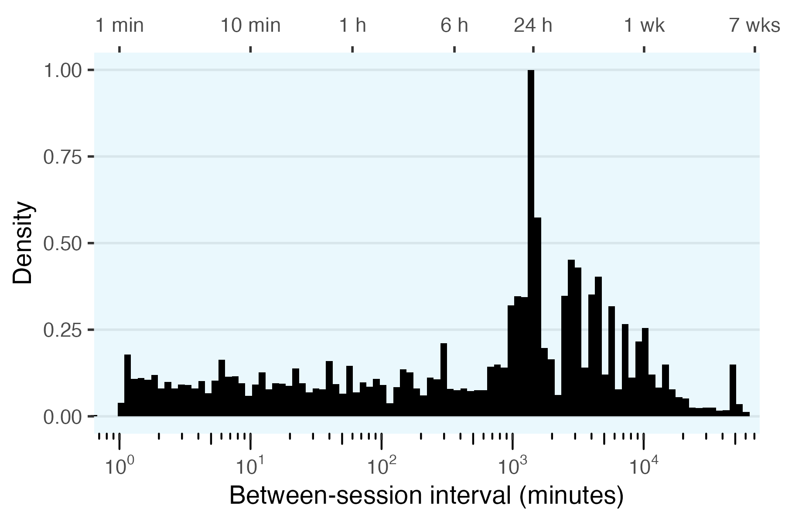

## Set up cross-validation

To assess how well each model does at predicting new data, and to compare the relative performance of the different models, we'll use k-fold cross validation. The model is fitted to the data from all but one of the folds, and used to predict recall in the held-out fold.
To ensure that between-session intervals are equally represented in each fold, we stratify the folds by the window of the between-session interval.
In addition, since one of the model variants involves fitting learner-specific parameters, we want to ensure that data from any single learner is spread across folds (as far as possible).

First, identify the window in which each sequence falls, based on the between-session interval.
```{r}
d_last <- d_last[window_range[n_windows == 20], on = .(time_between >= start, time_between <= end), window := i.window]
```

Create a stratification variable that combines the window and the learner ID.
```{r}
d_last[, stratify := paste(window, user, sep = "_")]
```

Create stratified cross-validation folds.
```{r}
k <- 5
d_last_folds <- createFolds(d_last$stratify, k = k, list = FALSE)
d_last[, fold := d_last_folds]
```

Verify that the between-session intervals are equally distributed across folds.
```{r}
d_last[, .(mean = mean(time_between),
           min = min(time_between),
           max = max(time_between),
           q05 = quantile(time_between, .05),
           q25 = quantile(time_between, .25),
           q50 = quantile(time_between, .5),
           q75 = quantile(time_between, .75),
           q95 = quantile(time_between, .95)
           ), by = fold]

p_stratification_intervals <- ggplot(d_last, aes(x = time_between, fill = factor(fold))) +
  facet_grid(fold ~ ., labeller = "label_both") +
  geom_histogram(colour = "black") +
  labs(x = "Time between sessions (s)", y = "Count") +
  guides(fill = "none") +
  scale_x_log10()

ggsave(here("output", "stratification_intervals.png"), p_stratification_intervals, width = 6, height = 4)
```
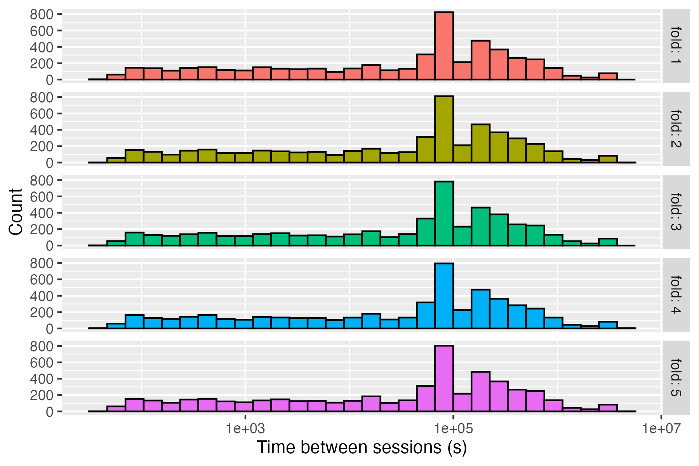

Is every learner represented in each fold?
Note that there are some cases where a learner has insufficient data to be represented in all folds, but the vast majority of learners is represented in all folds.
```{r}
d_last[, .(n_folds = length(unique(fold))), by = user][, table(n_folds)]
```


While we did not explicitly stratify by the amount of practice in the first session, we can verify that the distribution of practice amounts is also similar across folds.
```{r}
d_last[, .(mean = mean(as.numeric(trials)),
           min = min(as.numeric(trials)),
           max = max(as.numeric(trials)),
           q05 = quantile(as.numeric(trials), .05),
           q25 = quantile(as.numeric(trials), .25),
           q50 = quantile(as.numeric(trials), .5),
           q75 = quantile(as.numeric(trials), .75),
           q95 = quantile(as.numeric(trials), .95)
), by = fold]

p_stratification_practice <- ggplot(d_last, aes(x = as.numeric(trials), fill = factor(fold))) +
  facet_grid(fold ~ ., labeller = "label_both") +
  geom_histogram(binwidth = 1, colour = "black") +
  labs(x = "Number of trials in the first session", y = "Count") +
  guides(fill = "none")

ggsave(here("output", "stratification_practice.png"), p_stratification_practice, width = 6, height = 4)
```
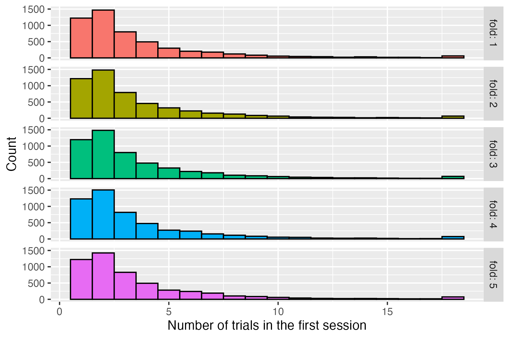


# Fit models

Specify the number of cross-validation folds.
```{r}
K_FOLDS <- 5
```

```{r fit-model-cv}
fit_model_cv <- function(subset = c("all", "by_learner", "by_practice")) {
  
  subset <- match.arg(subset)
  message("Subset: ", subset)
  
  # --- 1. Build fold x window combinations ---
  fold_window_combos <- CJ(fold = seq_len(K_FOLDS), window_id = window_range$window_id)
  
  # For by_learner and by_practice, only use regular windows
  if (subset != "all") {
    valid_window_ids <- window_range[window_type == "regular", window_id]
    fold_window_combos <- fold_window_combos[window_id %in% valid_window_ids]
  }
  
  # --- 2. Parallelise over all fold x window combinations ---
  results <- future_map(
    split(fold_window_combos, seq_len(nrow(fold_window_combos))),
    function(combo) {
      
      fold_id           <- combo$fold
      current_window_id <- combo$window_id
      fit_window        <- window_range[window_id == current_window_id]
      
      # Split into train / test on d_last
      d_train <- d_last[fold != fold_id]
      d_test  <- d_last[fold == fold_id]
      
      # Subset training data by learner or practice if needed
      d_train_sub <- switch(subset,
        "all"         = list(d_train),
        "by_learner"  = split(d_train, by = "user"),
        "by_practice" = split(d_train, by = "trials")
      )
      
      # --- 3. Fit parameters on training data, aggregate to median per group ---
      params_list <- map(d_train_sub, function(d_sub) {
        
        # Only include sequences within the window bounds: [start, end]
        d_sub_window <- d_sub[time_between >= fit_window$start & time_between <= fit_window$end]
        
        # To identify parameters, require at least 3 responses in the window,
        # with a mix of correct and incorrect responses
        if (!(nrow(d_sub_window) >= 3 && between(mean(d_sub_window$correct), 0, 1, incbounds = FALSE))) {
          return(NULL)
        }
        
        # Prepare sequences and fit
        d_sub_window[, window   := fit_window$window]
        d_sub_window[, sequence := 1:.N]
        d_sub_window <- d_f[d_sub_window[, .(id, window, sequence)], on = .(id)]
        seqs   <- generate_seq_list(d_sub_window)
        params <- fit_parameters(seqs, model_params)
        
        # Aggregate to a single parameter set per group (median d and h;
        # tau is constant within group so first value suffices)
        params_agg <- params[, .(
          tau = first(tau),
          d   = median(d, na.rm = TRUE),
          h   = median(h, na.rm = TRUE)
        )]
        
        sub_label <- switch(subset,
          "all"         = NA_character_,
          "by_learner"  = d_sub[1, user],
          "by_practice" = as.character(d_sub[1, trials])
        )
        
        cbind(
          data.table(fold = fold_id, window_id = current_window_id, sub_label = sub_label),
          params_agg
        )
      })
      
      params_dt <- rbindlist(discard(params_list, is.null))
      
      if (nrow(params_dt) == 0) return(NULL)
      
      # --- 4. Filter test data to this window (unless extrapolating) ---
      extrapolate_outside_fitted_window <- fit_window[1, window_type %in% c("short", "24h")]
      
      if (extrapolate_outside_fitted_window) {
        d_test_window <- copy(d_test)
      } else {
        d_test_window <- d_test[time_between >= fit_window$start & time_between <= fit_window$end]
      }
      
      if (nrow(d_test_window) == 0) return(NULL)
      
      # --- 5. Match test observations to fitted parameters by sub_label ---
      d_test_window[, sub_label := switch(subset,
        "all"         = NA_character_,
        "by_learner"  = user,
        "by_practice" = as.character(trials)
      )]
      
      d_test_window[params_dt, c("tau", "d", "h") := .(i.tau, i.d, i.h), on = .(sub_label)]
      
      # Flag test observations with no matching fitted parameters
      d_test_window[, has_params := !is.na(tau)]
      d_test_window[, window_id  := current_window_id]
      
      # --- 6. Return fitted params and annotated test set ---
      list(
        params = params_dt,
        test   = d_test_window
      )
    },
    .progress = FALSE
  )
  
  # --- 7. Aggregate results ---
  results    <- discard(results, is.null)
  params_all <- rbindlist(map(results, "params"))
  test_all   <- rbindlist(map(results, "test"), fill = TRUE)
  
  # Add window info to params
  params_all <- cbind(data.table(subset = subset), params_all)
  params_all <- window_range[params_all, on = .(window_id)]
  
  test_all <- cbind(data.table(subset = subset), test_all)
  
  list(
    params = params_all,
    test   = test_all
  )
}
```


Fit all variants of the model (note: this can take a while!).
(Set `use_saved_fit` to TRUE to try to load previous fits from file.)
```{r fit}
use_saved_fit <- TRUE

subsets <- c("all", "by_learner", "by_practice")

paths <- rbindlist(lapply(subsets, function(s) {
  data.table(
    subset       = s,
    params_path  = here("data", paste0("fit_", s, "_params.csv")),
    test_path    = here("data", paste0("fit_", s, "_test.csv"))
  )
}))

fit_results <- lapply(subsets, function(s) {
  p <- paths[subset == s]
  
  if (!use_saved_fit | !file.exists(p$params_path) | !file.exists(p$test_path)) {
    result <- fit_model_cv(subset = s)
    fwrite(result$params, p$params_path)
    fwrite(result$test,   p$test_path)
    result
  } else {
    list(
      params = fread(p$params_path),
      test   = fread(p$test_path)
    )
  }
})

names(fit_results) <- subsets

# Aggregated versions for convenience
fits_params <- rbindlist(lapply(fit_results, `[[`, "params"))
fits_test   <- rbindlist(lapply(fit_results, `[[`, "test"), fill = TRUE)

# --- Common evaluation set ---
# Exclude sequences that could not be predicted by ANY variant (fold x window x subset),
# and apply this exclusion uniformly across all variants
missing_ids <- fits_test[is.na(tau), unique(id)]
fits_test   <- fits_test[!id %in% missing_ids]

message(sprintf(
  "Excluded %d sequences (%.1f%%) with no fitted parameters in at least one variant/fold/window",
  length(missing_ids),
  100 * length(missing_ids) / d_last[, uniqueN(id)]
))
```

# Fitted parameters

## Regular fit

Here we fit all learners and amounts of practice together.
Red points show the median fitted parameter value in each time bin.
```{r fitted-tau}
fit_all_avg <- fits_params[,  .(tau = median(tau), d = median(d), h = median(h)),  by = .(n_windows, window_type, window, geom_mean)]

p_tau_all <- ggplot(fits_params, aes(x = geom_mean/60, y = tau)) +
  facet_wrap(~ paste0(n_windows, " window(s) (", window_type, ")")) +
  geom_point(alpha = .01) +
  geom_smooth(data = fit_all_avg, method = "lm", se = FALSE, formula = y ~ x) +
  geom_point(data = fit_all_avg, colour = "red") +
  plot_timescales() +
  coord_cartesian(ylim = c(-10, 0)) +
  labs(x = "Between-session interval (min)", y = "Fitted parameter", title = "Retrieval threshold tau")

ggsave(here("output", "tau_fit_all.png"), p_tau_all, width = 10, height = 6)
```

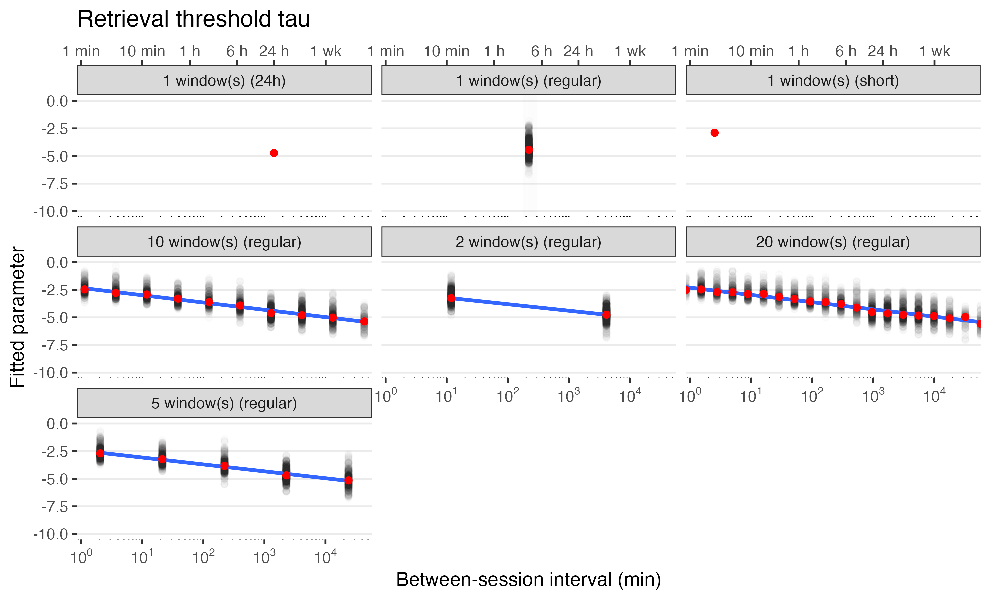

```{r fitted-d}
p_d_all <- ggplot(fits_params, aes(x = geom_mean/60, y = d)) +
  facet_wrap(~ paste0(n_windows, " window(s) (", window_type, ")")) +
  geom_point(alpha = .01) +
  geom_smooth(data = fit_all_avg, method = "lm", se = FALSE, formula = y ~ x) +
  geom_point(data = fit_all_avg, colour = "red") +
  plot_timescales() +
  labs(x = "Between-session interval (min)", y = "Fitted parameter", title = "Decay d")

ggsave(here("output", "d_fit_all.png"), p_d_all, width = 10, height = 6)
```

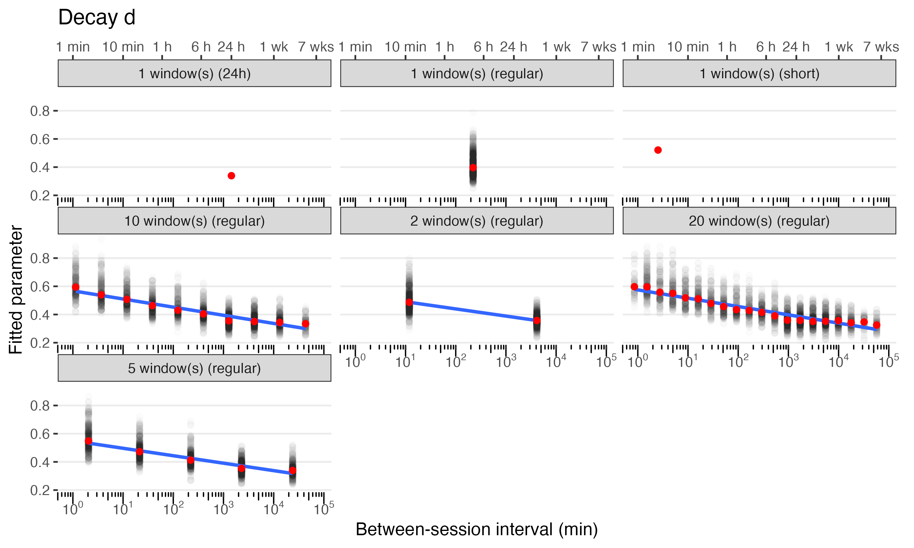

```{r fitted-h}
p_h_all <- ggplot(fits_params, aes(x = geom_mean/60, y = h)) +
  facet_wrap(~ paste0(n_windows, " window(s) (", window_type, ")")) +
  geom_point(alpha = .01) +
  geom_smooth(data = fit_all_avg, method = "lm", se = FALSE, formula = y ~ x) +
  geom_point(data = fit_all_avg, colour = "red") +
  plot_timescales() +
  scale_y_log10() +
  labs(x = "Between-session interval (min)", y = "Fitted parameter", title = "Scaling factor h")

ggsave(here("output", "h_fit_all.png"), p_h_all, width = 10, height = 6)
```

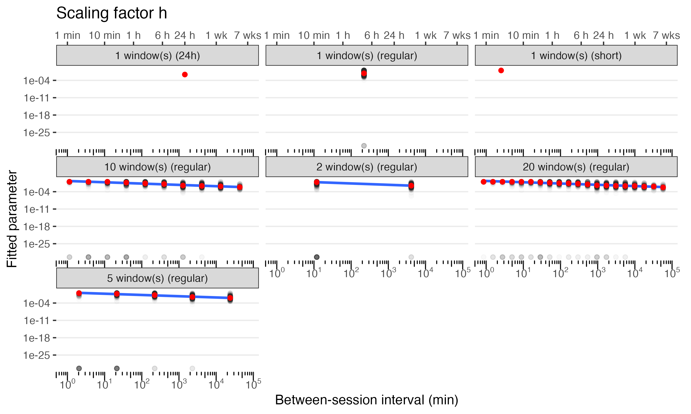

```{r fitted-h-filtered}
p_h_filt_all <- ggplot(fits_params[h >= 1e-15], aes(x = geom_mean/60, y = h)) +
  facet_wrap(~ paste0(n_windows, " window(s) (", window_type, ")")) +
  geom_point(alpha = .01) +
  geom_smooth(data = fit_all_avg, method = "lm", se = FALSE, formula = y ~ x) +
  geom_point(data = fit_all_avg, colour = "red") +
  plot_timescales() +
  scale_y_log10() +
  labs(x = "Between-session interval (min)", y = "Fitted parameter", title = "Scaling factor h (h >= 1e-15)")

ggsave(here("output", "h_fit_all_filtered.png"), p_h_filt_all, width = 10, height = 6)
```

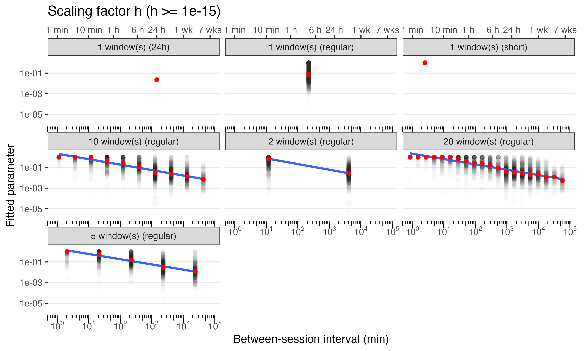
Create a pretty version of the 20-bin parameter plots.
```{r}
plot_parameter <- function(d_parameter,
                           parameter_name = "",
                           n_w = 1,
                           log_x = TRUE,
                           log_y = FALSE,
                           print_plot = TRUE) {
  
  # Calculate R-squared
  x <- d_parameter[n_windows == n_w, geom_mean]/60
  y <- d_parameter[n_windows == n_w, parameter]
  if (log_x) x <- log(x)
  if (log_y) y <- log(y)
  
  m <- lm(y ~ x)

  eq <- substitute(parameter_name == a-b %*% ln(italic(t)), 
                   list(parameter_name = parameter_name,
                        a = format(unname(coef(m)[1]), digits = 3),
                        b = format(abs(unname(coef(m)[2])), digits = 3)))
  
  eq <- as.character(as.expression(eq))
  
  rsq <- paste("R^2 ==", scales::number(summary(m)$r.squared, accuracy = .01))

  p <- ggplot() +
    # Window background
    geom_rect(data = window_range[n_windows == n_w],
              aes(xmin = start/60, xmax = ifelse(is.na(shift(start, -1)), end, shift(start, -1))/60,
                  ymin = ifelse(log_y, 0, -Inf), ymax = Inf, alpha = as.factor(window)),
              fill = window_col) +
    # Regression line
    geom_smooth(data = d_parameter[n_windows == n_w], 
                aes(y = parameter, x = geom_mean/60), 
                method = "lm", formula = y ~ x, 
                colour = pred_col, fill = pred_col) +
    # Parameter values
    geom_point(data = d_parameter[n_windows == n_w],
               aes(y = parameter, x = geom_mean/60)) +
    scale_alpha_manual(values = rep(c(.1, .25), ceiling(n_w/2))) +
    # R-squared
    geom_label(aes(x = Inf, y = Inf, label = rsq),
              label.padding = unit(.5, "lines"),
              label.size = NA,
              fill = NA,
              hjust = "inward", vjust = "inward",
              parse = TRUE) +
    geom_label(aes(x = ifelse(log_x, 0, -Inf), y = ifelse(log_y, 0, -Inf), label = eq),
              label.padding = unit(.5, "lines"),
              label.size = NA,
              fill = NA,
              hjust = "inward", vjust = "inward",
              parse = TRUE) +
    # Plot setup
    guides(alpha = "none") +
    labs(x = "Between-session interval (minutes)",
         y = "Fitted parameter") +
    scale_x_continuous(sec.axis = sec_axis(~.x, breaks = label_x, labels = label_txt)) +
    coord_cartesian(xlim = c(window_range[1, start], window_range[1, end])/60,
                    ylim = c(min(y) - .1*diff(range(y)), max(y) + .1*diff(range(y))),
                    clip = "off") +
    theme_bw(base_size = 14) +
    theme(plot.margin = margin(7, 14, 7, 7),
          panel.grid.major.x = element_blank(),
          panel.grid.minor = element_blank(),
          panel.border = element_blank(),
          axis.text.x.top = element_text(margin = margin(b = 8)))
  
  
  # Transform scales if required
  if (log_x) {
    p <- p +
      scale_x_log10(
        breaks = scales::trans_breaks("log10", function(x) 10^x),
        labels = scales::trans_format("log10", scales::math_format(10^.x)),
        expand = c(0, 0),
        sec.axis = sec_axis(~.x, breaks = label_x, labels = label_txt)
      ) +
      annotation_logticks(sides = "b", outside = T) +
      theme(axis.text.x = element_text(margin = margin(t = 8)))
  }
  
  if (log_y) {
    p <- p +
      scale_y_log10() +
      annotation_logticks(sides = "l", outside = T) +
      coord_cartesian(xlim = c(window_range[1, start], window_range[1, end])/60,
                      ylim = c(1e-3, 1.25),
                      clip = "off") +
      theme(axis.text.y = element_text(margin = margin(r = 8)))
  }

  if (print_plot) print(p)
  return (p)

}
```

```{r}
fit_tau_avg <- copy(fit_all_avg)
setnames(fit_tau_avg, "tau", "parameter")

p_tau_time <- plot_parameter(d_parameter = fit_tau_avg[window_type == "regular"],
                             parameter_name = quote(tau),
                             n_w = 20,
                             print_plot = FALSE)

fit_d_avg <- copy(fit_all_avg)
setnames(fit_d_avg, "d", "parameter")

p_d_time <- plot_parameter(d_parameter = fit_d_avg[window_type == "regular"],
                           parameter_name = quote(italic(d)),
                           n_w = 20,
                           print_plot = FALSE)

fit_h_avg <- copy(fit_all_avg)
setnames(fit_h_avg, "h", "parameter")

p_h_time <- plot_parameter(d_parameter = fit_h_avg[window_type == "regular"],
                           parameter_name = quote(ln(italic(h))),
                           log_y = TRUE,
                           n_w = 20,
                           print_plot = FALSE)
```


# Predict test set data

Use the fitted parameters to predict recall on the held-out folds.
```{r}
predict_recall_cv <- function(fits_test, fits_params) {
  
  # Split test set by fold x window x subset
  test_by_fold_window <- split(fits_test, by = c("fold", "window_id", "subset"))
  
  future_map(test_by_fold_window, function(d_test_fw) {
    
    current_fold <- d_test_fw[1, fold]
    current_window_id <- d_test_fw[1, window_id]
    current_subset <- d_test_fw[1, subset]
    
    # Get aggregated fitted params for this fold x window
    # (one row per sub_label, or one row total for "all")
    fit_window <- fits_params[subset == current_subset & fold == current_fold & window_id == current_window_id] 
    
    if (nrow(fit_window) == 0) return(NULL)
    
    extrapolate <- fit_window[1, window_type %in% c("short", "24h")]
    
    # --- Build sequence list for test observations ---
    d_window <- copy(d_test_fw)
    d_window[, sequence := 1:.N]
    if (extrapolate) d_window[, window := 1L]
    d_window <- d_f[d_window[, .(id, sequence, window)], on = "id"]
    d_window_seqs <- generate_seq_list(d_window)
    
    # --- Look up fitted parameters per test sequence ---
    if (current_subset == "all") {
      # Single parameter set for all sequences in this fold x window
      fitted_tau <- fit_window[1, tau]
      fitted_d <- fit_window[1, d]
      fitted_h <- fit_window[1, h]
    } else {
      # One parameter set per sub_label; match by sub_label of each test sequence
      fitted_tau <- fit_window[match(d_test_fw$sub_label, fit_window$sub_label), tau]
      fitted_d <- fit_window[match(d_test_fw$sub_label, fit_window$sub_label), d]
      fitted_h <- fit_window[match(d_test_fw$sub_label, fit_window$sub_label), h]
    }
    
    correct <- map_int(d_window_seqs, ~.$correct)
    time_between <- map_dbl(d_window_seqs, ~.$time_between)
    seq_ids <- map_chr(d_window_seqs, ~.$id)
    
    # --- Generate predictions from each fitted parameter ---
    
    # Prediction from fitted tau (d and h fixed at defaults)
    ac_tau <- map_dbl(d_window_seqs, function(x) {
      activation(x$time_within, x$time_between, model_params$h, model_params$decay)
    })
    p_recall_tau <- p_recall(ac_tau, fitted_tau, model_params$s)
    
    # Prediction from fitted d (tau and h fixed at defaults)
    ac_d <- map2_dbl(d_window_seqs, fitted_d, function(x, d) {
      activation(x$time_within, x$time_between, model_params$h, d)
    })
    p_recall_d <- p_recall(ac_d, model_params$tau, model_params$s)
    
    # Prediction from fitted h (tau and d fixed at defaults)
    ac_h <- map2_dbl(d_window_seqs, fitted_h, function(x, h) {
      activation(x$time_within, x$time_between, h, model_params$decay)
    })
    p_recall_h <- p_recall(ac_h, model_params$tau, model_params$s)
    
    # --- Assemble output ---
    # Join window-level fit info onto per-sequence predictions by sub_label
    predictions <- data.table(
      id           = seq_ids,
      sub_label    = d_test_fw$sub_label,
      fold         = current_fold,
      time_between = time_between,
      correct      = correct,
      p_recall_tau = p_recall_tau,
      p_recall_d   = p_recall_d,
      p_recall_h   = p_recall_h
    )
    
    # Add window metadata (one row per sub_label in fit_window)
    window_meta <- fit_window[, .(subset, sub_label, window_id, n_windows, window, geom_mean, window_type)]
    predictions <- window_meta[predictions, on = .(sub_label)]
    
    predictions
    
  }, .progress = FALSE) |>
    discard(is.null) |>
    rbindlist()
}
```

Make predictions for all folds and variants of the model, and save to file.
(Set `use_saved_predictions` to TRUE to try to load previous predictions from file.)
```{r}
use_saved_predictions <- TRUE

subsets <- c("all", "by_learner", "by_practice")

pred_paths <- rbindlist(lapply(subsets, function(s) {
  data.table(
    subset    = s,
    pred_path = here("data", paste0("pred_cv_", s, ".csv"))
  )
}))

preds_cv <- rbindlist(lapply(subsets, function(s) {
  p <- pred_paths[subset == s]
  
  if (!use_saved_predictions | !file.exists(p$pred_path)) {
    pred <- predict_recall_cv(
      fits_test   = fits_test[subset == s],
      fits_params = fits_params[subset == s]
    )
    fwrite(pred, p$pred_path)
    pred
  } else {
    fread(p$pred_path)
  }
}))
```

Evaluate the predictions on the hold-out fold by computing the log-likelihood of the observed data under the predicted probabilities.
```{r}
compute_cv_ll <- function(preds_cv, epsilon = 1e-6) {
  
  # Clip predictions to [epsilon, 1 - epsilon] to avoid log(0)
  preds_cv[, p_recall_tau := pmax(epsilon, pmin(1 - epsilon, p_recall_tau))]
  preds_cv[, p_recall_d   := pmax(epsilon, pmin(1 - epsilon, p_recall_d))]
  preds_cv[, p_recall_h   := pmax(epsilon, pmin(1 - epsilon, p_recall_h))]
  
  # Compute per-observation log-likelihood for each parameter
  preds_cv[, ll_tau := correct * log(p_recall_tau) + (1 - correct) * log(1 - p_recall_tau)]
  preds_cv[, ll_d   := correct * log(p_recall_d)   + (1 - correct) * log(1 - p_recall_d)]
  preds_cv[, ll_h   := correct * log(p_recall_h)   + (1 - correct) * log(1 - p_recall_h)]
  
  # Summed CV log-likelihood per configuration and fold
  ll_per_fold <- preds_cv[, .(
    ll_tau = sum(ll_tau, na.rm = TRUE),
    ll_d   = sum(ll_d,   na.rm = TRUE),
    ll_h   = sum(ll_h,   na.rm = TRUE),
    n      = .N
  ), by = .(subset, window_type, n_windows, fold)]
  
  # Summed CV log-likelihood per configuration (across all folds)
  ll_total <- preds_cv[, .(
    ll_tau = sum(ll_tau, na.rm = TRUE),
    ll_d   = sum(ll_d,   na.rm = TRUE),
    ll_h   = sum(ll_h,   na.rm = TRUE),
    n      = .N
  ), by = .(subset, window_type, n_windows)]
  
  list(
    per_fold = ll_per_fold,
    total    = ll_total
  )
}

cv_ll <- compute_cv_ll(copy(preds_cv))
```

## Model comparison
```{r}
# --- Reshape to long format ---
ll_long <- melt(
  cv_ll$total,
  id.vars      = c("subset", "window_type", "n_windows", "n"),
  measure.vars = c("ll_tau", "ll_d", "ll_h"),
  variable.name = "parameter",
  value.name    = "ll"
)

# Clean up labels
ll_long[, parameter := factor(parameter,
  levels = c("ll_tau", "ll_d", "ll_h"),
  labels = c("tau", "d", "h")
)]

ll_long[, subset := factor(subset,
  levels = c("all", "by_learner", "by_practice"),
  labels = c("All data", "By learner", "By practice")
)]

ll_long[, window_type := factor(window_type,
  levels = c("regular", "short", "24h"),
  labels = c("Regular", "Short (0–10 min)", "24h")
)]

ll_long[, config := factor(
  ifelse(window_type == "Regular", as.character(n_windows), as.character(window_type)),
  levels = c("1", "2", "5", "10", "20", "Short (0–10 min)", "24h")
)]

ll_best <- ll_long[window_type == "Regular", .SD[which.max(ll)], by = .(window_type, parameter, subset)]

# --- Shared theme ---
theme_cv <- theme_bw(base_size = 14) +
  theme(plot.margin = margin(7, 14, 7, 7),
          panel.grid.major.x = element_blank(),
          panel.grid.minor = element_blank(),
          panel.border = element_blank(),
          axis.text.x = element_text(margin = margin(t = 8)),
          axis.text.x.top = element_text(margin = margin(b = 8)))

colour_scale <- scale_colour_manual(
  values = c("tau" = "#E69F00", "d" = "#0072B2", "h" = "#009E73"),
  labels = c("tau" = expression(tau), "d" = "d", "h" = "h"),
  name   = "Parameter"
  # guide  = guide_legend(override.aes = list(linetype = 0, shape = 16))
)

# --- Plot 1: regular windows ---
p_ll_regular <- ggplot(
  ll_long[window_type == "Regular"],
  aes(x = config, y = ll, colour = parameter, group = parameter)
) +
  geom_line(linewidth = 0.8) +
  geom_point(data = ll_best, size = 5, shape = 1, show.legend = FALSE) +
  geom_point(size = 2.5) +
  facet_wrap(~subset, ncol = 3) +
  colour_scale +
  labs(
    x     = "Number of between-session interval bins",
    y     = "Held-out log-likelihood"
  ) +
  theme_cv

# --- Plot 2: extrapolation windows ---
p_ll_extrap <- ggplot(
  ll_long[window_type != "Regular"],
  aes(x = config, y = ll, colour = parameter, group = parameter)
) +
  geom_line(linewidth = 0.8) +
  geom_point(size = 2.5) +
  facet_wrap(~subset, ncol = 3) +
  colour_scale +
  scale_x_discrete(labels = c("Short (0–10 min)" = "Short\n(0–10 min)", "24h" = "24h")) +
  labs(
    x     = "Between-session interval",
    y     = "Held-out log-likelihood"
  ) +
  theme_cv
```

## Visualise fit


```{r plot-comparison}
plot_comparison <- function (d_model,
                             d_last,
                             window_range,
                             n_w = 1,
                             label_pos = list(data = list(x = 35000, y = .54), 
                                              model = list(x = 35000, y = .46)),
                             print_plot = TRUE) {
  
  
  plot_dodge <- function(y, dodge = .1) {
    return (y * (1 + dodge) - dodge/2)
  }
  
  p <- ggplot() +
    # Window background
    geom_rect(data = window_range[n_windows == n_w],
              aes(xmin = start/60, xmax = ifelse(is.na(shift(start, -1)), end, shift(start, -1))/60,
                  ymin = -Inf, ymax = Inf, alpha = as.factor(window)),
              fill = window_col) +
    # Jittered observations along edges
    geom_point(data = d_last, 
               aes(x = time_between/60, y = plot_dodge(correct, .05)),
               position = position_jitter(width = 0, height = .025, seed = 123),
               colour = obs_col, size = .001, pch = ".", alpha = .1) +
    # Predictions of the model
    # geom_point(data = d_model, 
    #            aes(x = time_between/60, y = pred_correct),
    #            colour = pred_col, alpha = .01) +
    # GAM: data
    geom_smooth(data = d_last,
                aes(x = time_between/60, y = correct),
                method = "gam", formula = y ~ s(x, bs = "cs"),
                colour = obs_col, lty = 1, lwd = 1) +
    # GAM: model
    geom_smooth(data = d_model, 
                aes(x = time_between/60, y = pred_correct),
                method = "gam", formula = y ~ s(x, bs = "cs"), 
                colour = pred_col, fill = pred_col, lty = 1, lwd = .75) +
    # Labels
    annotate("text", x = label_pos$data$x, y = label_pos$data$y,
             size = 4.05,
             label = "Data", colour = obs_col) +
    annotate("text", x = label_pos$model$x, y = label_pos$model$y,
             size = 4.05,
             label = "Model", colour = pred_col) +
    # Plot setup
    scale_x_log10(
      breaks = scales::trans_breaks("log10", function(x) 10^x),
      labels = scales::trans_format("log10", scales::math_format(10^.x)),
      expand = c(0, 0),
      sec.axis = sec_axis(~.x, breaks = label_x, labels = label_txt)
    ) +
    scale_y_continuous(breaks = seq(0, 1, by = .25), labels = scales::percent_format()) +
    scale_alpha_manual(values = rep(c(.1, .25), ceiling(n_w/2))) +
    guides(colour = "none",
           alpha = "none") +
    labs(x = "Between-session interval (minutes)",
         y = "Response accuracy") +
    annotation_logticks(sides = "b", outside = T) +
    coord_cartesian(ylim = c(0, 1), xlim = c(window_range[1, start], window_range[.N, end])/60, clip = "off") +
    theme_bw(base_size = 14) +
    theme(plot.margin = margin(7, 14, 7, 7),
          panel.grid.major.x = element_blank(),
          panel.grid.minor = element_blank(),
          panel.border = element_blank(),
          axis.text.x = element_text(margin = margin(t = 8)),
          axis.text.x.top = element_text(margin = margin(b = 8)))
  
  if (print_plot) print(p)
  return (p)
    
}
```

### Regular fit

#### Window splits

Tau fitted to various window splits:
```{r}
pred_tau <- copy(preds_cv)
setnames(pred_tau, "p_recall_tau", "pred_correct")

p_tau_windows <- map(n_windows, function (n_w) {
  p <- plot_comparison(d_model = pred_tau[subset == "all" & n_windows == n_w & window_type == "regular"], 
                       d_last = pred_tau[subset == "all" & n_windows == n_w & window_type == "regular"],
                       window_range = window_range[n_windows == n_w & window_type == "regular"],
                       n_w = n_w, 
                       label_pos = list(data = list(x = 35000, y = .5), 
                                        model = list(x = 20000, y = .325)))
  return (p)
})
```

Decay fitted to various window splits:
```{r}
pred_d <- copy(preds_cv)
setnames(pred_d, "p_recall_d", "pred_correct")

p_d_windows <- map(n_windows, function (n_w) {
  p <- plot_comparison(d_model = pred_d[subset == "all" & n_windows == n_w & window_type == "regular"], 
                       d_last = pred_d[subset == "all" & n_windows == n_w & window_type == "regular"],
                       window_range = window_range[n_windows == n_w & window_type == "regular"],
                       n_w = n_w, 
                       label_pos = list(data = list(x = 20000, y = .35), 
                                        model = list(x = 35000, y = .55)))
  return (p)
})
```

Scaling factor fitted to various window splits:
```{r}
pred_h <- copy(preds_cv)
setnames(pred_h, "p_recall_h", "pred_correct")

p_h_windows <- map(n_windows, function (n_w) {
  p <- plot_comparison(d_model = pred_h[subset == "all" & n_windows == n_w & window_type == "regular"], 
                       d_last = pred_h[subset == "all" & n_windows == n_w & window_type == "regular"],
                       window_range = window_range[n_windows == n_w & window_type == "regular"],
                       n_w = n_w, 
                       label_pos = list(data = list(x = 20000, y = .35), 
                                        model = list(x = 35000, y = .55)))
  return (p)
})
```

#### Short intervals

Tau fitted to short intervals:
```{r}
p_tau_short <- plot_comparison(d_model = pred_tau[subset == "all" & window_type == "short"], 
                               d_last = pred_tau[subset == "all" & window_type == "short"], 
                               window_range = window_range[n_windows == 1 & window_type == "regular"], 
                               n_w = 1, 
                               label_pos = list(data = list(x = 35000, y = .5), 
                                                model = list(x = 35000, y = .08)),
                               print_plot = FALSE) +
  geom_rect(aes(xmin  = window_range[window_type == "short", start/60], xmax = window_range[window_type == "short", end/60], ymin = -0.05, ymax = 1.05), fill = section_col, alpha = .25)

ggsave(here("output", "tau_fit_short.png"), p_tau_short, width = 6, height = 4)
```

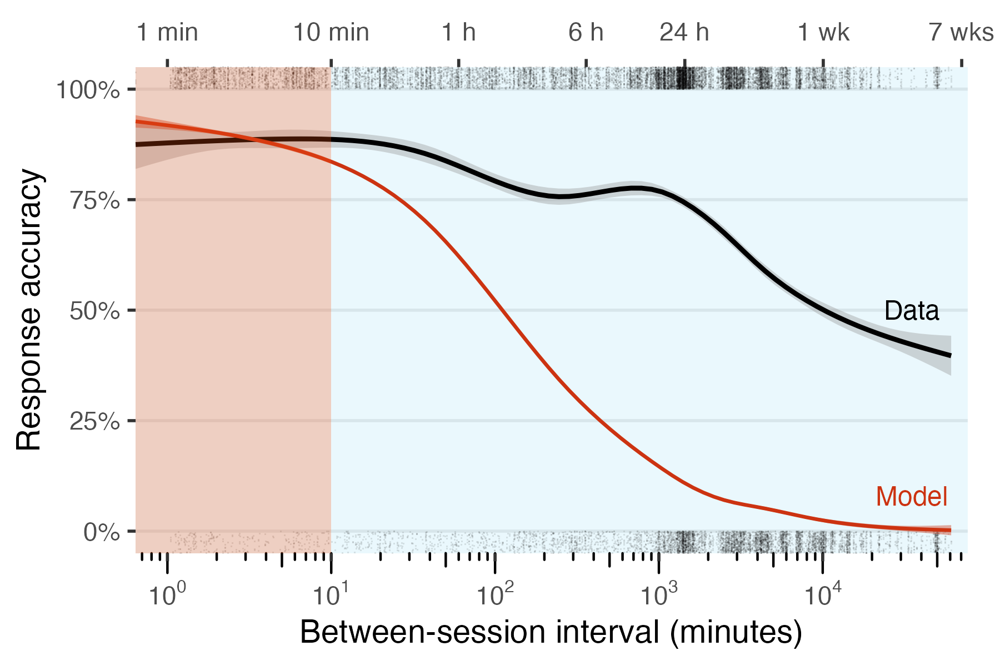

Decay fitted to short intervals:
```{r}
p_d_short <- plot_comparison(d_model = pred_d[subset == "all" & window_type == "short"], 
                             d_last = pred_d[subset == "all" & window_type == "short"], 
                             window_range = window_range[n_windows == 1 & window_type == "regular"], 
                             n_w = 1, 
                             label_pos = list(data = list(x = 35000, y = .5), 
                                              model = list(x = 35000, y = .08)),
                             print_plot = FALSE) +
  geom_rect(aes(xmin  = window_range[window_type == "short", start/60], xmax = window_range[window_type == "short", end/60], ymin = -0.05, ymax = 1.05), fill = section_col, alpha = .25)

ggsave(here("output", "d_fit_short.png"), p_d_short, width = 6, height = 4)
```

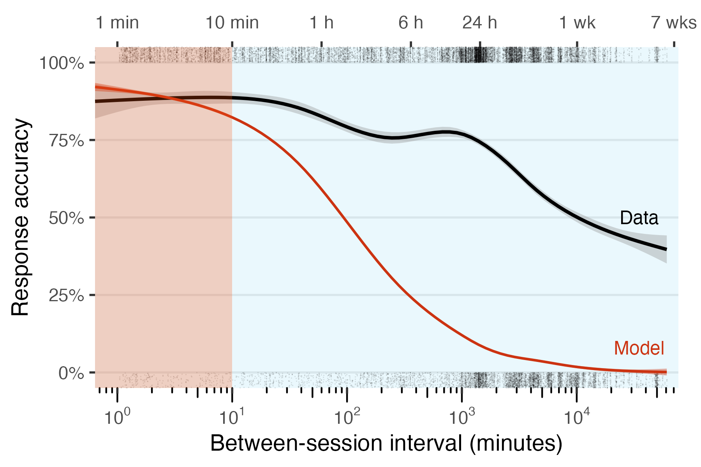

Scaling factor fitted to short intervals:
```{r}
p_h_short <- plot_comparison(d_model = pred_h[subset == "all" & window_type == "short"], 
                             d_last = pred_h[subset == "all" & window_type == "short"], 
                             window_range = window_range[n_windows == 1 & window_type == "regular"], 
                             n_w = 1, 
                             label_pos = list(data = list(x = 35000, y = .5), 
                                              model = list(x = 35000, y = .08)),
                             print_plot = FALSE) +
  geom_rect(aes(xmin  = window_range[window_type == "short", start/60], xmax = window_range[window_type == "short", end/60], ymin = -0.05, ymax = 1.05), fill = section_col, alpha = .25)

ggsave(here("output", "h_fit_short.png"), p_h_short, width = 6, height = 4)
```

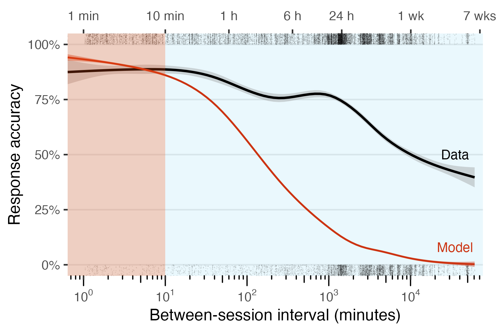

#### 24h intervals

Tau fitted to 24 h:
```{r}
p_tau_24h <- plot_comparison(d_model = pred_tau[subset == "all" & window_type == "24h"], 
                             d_last = pred_tau[subset == "all" & window_type == "24h"], 
                             window_range = window_range[n_windows == 1 & window_type == "regular"], 
                             n_w = 1, 
                             label_pos = list(data = list(x = 35000, y = .5), 
                                              model = list(x = 5000, y = .29)),
                             print_plot = FALSE) +
  geom_rect(aes(xmin  = window_range[window_type == "24h", start/60], xmax = window_range[window_type == "24h", end/60], ymin = -0.05, ymax = 1.05), fill = section_col, alpha = .25)

ggsave(here("output", "tau_fit_24h.png"), p_tau_24h, width = 6, height = 4)
```

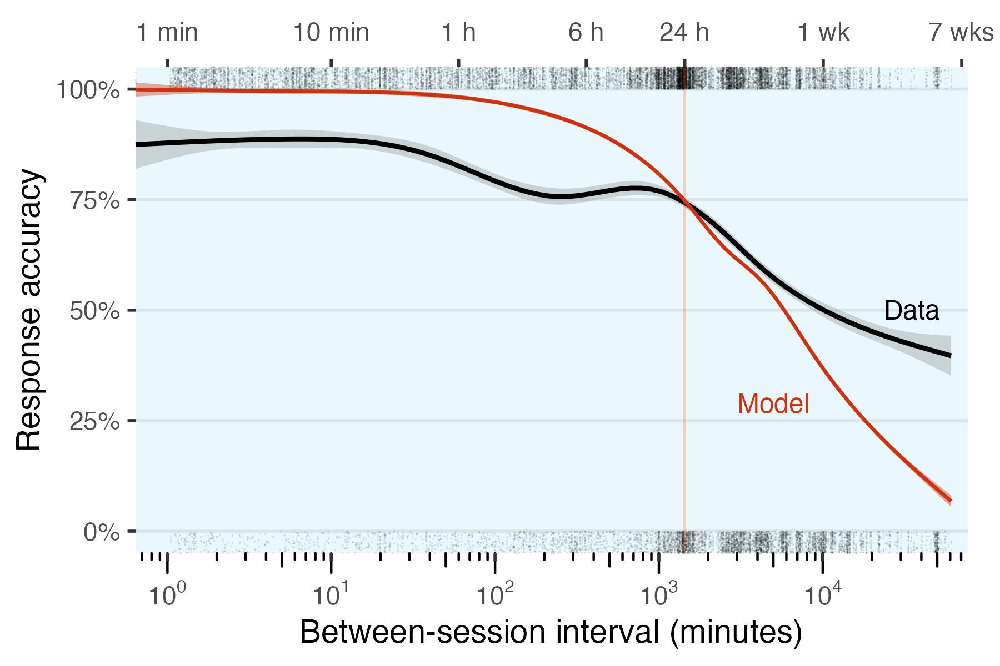

Decay fitted to 24 h:
```{r}
p_d_24h <- plot_comparison(d_model = pred_d[subset == "all" & window_type == "24h"], 
                           d_last = pred_d[subset == "all" & window_type == "24h"], 
                           window_range = window_range[n_windows == 1 & window_type == "regular"], 
                           n_w = 1, 
                           label_pos = list(data = list(x = 35000, y = .5), 
                                            model = list(x = 5000, y = .78)),
                           print_plot = FALSE) +
  geom_rect(aes(xmin  = window_range[window_type == "24h", start/60], xmax = window_range[window_type == "24h", end/60], ymin = -0.05, ymax = 1.05), fill = section_col, alpha = .25)

ggsave(here("output", "d_fit_24h.png"), p_d_24h, width = 6, height = 4)
```

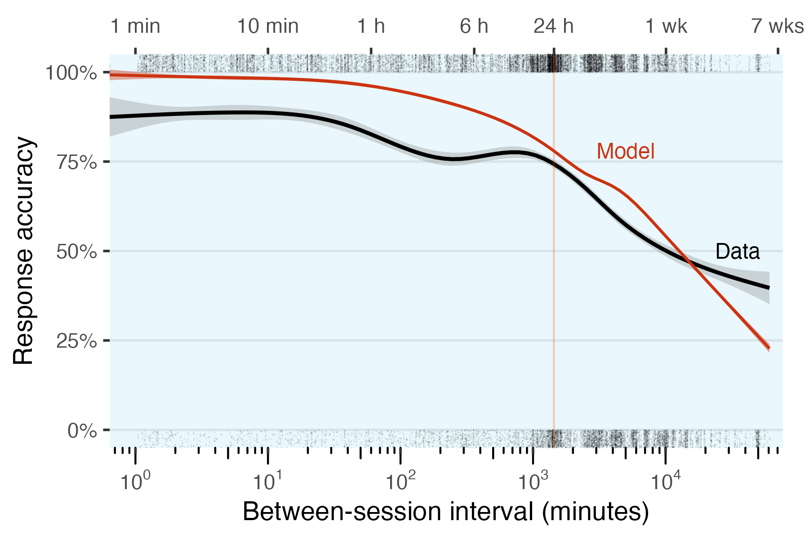

Scaling factor fitted to 24 h:
```{r}
p_h_24h <- plot_comparison(d_model = pred_h[subset == "all" & window_type == "24h"], 
                           d_last = pred_h[subset == "all" & window_type == "24h"], 
                           window_range = window_range[n_windows == 1 & window_type == "regular"], 
                           n_w = 1, 
                           label_pos = list(data = list(x = 35000, y = .5), 
                                            model = list(x = 5000, y = .78)),
                           print_plot = FALSE) +
  geom_rect(aes(xmin  = window_range[window_type == "24h", start/60], xmax = window_range[window_type == "24h", end/60], ymin = -0.05, ymax = 1.05), fill = section_col, alpha = .25)

ggsave(here("output", "h_fit_24h.png"), p_h_24h, width = 6, height = 4)
```

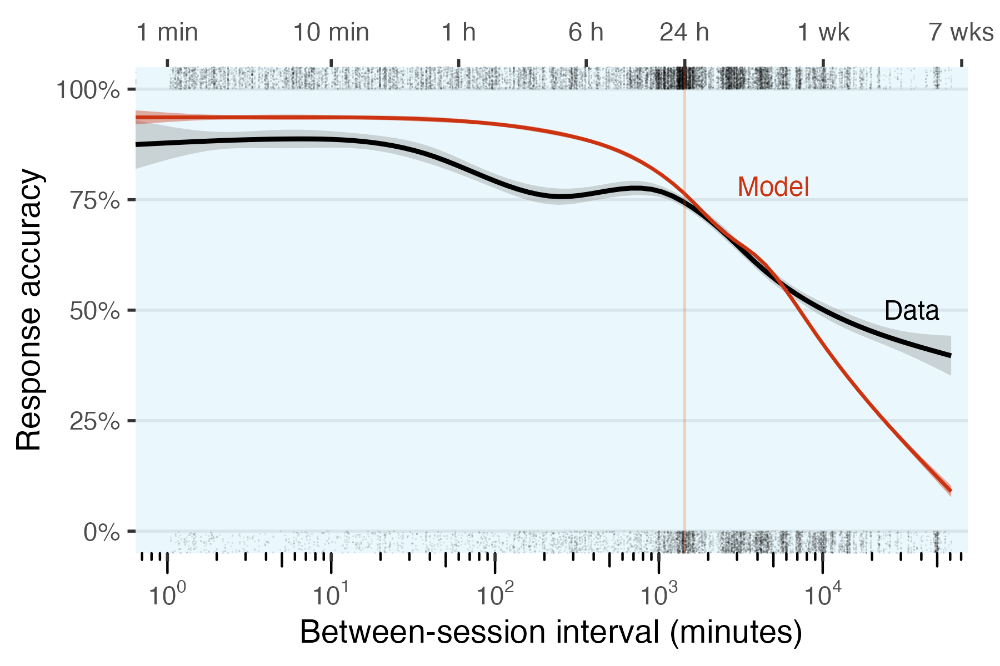

### Fit by learner

At the level of the individual learner, the data is quite sparse.
The plot below provides a sample of learner-specific fits for tau, based on a 20-window split.
The red points are individual predictions (light) and averages (dark); the black points the observed recall.

```{r}
set.seed(0)

pred_20_learner <- copy(preds_cv[subset == "by_learner" & n_windows == 20 & window_type == "regular"])
pred_20_learner_avg <- pred_20_learner[, .(correct = mean(correct), p_recall_tau = mean(p_recall_tau), p_recall_d = mean(p_recall_d), p_recall_h = mean(p_recall_h)), by = .(sub_label, n_windows, window_type, window, geom_mean)]

sample_learners <- sample(unique(pred_20_learner_avg$sub_label), 18, replace = FALSE)

p_tau_fit_by_learner_sample <- ggplot(pred_20_learner[sub_label %in% sample_learners], aes(x = time_between/60, y = p_recall_tau, group = sub_label)) +
  facet_wrap(~ sub_label, ncol = 6) +
  geom_point(aes(y = correct), position = position_jitter(width = 0, height = .025), alpha = .1, colour = "black") +
  geom_point(alpha = .05, colour = "red") +
  geom_point(data = pred_20_learner_avg[sub_label %in% sample_learners], aes( x= geom_mean/60, y = p_recall_tau), colour = "red", size = 2) +
  plot_timescales() +
  guides(colour = "none") +
  labs(x = "Between-session interval (min)", y = "Predicted recall", colour = "Learner")

ggsave(here("output", "tau_fit_by_learner_sample.png"), p_tau_fit_by_learner_sample, width = 6, height = 4)
```

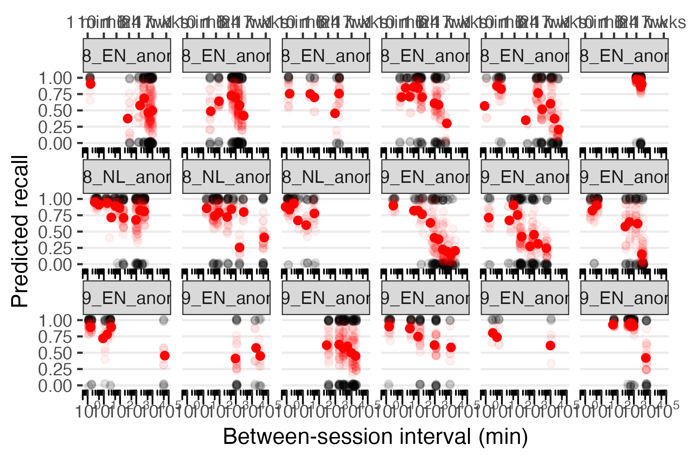

The same plot fot fitted decay:
```{r}
p_d_fit_by_learner_sample <- ggplot(pred_20_learner[sub_label %in% sample_learners], aes(x = time_between/60, y = p_recall_d, group = sub_label)) +
  facet_wrap(~ sub_label, ncol = 6) +
  geom_point(aes(y = correct), position = position_jitter(width = 0, height = .025), alpha = .1, colour = "black") +
  geom_point(alpha = .05, colour = "red") +
  geom_point(data = pred_20_learner_avg[sub_label %in% sample_learners], aes( x= geom_mean/60, y = p_recall_d), colour = "red", size = 2) +
  plot_timescales() +
  guides(colour = "none") +
  labs(x = "Between-session interval (min)", y = "Predicted recall", colour = "Learner")

ggsave(here("output", "d_fit_by_learner_sample.png"), p_d_fit_by_learner_sample, width = 6, height = 4)
```

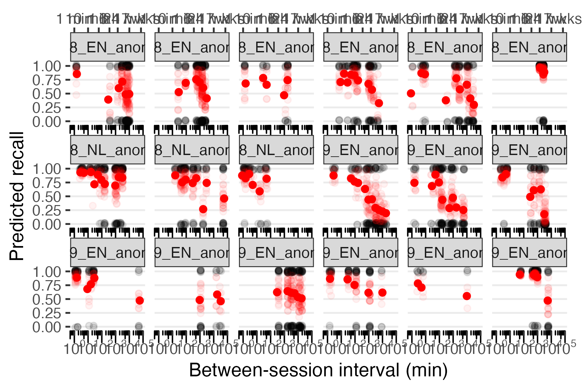


The same plot for fitted scaling factor h:
```{r}
p_h_fit_by_learner_sample <- ggplot(pred_20_learner[sub_label %in% sample_learners], aes(x = time_between/60, y = p_recall_h, group = sub_label)) +
  facet_wrap(~ sub_label, ncol = 6) +
  geom_point(aes(y = correct), position = position_jitter(width = 0, height = .025), alpha = .1, colour = "black") +
  geom_point(alpha = .05, colour = "red") +
  geom_point(data = pred_20_learner_avg[sub_label %in% sample_learners], aes( x= geom_mean/60, y = p_recall_h), colour = "red", size = 2) +
  plot_timescales() +
  guides(colour = "none") +
  labs(x = "Between-session interval (min)", y = "Predicted recall", colour = "Learner")

ggsave(here("output", "h_fit_by_learner_sample.png"), p_h_fit_by_learner_sample, width = 6, height = 4)
```

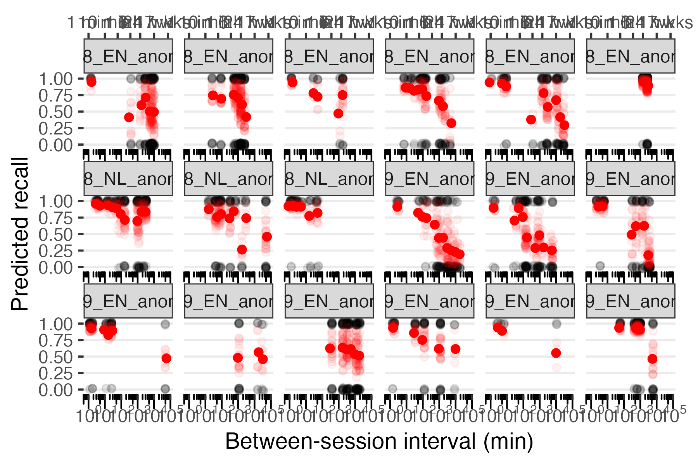

### Fit by practice

Fitted tau by amount of practice:
```{r}
pred_20_practice <- copy(preds_cv[subset == "by_practice" & n_windows == 20 & window_type == "regular"])
pred_20_practice_avg <- pred_20_practice[, .(correct = mean(correct), p_recall_tau = mean(p_recall_tau), p_recall_d = mean(p_recall_d), p_recall_h = mean(p_recall_h)), by = .(sub_label, n_windows, window_type, window, geom_mean)]

p_tau_fit_by_practice <- ggplot(pred_20_practice_avg, aes(x = geom_mean/60, y = p_recall_tau, group = sub_label, colour = sub_label)) +
  facet_wrap(~ sub_label, ncol = 6) +
  geom_line() +
  geom_point(aes(colour = sub_label)) +
  plot_timescales() +
  labs(x = "Between-session interval (min)", y = "Predicted recall", colour = "Trials")

ggsave(here("output", "tau_fit_by_practice.png"), p_tau_fit_by_practice, width = 6, height = 4)
```


Fitted decay by amount of practice:
```{r}
p_d_fit_by_practice <- ggplot(pred_20_practice_avg, aes(x = geom_mean/60, y = p_recall_d, group = sub_label, colour = sub_label)) +
  facet_wrap(~ sub_label, ncol = 6) +
  geom_line() +
  geom_point(aes(colour = sub_label)) +
  plot_timescales() +
  labs(x = "Between-session interval (min)", y = "Predicted recall", colour = "Trials")

ggsave(here("output", "d_fit_by_practice.png"), p_d_fit_by_practice, width = 6, height = 4)
```

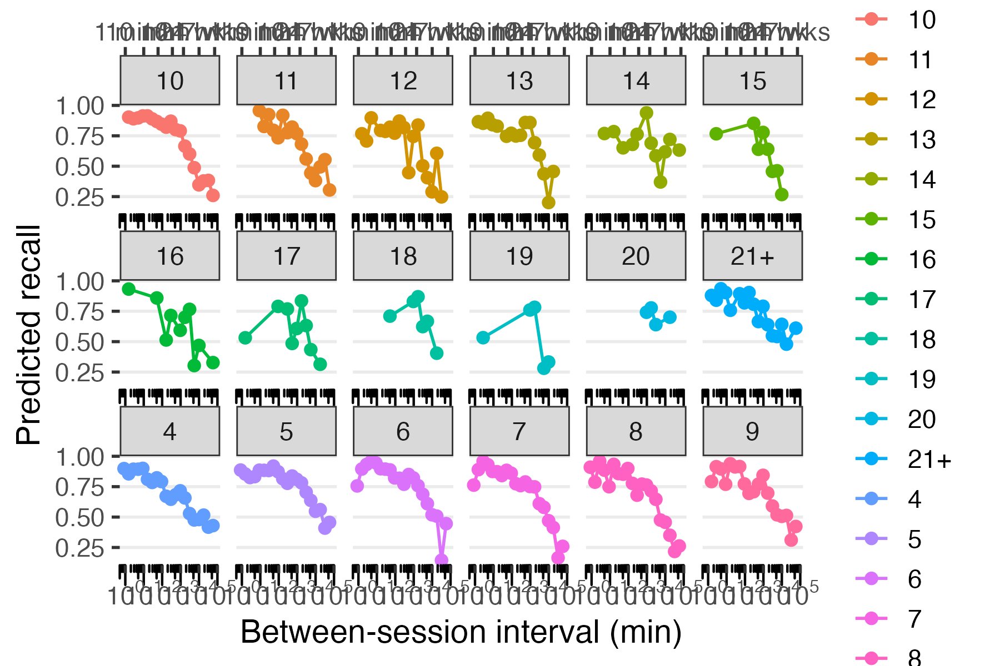

Fitted h by amount of practice:
```{r}
p_h_fit_by_practice <- ggplot(pred_20_practice_avg, aes(x = geom_mean/60, y = p_recall_h, group = sub_label, colour = sub_label)) +
  facet_wrap(~ sub_label, ncol = 6) +
  geom_line() +
  geom_point(aes(colour = sub_label)) +
  plot_timescales() +
  labs(x = "Between-session interval (min)", y = "Predicted recall", colour = "Trials")

ggsave(here("output", "h_fit_by_practice.png"), p_h_fit_by_practice, width = 6, height = 4)
```

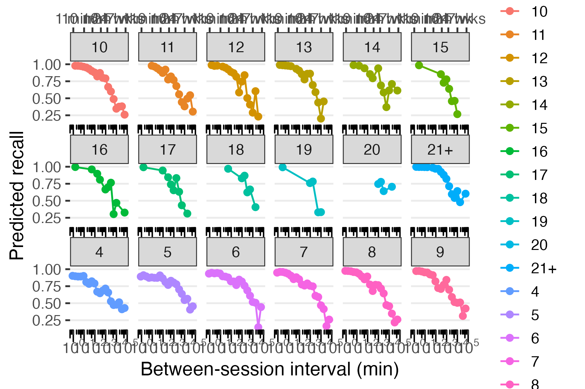

Were some amounts of prior practice more prevalent in certain windows?
Not really, the distribution looks fairly similar across different amounts of practice (facets):
```{r}
p_practice_by_windows <- ggplot(pred_20_practice, aes(x = window, fill = as.factor(window))) +
  facet_wrap(~ sub_label, ncol = 6, scales = "free_y") +
  geom_histogram() +
  labs(x = "Between-session interval (window)", y = "Count", fill = "Window")

ggsave(here("output", "practice_by_windows.png"), p_practice_by_windows, width = 6, height = 4)
```

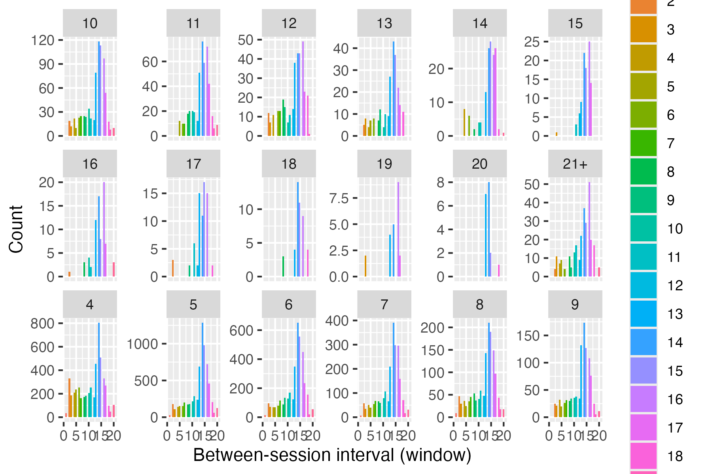

# Visualisations

Model fits (Figure 1):
```{r}
plot_theme <- theme(
  plot.background = element_rect(fill = "white", colour = NA),
  plot.tag.position = c(0, .976),
  plot.tag = element_text(face = "bold", hjust = 0),
  plot.title = element_text(face = "bold", hjust = 0)
)

p_combined <-
  (
    (p_histogram + ggtitle("Interval distribution") + plot_theme) |
    (p_tau_short + ggtitle("Threshold optimised for 0–10 min") + plot_theme)
  ) /
  (
    (p_tau_24h + ggtitle("Threshold optimised for 24h") + plot_theme) |
    (p_tau_windows[[5]] + ggtitle("Interval-dependent threshold") + plot_theme)
  ) /
  (
    (p_d_24h + ggtitle("Decay optimised for 24h") + plot_theme) |
    (p_d_windows[[5]] + ggtitle("Interval-dependent decay") + plot_theme)
  ) /
  (
    (p_h_24h + ggtitle("Scaling factor optimised for 24h") + plot_theme) |
    (p_h_windows[[5]] + ggtitle("Interval-dependent scaling factor") + plot_theme)
  ) +
  plot_annotation(tag_levels = "a")

ggsave(file.path("..", "output", "model_fitting_results_revision.png"), width = 10, height = 15)
```


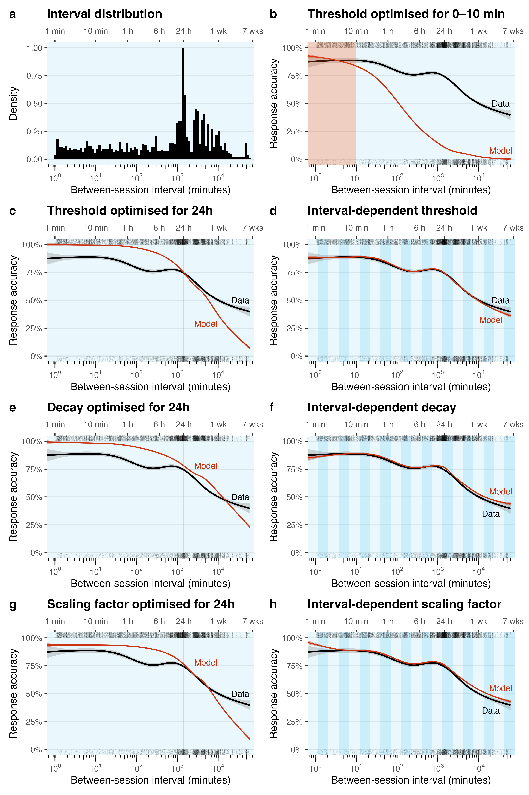

Parameters as a function of the between-session interval (Figure 2):
```{r}
p_combined_time <-
  (
    p_tau_time + ggtitle("Interval-dependent threshold") + plot_theme |
    p_d_time   + ggtitle("Interval-dependent decay") + plot_theme |
    p_h_time   + ggtitle("Interval-dependent h") + plot_theme
  ) +
  plot_annotation(tag_levels = "a")

ggsave(file.path("..", "output", "params_time_revision.png"), width = 12, height = 4)
```

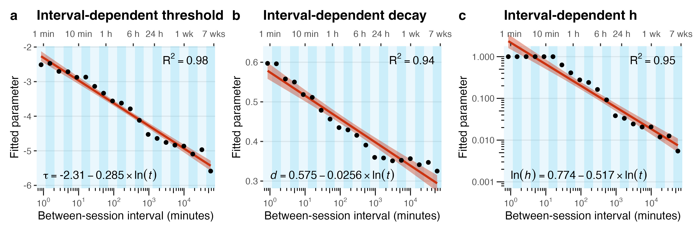

Log-likelihood comparison (Figure 3):
```{r}
p_combined_ll <- p_ll_regular + ggtitle("Interval-dependent fits") + plot_theme + p_ll_extrap + ggtitle("Localised fits") + plot_theme +
  plot_layout(widths = c(3, 1), guides = "collect") +
  plot_annotation(tag_levels = "a")

p_combined_ll <- patchwork:::`&.gg`(p_combined_ll, theme(legend.position = "bottom"))

ggsave(
  plot = p_combined_ll,
  filename = here("output", "cv_log_likelihood.png"),
  width = 12, height = 5
)

```

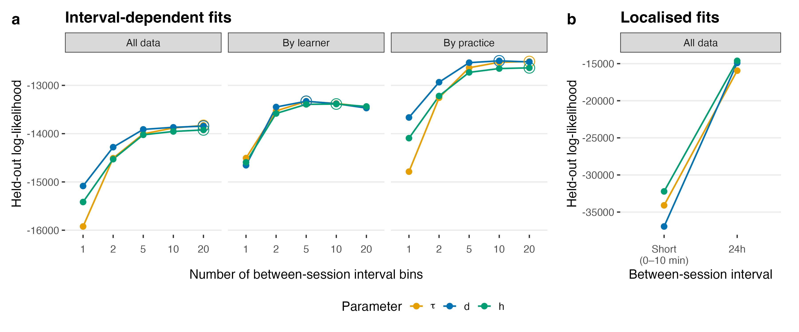

# Session info
```{r}
sessionInfo()
```
