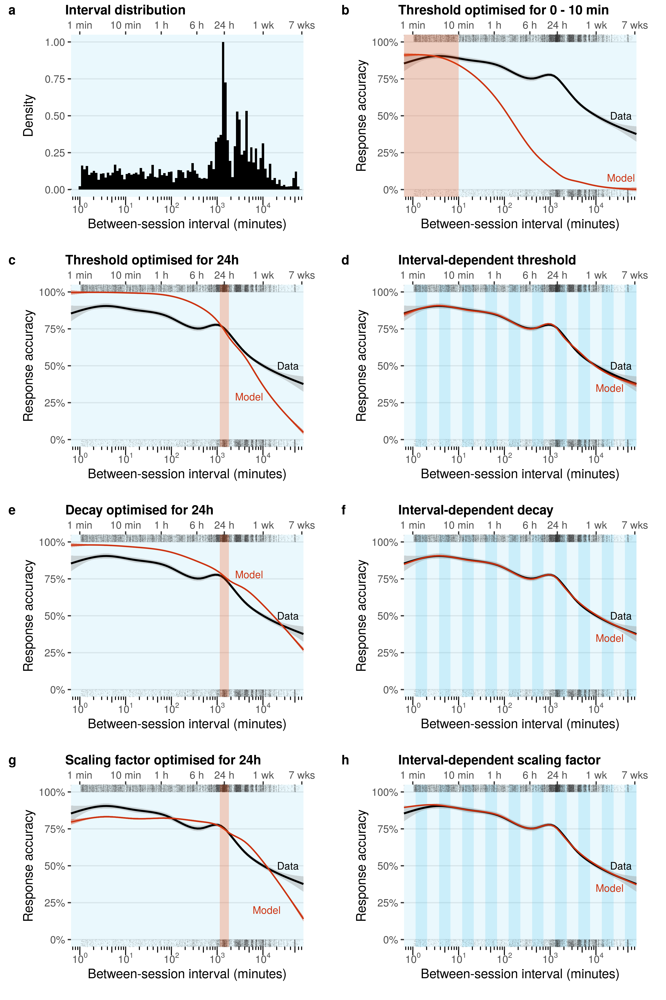

# Outline

This notebook fits various configurations of the memory model to the full set of retrieval practice data.
We vary the following factors:

  - **Subset**: fit all data, fit by learner, fit by amount of practice
  - **Temporal scope**: fit all intervals, only short intervals (0-10 min), only intervals around 24 h, different numbers of time bins
  - **Parameter**: fit retrieval threshold $\tau$, decay $d$, scaling factor $h$
  
Finally, the fitted models are compared in terms of goodness of fit. 
Since the fits use different numbers of parameters and slightly different subsets of the full dataset, the comparison uses average Akaike Information Criterion (AIC) scores.

  
# Setup

```{r setup}
library(data.table)
library(purrr)
library(furrr)
library(here)
library(ggplot2)
library(patchwork)
library(ggtext)

source("00_helper_funs.R")

pred_col <- "#CC3311"    # red
obs_col <- "#000000"     # black
window_col <- "#33BBEE"  # blue
section_col <- "#FD520F" # orange

future::plan("multisession", workers = 8) # Set to desired number of cores

set.seed(0)
```


## Model fitting setup

Set default parameters for the ACT-R memory model.
These values are used whenever a parameter is not fitted.
```{r model-parameters}
model_params <- list(
  tau = -3.0, # Retrieval threshold
  s = .5, # Activation noise
  decay = .5, # Decay
  h = 1 # Scaling factor
)
```


## Data setup

```{r load-data}
d_f <- fread(file.path("..", "data", "cogpsych_data_formatted.csv"))
```

Each user-fact pair has a single learning sequence associated with it, consisting of three or more trials in one session and the first trial in the next session.

Isolate the last observation per learning sequence (i.e., the one after the between-session interval).
This is the observation that the model has to predict, given all prior observations in the sequence.
```{r last-observation}
d_last <- d_f[, .SD[.N], by = id]
```

### Create subsets

Split the data by learner, so that we can fit each learner's data separately.
```{r data-by-learner}
d_f_by_learner <- split(d_f, by = "user")
d_last_by_learner <- split(d_last, by = "user")
```

Split the data by the amount of practice (i.e., the number of trials within a sequence), so that we can fit different amounts of practice separately.
Each sequence consists of at least 4 trials.
To keep things manageable, we group sequences with over 21 trials into a single "21+" bucket.
```{r data-by-practice}
trials_by_id <- d_f[, .(trials = .N), by = .(id)]
trials_by_id[, trials := factor(ifelse(trials < 21, trials, "21+"),
                                levels = c(4:20, "21+"))]

d_f <- d_f[trials_by_id, on = "id"]
d_last <- d_last[trials_by_id, on = "id"]

d_f_by_practice <- split(d_f, by = "trials")
d_last_by_practice <- split(d_last, by = "trials")
```

### Define time bins

Split the data by the between-session interval.
This interval ranges from seconds to weeks.
We vary the number of splits (windows) between 1 (all data in a single window) and 20.
Window ranges are equally sized on a logarithmic scale; the middle of each window is the geometric mean of its boundaries.


```{r window-range}
n_windows <- c(1, 5, 10, 20)

window_range <- map(n_windows, function (n_w) {

  d_windows <- copy(d_last)
  
  if (n_w == 1) {
    d_windows[, window := 1]
  } else {
    d_windows[, window := cut(log(time_between), breaks = n_w, labels = FALSE)]
  }  
  
  # Get the window range(s)
  window_range <- d_windows[, .(start = min(time_between), end = max(time_between)), by = .(window)]
  window_range[, geom_mean := sqrt(start*end), by = .(window)]
  setorder(window_range, window)
  window_range[, window := window]
  window_range[, n_windows := n_w]

  return (window_range)
}) |>
  rbindlist()

window_range[, window_type := "regular"]
```

We'll also include a "short" window (0-10 min) and a "24h" window (23.5-24.5h), to see how well the model performs if fitted only to these intervals.
```{r short-and-24h}
window_range <- rbind(window_range,
                      list(window = 1,
                           start = window_range[, min(start)],
                           end = 10*60,
                           geom_mean = sqrt((window_range[, min(start)]) * (10*60)),
                           n_windows = 1, 
                           window_type = "short"),
                      list(window = 1,
                           start = 23.5*60*60,
                           end = 24.5*60*60,
                           geom_mean = sqrt(23.5*24.5)*60*60,
                           n_windows = 1,
                           window_type = "24h"))

window_range[, window_id := 1:.N]
```

The resulting window ranges:
```{r window-ranges}
window_range
```


The distribution of between-session intervals looks as follows:
```{r}
p_histogram <- ggplot() +
  # Window background
  geom_rect(data = window_range[1], aes(xmin = start/60, xmax = end/60, ymin = -Inf, ymax = Inf), fill = window_col, alpha = .1) +
  # Histogram
  geom_histogram(data = d_last, aes(x = time_between/60, y = ..ncount..), bins = 100, fill = obs_col) +
  # Plot setup
  scale_x_log10(
    breaks = scales::trans_breaks("log10", function(x) 10^x),
    labels = scales::trans_format("log10", scales::math_format(10^.x)),
    expand = c(0, 0),
    sec.axis = sec_axis(~.x, breaks = label_x, labels = label_txt)
  ) +
  scale_y_continuous(breaks = seq(0, 1, by = .25)) +
  labs(x = "Between-session interval (minutes)",
       y = "Density") +
  annotation_logticks(sides = "b", outside = T) +
  coord_cartesian(ylim = c(0, 1), xlim = c(window_range[1, start], window_range[1, end])/60, clip = "off") +
  theme_bw(base_size = 14) +
  theme(plot.margin = margin(7, 14, 7, 7),
        panel.grid.major.x = element_blank(),
        panel.grid.minor = element_blank(),
        panel.border = element_blank(),
        axis.text.x = element_text(margin = margin(t = 8)),
        axis.text.x.top = element_text(margin = margin(b = 8)))

p_histogram

```


# Fit models

Define the model fitting function:
```{r fit-model}
fit_model <- function (subset = c("all", "by_learner", "by_practice")) {

  subset <- match.arg(subset)
  message("Subset: ", subset)

  d_fit <- switch(subset,
                  "all" = list(copy(d_last)),
                  "by_learner" = copy(d_last_by_learner),
                  "by_practice" = copy(d_last_by_practice))
  
  # Iterate over subsets
  fit_out <- map(d_fit, function (d_fit_sub) {
    
    # Iterate over window ranges
    windows <- copy(window_range)
    
    # Only fit the "short" and "24h" windows to all sequences
    if (subset != "all") {
      windows <- windows[window_type == "regular"]
    }
    
    fit_windows <- split(windows, by = "window_id")
    fit_params <- future_map(fit_windows, function (fit_window) {
      
      # Only include sequences within the window bounds: <start, end]
      # But: if this is the first window, do include the lower bound
      if (fit_window$window == 1) {
        d_fit_sub_window <- d_fit_sub[time_between >= fit_window$start & time_between <= fit_window$end]
      } else {
        d_fit_sub_window <- d_fit_sub[time_between > fit_window$start & time_between <= fit_window$end]
      }
      
      # To identify parameters, require at least 3 responses in the window, with a mix of correct and incorrect responses
      if (!(nrow(d_fit_sub_window) >= 3 && between(mean(d_fit_sub_window$correct), 0, 1, incbounds = FALSE))) {
        return (NULL)
      }
      
      # Prepare data
      d_fit_sub_window[, window := fit_window$window]
      d_fit_sub_window[, sequence := 1:.N]
      d_fit_sub_window <- d_f[d_fit_sub_window[, .(id, window, sequence)], on = .(id)]
      d_fit_sub_window_seqs <- generate_seq_list(d_fit_sub_window)
      
      # Fit parameters
      d_fit_sub_window_params <- fit_parameters(d_fit_sub_window_seqs, model_params)
      
      # Add subgroup info and window ID
      sub_label <- switch(subset,
                          "all" = NA,
                          "by_learner" = d_fit_sub[1, user],
                          "by_practice" = d_fit_sub[1, trials])
      
      d_fit_sub_window_params <- cbind(fit_window[, .(window_id)], sub_label, d_fit_sub_window_params)
      
      return (d_fit_sub_window_params)
    })
    
    return (fit_params)
  }, .progress = interactive())
  
  # Only keep window fits with observations
  fit_out <- discard(flatten(fit_out), is.null)
  
  # Convert list to data.table
  fit_out <- rbindlist(fit_out)
  
  # Add window information
  fit_out <- fit_out[window_range, on = .(window_id)][!is.na(id)]

  # Add subset information
  fit_out <- cbind(data.table(subset = subset), fit_out)
  
  return (fit_out)
  
}
```

Fit all variants of the model (note: this can take a while!).
(Set `use_saved_fit` to TRUE to try to load previous fits from file.)
```{r fit}
use_saved_fit <- TRUE

fit_all_path <- here("data", "fit_all.csv")
fit_by_learner_path <- here("data", "fit_by_learner.csv")
fit_by_practice_path <- here("data", "fit_by_practice.csv")

if (!use_saved_fit | !file.exists(fit_all_path)) {
  fit_all <- fit_model(subset = "all")
  fwrite(fit_all, fit_all_path)
} else {
  fit_all <- fread(fit_all_path)
}

if (!use_saved_fit | !file.exists(fit_by_learner_path)) {
  fit_by_learner <- fit_model(subset = "by_learner")
  fwrite(fit_by_learner, fit_by_learner_path)
} else {
  fit_by_learner <- fread(fit_by_learner_path)
}

if (!use_saved_fit | !file.exists(fit_by_practice_path)) {
  fit_by_practice <- fit_model(subset = "by_practice")
  fwrite(fit_by_practice, fit_by_practice_path)
} else {
  fit_by_practice <- fread(fit_by_practice_path)
}

fits <- rbind(fit_all, fit_by_learner, fit_by_practice)
```

### Parametric function
In addition to window-specific fits, we can also include a linear model fit based on the window-wise parameter estimates.
We only do this for the 20-window split.
```{r fit-parametric}
fit_by_window <- fits[n_windows == 20, .(tau = tau[1], d = median(d), h = median(h)), by = .(subset, sub_label, n_windows, window)]
fit_by_window <- fit_by_window[window_range[n_windows == 20, .(n_windows, window, geom_mean)], on = .(n_windows, window)]

# Fit a linear model for each set of parameter estimates
fit_lm <- function (geom_mean, param, log_param = FALSE) {
  if (log_param) {
    param <- log(param)
  }
  m <- lm(param ~ log(geom_mean))
  
  return (m)
}

lm_fit <- fit_by_window[, .(lm_tau = list(fit_lm(geom_mean, tau)),
                                   lm_d = list(fit_lm(geom_mean, d)),
                                   lm_h = list(fit_lm(geom_mean, h, log_param = TRUE))), 
                               by = .(subset, sub_label)]
```


## Fitted parameters

### Regular fit

Here we fit all learners and amounts of practice together.
Red points show the median fitted parameter value in each time bin.
```{r fitted-tau}
fit_all_avg <- fit_all[,  .(tau = median(tau), d = median(d), h = median(h)),  by = .(n_windows, window_type, window, geom_mean)]

p_tau_all <- ggplot(fit_all, aes(x = geom_mean/60, y = tau)) +
  facet_wrap(~ paste0(n_windows, " window(s) (", window_type, ")")) +
  geom_point(alpha = .01) +
  geom_smooth(data = fit_all_avg, method = "lm", se = FALSE, formula = y ~ x) +
  geom_point(data = fit_all_avg, colour = "red") +
  plot_timescales() +
  labs(x = "Between-session interval (min)", y = "Fitted parameter", title = "Retrieval threshold tau")

ggsave(here("output", "tau_fit_all.png"), p_tau_all, width = 10, height = 6)
```


```{r fitted-d}
p_d_all <- ggplot(fit_all, aes(x = geom_mean/60, y = d)) +
  facet_wrap(~ paste0(n_windows, " window(s) (", window_type, ")")) +
  geom_point(alpha = .01) +
  geom_smooth(data = fit_all_avg, method = "lm", se = FALSE, formula = y ~ x) +
  geom_point(data = fit_all_avg, colour = "red") +
  plot_timescales() +
  labs(x = "Between-session interval (min)", y = "Fitted parameter", title = "Decay d")

ggsave(here("output", "d_fit_all.png"), p_d_all, width = 10, height = 6)
```


```{r fitted-h}
p_h_all <- ggplot(fit_all, aes(x = geom_mean/60, y = h)) +
  facet_wrap(~ paste0(n_windows, " window(s) (", window_type, ")")) +
  geom_point(alpha = .01) +
  geom_smooth(data = fit_all_avg, method = "lm", se = FALSE, formula = y ~ x) +
  geom_point(data = fit_all_avg, colour = "red") +
  plot_timescales() +
  scale_y_log10() +
  labs(x = "Between-session interval (min)", y = "Fitted parameter", title = "Scaling factor h")

ggsave(here("output", "h_fit_all.png"), p_h_all, width = 10, height = 6)
```


```{r fitted-h-filtered}
p_h_filt_all <- ggplot(fit_all[h >= 1e-15], aes(x = geom_mean/60, y = h)) +
  facet_wrap(~ paste0(n_windows, " window(s) (", window_type, ")")) +
  geom_point(alpha = .01) +
  geom_smooth(data = fit_all_avg, method = "lm", se = FALSE, formula = y ~ x) +
  geom_point(data = fit_all_avg, colour = "red") +
  plot_timescales() +
  scale_y_log10() +
  labs(x = "Between-session interval (min)", y = "Fitted parameter", title = "Scaling factor h (h >= 1e-15)")

ggsave(here("output", "h_fit_all_filtered.png"), p_h_filt_all, width = 10, height = 6)
```


Create a pretty version of the 20-bin parameter plots.
```{r}
plot_parameter <- function(d_parameter,
                           parameter_name = "",
                           n_w = 1,
                           log_x = TRUE,
                           log_y = FALSE,
                           print_plot = TRUE) {
  
  # Calculate R-squared
  x <- d_parameter[n_windows == n_w, geom_mean]/60
  y <- d_parameter[n_windows == n_w, parameter]
  if (log_x) x <- log(x)
  if (log_y) y <- log(y)
  
  m <- lm(y ~ x)

  eq <- substitute(parameter_name == a-b %*% ln(italic(t)), 
                   list(parameter_name = parameter_name,
                        a = format(unname(coef(m)[1]), digits = 3),
                        b = format(abs(unname(coef(m)[2])), digits = 3)))
  
  eq <- as.character(as.expression(eq))
  
  rsq <- paste("R^2 ==", scales::number(summary(m)$r.squared, accuracy = .01))

  p <- ggplot() +
    # Window background
    geom_rect(data = window_range[n_windows == n_w],
              aes(xmin = start/60, xmax = ifelse(is.na(shift(start, -1)), end, shift(start, -1))/60,
                  ymin = ifelse(log_y, 0, -Inf), ymax = Inf, alpha = as.factor(window)),
              fill = window_col) +
    # Regression line
    geom_smooth(data = d_parameter[n_windows == n_w], 
                aes(y = parameter, x = geom_mean/60), 
                method = "lm", formula = y ~ x, 
                colour = pred_col, fill = pred_col) +
    # Parameter values
    geom_point(data = d_parameter[n_windows == n_w],
               aes(y = parameter, x = geom_mean/60)) +
    scale_alpha_manual(values = rep(c(.1, .25), ceiling(n_w/2))) +
    # R-squared
    geom_label(aes(x = Inf, y = Inf, label = rsq),
              label.padding = unit(.5, "lines"),
              label.size = NA,
              fill = NA,
              hjust = "inward", vjust = "inward",
              parse = TRUE) +
    geom_label(aes(x = ifelse(log_x, 0, -Inf), y = ifelse(log_y, 0, -Inf), label = eq),
              label.padding = unit(.5, "lines"),
              label.size = NA,
              fill = NA,
              hjust = "inward", vjust = "inward",
              parse = TRUE) +
    # Plot setup
    guides(alpha = "none") +
    labs(x = "Between-session interval (minutes)",
         y = "Fitted parameter") +
    scale_x_continuous(sec.axis = sec_axis(~.x, breaks = label_x, labels = label_txt)) +
    coord_cartesian(xlim = c(window_range[1, start], window_range[1, end])/60,
                    ylim = c(min(y) - .1*diff(range(y)), max(y) + .1*diff(range(y))),
                    clip = "off") +
    theme_bw(base_size = 14) +
    theme(plot.margin = margin(7, 14, 7, 7),
          panel.grid.major.x = element_blank(),
          panel.grid.minor = element_blank(),
          panel.border = element_blank(),
          axis.text.x.top = element_text(margin = margin(b = 8)))
  
  
  # Transform scales if required
  if (log_x) {
    p <- p +
      scale_x_log10(
        breaks = scales::trans_breaks("log10", function(x) 10^x),
        labels = scales::trans_format("log10", scales::math_format(10^.x)),
        expand = c(0, 0),
        sec.axis = sec_axis(~.x, breaks = label_x, labels = label_txt)
      ) +
      annotation_logticks(sides = "b", outside = T) +
      theme(axis.text.x = element_text(margin = margin(t = 8)))
  }
  
  if (log_y) {
    p <- p +
      scale_y_log10() +
      annotation_logticks(sides = "l", outside = T) +
      coord_cartesian(xlim = c(window_range[1, start], window_range[1, end])/60,
                      ylim = c(1e-3, 1.25),
                      clip = "off") +
      theme(axis.text.y = element_text(margin = margin(r = 8)))
  }

  if (print_plot) print(p)
  return (p)

}
```

```{r}
fit_tau_avg <- copy(fit_all_avg)
setnames(fit_tau_avg, "tau", "parameter")

p_tau_time <- plot_parameter(d_parameter = fit_tau_avg[window_type == "regular"],
                             parameter_name = quote(tau),
                             n_w = 20,
                             print_plot = FALSE)

fit_d_avg <- copy(fit_all_avg)
setnames(fit_d_avg, "d", "parameter")

p_d_time <- plot_parameter(d_parameter = fit_d_avg[window_type == "regular"],
                           parameter_name = quote(italic(d)),
                           n_w = 20,
                           print_plot = FALSE)

fit_h_avg <- copy(fit_all_avg)
setnames(fit_h_avg, "h", "parameter")

p_h_time <- plot_parameter(d_parameter = fit_h_avg[window_type == "regular"],
                           parameter_name = quote(ln(italic(h))),
                           log_y = TRUE,
                           n_w = 20,
                           print_plot = FALSE)
```


### Fit by learner

The following plot show the parameters that were fitted per learner (specifically: the lines are linear models fitted to the binwise parameter estimates shown as points).
It is clear that nearly all learners exhibit the pattern that is also found at the group-level: as the between-session interval increases, tau/d/h decreases.
In addition, there seem to be individual differences in both intercept and slope, which could indicate that a learner-specific fit could produce better results than a group-level fit.

```{r fitted-tau-by-learner}
fit_by_learner_avg <- fit_by_learner[,  .(.N, tau = mean(tau), d = mean(d), h = mean(h)),  by = .(n_windows, window_type, window, geom_mean, sub_label)]

p_tau_learner <- ggplot(fit_by_learner_avg, aes(x = geom_mean/60, y = tau, colour = sub_label)) +
  facet_wrap(~ paste0(n_windows, " window(s) (", window_type, ")")) +
  geom_point(alpha = .01) +
  geom_smooth(method = "lm", se = FALSE, formula = y ~ x, linewidth = .1) +
  plot_timescales() +
  scale_y_continuous(limits = c(-7, 0)) +
  guides(colour = "none") +
  labs(x = "Between-session interval (min)", y = "Fitted parameter", title = "Retrieval threshold tau by learner")

ggsave(here("output", "tau_fit_by_learner.png"), p_tau_learner, width = 10, height = 6)
```


```{r fitted-d-by-learner}
p_d_learner <- ggplot(fit_by_learner_avg, aes(x = geom_mean/60, y = d, colour = sub_label)) +
  facet_wrap(~ paste0(n_windows, " window(s) (", window_type, ")")) +
  geom_point(alpha = .01) +
  geom_smooth(method = "lm", se = FALSE, formula = y ~ x, linewidth = .1) +
  plot_timescales() +
  guides(colour = "none") +
  labs(x = "Between-session interval (min)", y = "Fitted parameter", title = "Decay d by learner")

ggsave(here("output", "d_fit_by_learner.png"), p_d_learner, width = 10, height = 6)
```


```{r fitted-h-by-learner}
p_h_learner <- ggplot(fit_by_learner_avg, aes(x = geom_mean/60, y = h, colour = sub_label)) +
  facet_wrap(~ paste0(n_windows, " window(s) (", window_type, ")")) +
  geom_point(alpha = .01) +
  geom_smooth(method = "lm", se = FALSE, formula = y ~ x, linewidth = .1) +
  plot_timescales() +
  scale_y_log10() +
  guides(colour = "none") +
  labs(x = "Between-session interval (min)", y = "Fitted parameter", title = "Scaling factor h by learner")

ggsave(here("output", "h_fit_by_learner.png"), p_h_learner, width = 10, height = 6)
```


The plots below show the coefficients from the fitted linear models per learner.
Here we also see that most learners are clustered around similar values.

```{r}
tau_by_learner_lm <- lm_fit[subset == "by_learner", .(map_dfr(lm_tau, function (m) {
  list(intercept = coef(m)[[1]],
       slope = coef(m)[[2]])
}))]

p_tau_learner_lm <- ggplot(tau_by_learner_lm, aes(x = intercept, y = slope)) +
  geom_point(alpha = .25) +
  labs(x = "Intercept", y = "Slope", title = "Retrieval threshold tau by learner")

d_by_learner_lm <- lm_fit[subset == "by_learner", .(map_dfr(lm_d, function (m) {
  list(intercept = coef(m)[[1]],
       slope = coef(m)[[2]])
}))]

p_d_learner_lm <- ggplot(d_by_learner_lm, aes(x = intercept, y = slope)) +
  geom_point(alpha = .25) +
  labs(x = "Intercept", y = "Slope", title = "Decay d by learner")


h_by_learner_lm <- lm_fit[subset == "by_learner", .(map_dfr(lm_h, function (m) {
  list(intercept = coef(m)[[1]],
       slope = coef(m)[[2]])
}))]

p_h_learner_lm <- ggplot(h_by_learner_lm, aes(x = intercept, y = slope)) +
  geom_point(alpha = .25) +
  labs(x = "Intercept", y = "Slope", title = "Scaling factor h by learner")

ggsave(here("output", "tau_fit_by_learner_lm.png"), p_tau_learner_lm, width = 5, height = 4)
ggsave(here("output", "d_fit_by_learner_lm.png"), p_d_learner_lm, width = 5, height = 4)
ggsave(here("output", "h_fit_by_learner_lm.png"), p_h_learner_lm, width = 5, height = 4)
```


### Fit by amount of practice
The plots below show the fitted parameters by amount of practice.

Notice that there seems to be a systematic effect of the amount of practice on the fitted model parameters: more practice in the first session corresponds to a higher retrieval threshold / (initial) decay / scaling factor.
A logical explanation for this could be that the amount of practice is correlated with item difficulty: for instance more difficult items are selected more frequently by the adaptive learning system, and the extra practice of these items leads to higher predicted activation in session 2 (because of additional traces), but their difficulty means that accuracy is not actually higher, which means that a stronger decay is necessary to bridge the gap.

```{r fitted-tau-by-practice}
fit_by_practice_avg <- fit_by_practice[,  .(.N, tau = mean(tau), d = mean(d), h = mean(h)),  by = .(n_windows, window_type, window, geom_mean, sub_label)]

p_tau_practice <- ggplot(fit_by_practice_avg, aes(x = geom_mean/60, y = tau, colour = sub_label)) +
  facet_wrap(~ paste0(n_windows, " window(s) (", window_type, ")")) +
  geom_point(alpha = .01) +
  geom_smooth(method = "lm", se = FALSE, formula = y ~ x, linewidth = .1) +
  plot_timescales() +
  scale_y_continuous(limits = c(-7, 0)) +
  scale_colour_viridis_d() +
  labs(x = "Between-session interval (min)", y = "Fitted parameter", colour = "Trials", title = "Retrieval threshold tau by practice")

ggsave(here("output", "tau_fit_by_practice.png"), p_tau_practice, width = 10, height = 6)
```


```{r fitted-d-by-practice}
p_d_practice <- ggplot(fit_by_practice_avg, aes(x = geom_mean/60, y = d, colour = sub_label)) +
  facet_wrap(~ paste0(n_windows, " window(s) (", window_type, ")")) +
  geom_point(alpha = .01) +
  geom_smooth(method = "lm", se = FALSE, formula = y ~ x, linewidth = .1) +
  plot_timescales() +
  scale_colour_viridis_d() +
  labs(x = "Between-session interval (min)", y = "Fitted parameter", colour = "Trials", title = "Decay d by practice")

ggsave(here("output", "d_fit_by_practice.png"), p_d_practice, width = 10, height = 6)
```


```{r fitted-h-by-practice}
p_h_practice <- ggplot(fit_by_practice_avg, aes(x = geom_mean/60, y = h, colour = sub_label)) +
  facet_wrap(~ paste0(n_windows, " window(s) (", window_type, ")")) +
  geom_point(alpha = .01) +
  geom_smooth(method = "lm", se = FALSE, formula = y ~ x, linewidth = .1) +
  plot_timescales() +
  scale_y_log10() +
  scale_colour_viridis_d() +
  labs(x = "Between-session interval (min)", y = "Fitted parameter", colour = "Trials", title = "Scaling factor h by practice")

ggsave(here("output", "h_fit_by_practice.png"), p_h_practice, width = 10, height = 6)
```


The plots below show the coefficients from the fitted linear models per amount of practice.
```{r}
tau_by_practice_lm <- lm_fit[subset == "by_practice", .(map_dfr(lm_tau, function (m) {
  list(intercept = coef(m)[[1]],
       slope = coef(m)[[2]])
}))]

p_tau_practice_lm <- ggplot(tau_by_practice_lm, aes(x = intercept, y = slope)) +
  geom_point(alpha = .25) +
  labs(x = "Intercept", y = "Slope", title = "Retrieval threshold tau by practice")

d_by_practice_lm <- lm_fit[subset == "by_practice", .(map_dfr(lm_d, function (m) {
  list(intercept = coef(m)[[1]],
       slope = coef(m)[[2]])
}))]

p_d_practice_lm <- ggplot(d_by_practice_lm, aes(x = intercept, y = slope)) +
  geom_point(alpha = .25) +
  labs(x = "Intercept", y = "Slope", title = "Decay d by practice")


h_by_practice_lm <- lm_fit[subset == "by_practice", .(map_dfr(lm_h, function (m) {
  list(intercept = coef(m)[[1]],
       slope = coef(m)[[2]])
}))]

p_h_practice_lm <- ggplot(h_by_practice_lm, aes(x = intercept, y = slope)) +
  geom_point(alpha = .25) +
  labs(x = "Intercept", y = "Slope", title = "Scaling factor h by practice")


ggsave(here("output", "tau_fit_by_practice_lm.png"), p_tau_practice_lm, width = 5, height = 4)
ggsave(here("output", "d_fit_by_practice_lm.png"), p_d_practice_lm, width = 5, height = 4)
ggsave(here("output", "h_fit_by_practice_lm.png"), p_h_practice_lm, width = 5, height = 4)
```


# Evaluate models

## Predict recall

Define the function to predict recall from fitted parameters:
```{r predict-recall}
predict_recall <- function (model_fit) {
  
  d_fit <- switch(model_fit[1, subset],
                  "all" = list(copy(d_last)),
                  "by_learner" = copy(d_last_by_learner),
                  "by_practice" = copy(d_last_by_practice))
  
  fit_by_window <- split(model_fit, by = "window_id")
  
  future_map(fit_by_window, function (fit_window) {
    
    extrapolate_outside_fitted_window <- fit_window[1, subset == "all" && window_type %in% c("short", "24h")]
    
    if (extrapolate_outside_fitted_window) {
      # In these cases, apply the parameters outside the fitted window
      d_window <- d_fit[[1]]
      d_window[, window := 1]
      d_window[, sequence := 1:.N]
      d_window <- d_f[d_window[, .(id, sequence, window)], on = "id"]
      
    } else {
      # Otherwise, use fitted parameters only in their own window
      fit_window[, sequence := 1:.N]
      d_window <- d_f[fit_window[, .(id, sequence, window)], on = "id"]
    }
    
    d_window_seqs <- generate_seq_list(d_window)
    
    correct <- map_int(d_window_seqs, ~.$correct)
    time_between <- map_dbl(d_window_seqs, ~.$time_between)
    
    if (extrapolate_outside_fitted_window) {
        fitted_tau <- fit_window[1, tau]
        fitted_d <- fit_window[, median(d)]
        fitted_h <- fit_window[, median(h)]
    } else {
        fitted_tau <- fit_window$tau
        fitted_d <- fit_window$d
        fitted_h <- fit_window$h
    }
    
    # Prediction from fitted tau
    ac <- map_dbl(d_window_seqs, function (x) {
      activation(x$time_within, x$time_between, model_params$h, model_params$decay)
    })
    p_recall_tau <- p_recall(ac, fitted_tau, model_params$s)
    
    # Prediction from fitted d
    ac_d <- map2_dbl(d_window_seqs, fitted_d, function (x, d) {
      activation(x$time_within, x$time_between, model_params$h, d)
    })
    p_recall_d <- p_recall(ac_d, model_params$tau, model_params$s)
    
    # Prediction from fitted h
    ac_h <- map2_dbl(d_window_seqs, fitted_h, function (x, h) {
      activation(x$time_within, x$time_between, h, model_params$decay)
    })
    p_recall_h <- p_recall(ac_h, model_params$tau, model_params$s)
    
    fit_info <- fit_window[, .(subset, sub_label, window_id, n_windows, window, geom_mean, window_type, id)]
    
    if (extrapolate_outside_fitted_window) {
      fit_info[, id := NULL]
      fit_info <- cbind(fit_info[1], data.table(id = map_chr(d_window_seqs, ~.$id)))
    }
    
    data.table(fit_info,
               time_between = time_between,
               correct = correct,
               p_recall_tau = p_recall_tau,
               p_recall_d = p_recall_d,
               p_recall_h = p_recall_h)
  }) |>
    rbindlist()
}
```

Predict recall for all fitted models (note: this can take a while!).
(Set `use_saved_predictions` to TRUE to try to load previous predictions from file.)
```{r predict}
use_saved_predictions <- TRUE

pred_all_path <- here("data", "pred_all.csv")
pred_by_learner_path <- here("data", "pred_by_learner.csv")
pred_by_practice_path <- here("data", "pred_by_practice.csv")

if (!use_saved_predictions | !file.exists(pred_all_path)) {
  pred_all <- predict_recall(fit_all)
  fwrite(pred_all, pred_all_path)
} else {
  pred_all <- fread(pred_all_path)
}

if (!use_saved_predictions | !file.exists(pred_by_learner_path)) {
  pred_by_learner <- predict_recall(fit_by_learner)
  fwrite(pred_by_learner, pred_by_learner_path)
} else {
  pred_by_learner <- fread(pred_by_learner_path)
}

if (!use_saved_predictions | !file.exists(pred_by_practice_path)) {
  pred_by_practice <- predict_recall(fit_by_practice)
  fwrite(pred_by_practice, pred_by_practice_path)
} else {
  pred_by_practice <- fread(pred_by_practice_path)
}

preds <- rbind(pred_all, pred_by_learner, pred_by_practice)
```

Also predict recall using the parametric function:
```{r predict-parametric}
# Predict recall using the linear model
predict_lm <- function (subset, sub_label, lm_tau, lm_d, lm_h) {
  
  d_pred <- d_last[, .(id, user, trials, time_between, correct)]
  if (subset == "by_learner") {
    d_pred <- d_pred[user == sub_label]
  } else if (subset == "by_practice") {
    d_pred <- d_pred[trials == sub_label]
  }
  
  # Get model parameters per sequence
  tau_fit <- predict(lm_tau, newdata = d_pred[, .(geom_mean = time_between)])
  d_fit <- predict(lm_d, newdata = d_pred[, .(geom_mean = time_between)])
  h_fit <- predict(lm_h, newdata = d_pred[, .(geom_mean = time_between)]) |> exp()
  
  params_fit <- cbind(d_pred[, .(id)], tau_fit, d_fit, h_fit)
  
  # Prepare sequences
  d_pred[, sequence := 1:.N]
  d_pred[, window := 0]
  d_pred_full <- d_f[d_pred[, .(id, sequence, window)], on = .(id)]
  d_pred_seqs <- generate_seq_list(d_pred_full)
  
  # tau
  ac_tau <- map_dbl(d_pred_seqs, function (x) {
    activation(x$time_within, x$time_between, model_params$h, model_params$decay)
  })
  p_recall_tau <- p_recall(ac_tau, params_fit$tau_fit, model_params$s)

  # d
  ac_d <- map2_dbl(d_pred_seqs, params_fit$d_fit, function (x, d_x) {
    activation(x$time_within, x$time_between, model_params$h, d_x)
  })
  p_recall_d <- p_recall(ac_d, model_params$tau, model_params$s)
  
  # h
  ac_h <- map2_dbl(d_pred_seqs, params_fit$h_fit, function (x, h_x) {
    activation(x$time_within, x$time_between, h_x, model_params$decay)
  })
  p_recall_h <- p_recall(ac_h, model_params$tau, model_params$s)
  
  return (data.table(subset = subset,
                     sub_label = sub_label,
                     window_id = 0,
                     n_windows = 20,
                     window = 0,
                     geom_mean = NA,
                     window_type = "lm",
                     id = d_pred$id,
                     time_between = d_pred$time_between,
                     correct = d_pred$correct,
                     p_recall_tau = p_recall_tau,
                     p_recall_d = p_recall_d,
                     p_recall_h = p_recall_h))
  
}


pred_lm_path <- here("data", "pred_lm.csv")

if (!use_saved_predictions | !file.exists(pred_lm_path)) {
  pred_lm <- future_map(seq_len(nrow(lm_fit)), function (x) {
    lm_fit[x, predict_lm(subset, sub_label, lm_tau[[1]], lm_d[[1]], lm_h[[1]])]
  }) |>
    rbindlist()
  fwrite(pred_lm, pred_lm_path)
} else {
  pred_lm <- fread(pred_lm_path)
}

preds <- rbind(preds, pred_lm)
```

## Visualise fit


```{r plot-comparison}
plot_comparison <- function (d_model,
                             d_last,
                             window_range,
                             n_w = 1,
                             label_pos = list(data = list(x = 35000, y = .54), 
                                              model = list(x = 35000, y = .46)),
                             print_plot = TRUE) {
  
  
  plot_dodge <- function(y, dodge = .1) {
    return (y * (1 + dodge) - dodge/2)
  }
  
  p <- ggplot() +
    # Window background
    geom_rect(data = window_range[n_windows == n_w],
              aes(xmin = start/60, xmax = ifelse(is.na(shift(start, -1)), end, shift(start, -1))/60,
                  ymin = -Inf, ymax = Inf, alpha = as.factor(window)),
              fill = window_col) +
    # Jittered observations along edges
    geom_point(data = d_last, 
               aes(x = time_between/60, y = plot_dodge(correct, .05)),
               position = position_jitter(width = 0, height = .025, seed = 123),
               colour = obs_col, size = .001, pch = ".", alpha = .1) +
    # Predictions of the model
    # geom_point(data = d_model, 
    #            aes(x = time_between/60, y = pred_correct),
    #            colour = pred_col, alpha = .01) +
    # GAM: data
    geom_smooth(data = d_last,
                aes(x = time_between/60, y = correct),
                method = "gam", formula = y ~ s(x, bs = "cs"),
                colour = obs_col, lty = 1, lwd = 1) +
    # GAM: model
    geom_smooth(data = d_model, 
                aes(x = time_between/60, y = pred_correct),
                method = "gam", formula = y ~ s(x, bs = "cs"), 
                colour = pred_col, fill = pred_col, lty = 1, lwd = .75) +
    # Labels
    annotate("text", x = label_pos$data$x, y = label_pos$data$y,
             label = "Data", colour = obs_col) +
    annotate("text", x = label_pos$model$x, y = label_pos$model$y,
             label = "Model", colour = pred_col) +
    # Plot setup
    scale_x_log10(
      breaks = scales::trans_breaks("log10", function(x) 10^x),
      labels = scales::trans_format("log10", scales::math_format(10^.x)),
      expand = c(0, 0),
      sec.axis = sec_axis(~.x, breaks = label_x, labels = label_txt)
    ) +
    scale_y_continuous(breaks = seq(0, 1, by = .25), labels = scales::percent_format()) +
    scale_alpha_manual(values = rep(c(.1, .25), ceiling(n_w/2))) +
    guides(colour = "none",
           alpha = "none") +
    labs(x = "Between-session interval (minutes)",
         y = "Response accuracy") +
    annotation_logticks(sides = "b", outside = T) +
    coord_cartesian(ylim = c(0, 1), xlim = c(window_range[1, start], window_range[.N, end])/60, clip = "off") +
    theme_bw(base_size = 14) +
    theme(plot.margin = margin(7, 14, 7, 7),
          panel.grid.major.x = element_blank(),
          panel.grid.minor = element_blank(),
          panel.border = element_blank(),
          axis.text.x = element_text(margin = margin(t = 8)),
          axis.text.x.top = element_text(margin = margin(b = 8)))
  
  if (print_plot) print(p)
  return (p)
    
}
```

### Regular fit

#### Window splits

Tau fitted to various window splits:
```{r}
pred_tau <- copy(preds)
setnames(pred_tau, "p_recall_tau", "pred_correct")

p_tau_windows <- map(n_windows, function (n_w) {
  p <- plot_comparison(d_model = pred_tau[subset == "all" & n_windows == n_w & window_type == "regular"], 
                       d_last = pred_tau[subset == "all" & n_windows == n_w & window_type == "regular"],
                       window_range = window_range[n_windows == n_w & window_type == "regular"],
                       n_w = n_w, 
                       label_pos = list(data = list(x = 35000, y = .5), 
                                        model = list(x = 20000, y = .35)))
  return (p)
})
```

Decay fitted to various window splits:
```{r}
pred_d <- copy(preds)
setnames(pred_d, "p_recall_d", "pred_correct")

p_d_windows <- map(n_windows, function (n_w) {
  p <- plot_comparison(d_model = pred_d[subset == "all" & n_windows == n_w & window_type == "regular"], 
                       d_last = pred_d[subset == "all" & n_windows == n_w & window_type == "regular"],
                       window_range = window_range[n_windows == n_w & window_type == "regular"],
                       n_w = n_w, 
                       label_pos = list(data = list(x = 35000, y = .5), 
                                        model = list(x = 20000, y = .35)))
  return (p)
})
```
Scaling factor fitted to various window splits:
```{r}
pred_h <- copy(preds)
setnames(pred_h, "p_recall_h", "pred_correct")

p_h_windows <- map(n_windows, function (n_w) {
  p <- plot_comparison(d_model = pred_h[subset == "all" & n_windows == n_w & window_type == "regular"], 
                       d_last = pred_h[subset == "all" & n_windows == n_w & window_type == "regular"],
                       window_range = window_range[n_windows == n_w & window_type == "regular"],
                       n_w = n_w, 
                       label_pos = list(data = list(x = 35000, y = .5), 
                                        model = list(x = 20000, y = .35)))
  return (p)
})
```
#### Short intervals

Tau fitted to short intervals:
```{r}
p_tau_short <- plot_comparison(d_model = pred_tau[subset == "all" & window_type == "short"], 
                               d_last = pred_tau[subset == "all" & window_type == "short"], 
                               window_range = window_range[n_windows == 1 & window_type == "regular"], 
                               n_w = 1, 
                               label_pos = list(data = list(x = 35000, y = .5), 
                                                model = list(x = 35000, y = .08)),
                               print_plot = FALSE) +
  geom_rect(aes(xmin  = window_range[window_type == "short", start/60], xmax = window_range[window_type == "short", end/60], ymin = -0.05, ymax = 1.05), fill = section_col, alpha = .25)

p_tau_short
```
Decay fitted to short intervals:
```{r}
p_d_short <- plot_comparison(d_model = pred_d[subset == "all" & window_type == "short"], 
                             d_last = pred_d[subset == "all" & window_type == "short"], 
                             window_range = window_range[n_windows == 1 & window_type == "regular"], 
                             n_w = 1, 
                             label_pos = list(data = list(x = 35000, y = .5), 
                                              model = list(x = 35000, y = .08)),
                             print_plot = FALSE) +
  geom_rect(aes(xmin  = window_range[window_type == "short", start/60], xmax = window_range[window_type == "short", end/60], ymin = -0.05, ymax = 1.05), fill = section_col, alpha = .25)

p_d_short
```

Scaling factor fitted to short intervals:
```{r}
p_h_short <- plot_comparison(d_model = pred_h[subset == "all" & window_type == "short"], 
                             d_last = pred_h[subset == "all" & window_type == "short"], 
                             window_range = window_range[n_windows == 1 & window_type == "regular"], 
                             n_w = 1, 
                             label_pos = list(data = list(x = 35000, y = .5), 
                                              model = list(x = 35000, y = .08)),
                             print_plot = FALSE) +
  geom_rect(aes(xmin  = window_range[window_type == "short", start/60], xmax = window_range[window_type == "short", end/60], ymin = -0.05, ymax = 1.05), fill = section_col, alpha = .25)

p_h_short
```

#### 24h intervals

Tau fitted to 24 h:
```{r}
p_tau_24h <- plot_comparison(d_model = pred_tau[subset == "all" & window_type == "24h"], 
                             d_last = pred_tau[subset == "all" & window_type == "24h"], 
                             window_range = window_range[n_windows == 1 & window_type == "regular"], 
                             n_w = 1, 
                             label_pos = list(data = list(x = 35000, y = .5), 
                                              model = list(x = 5000, y = .29)),
                             print_plot = FALSE) +
  geom_rect(aes(xmin  = window_range[window_type == "24h", start/60], xmax = window_range[window_type == "24h", end/60], ymin = -0.05, ymax = 1.05), fill = section_col, alpha = .25)

p_tau_24h
```

Decay fitted to 24 h:
```{r}
p_d_24h <- plot_comparison(d_model = pred_d[subset == "all" & window_type == "24h"], 
                           d_last = pred_d[subset == "all" & window_type == "24h"], 
                           window_range = window_range[n_windows == 1 & window_type == "regular"], 
                           n_w = 1, 
                           label_pos = list(data = list(x = 35000, y = .5), 
                                            model = list(x = 5000, y = .78)),
                           print_plot = FALSE) +
  geom_rect(aes(xmin  = window_range[window_type == "24h", start/60], xmax = window_range[window_type == "24h", end/60], ymin = -0.05, ymax = 1.05), fill = section_col, alpha = .25)

p_d_24h
```

Scaling factor fitted to 24 h:
```{r}
p_h_24h <- plot_comparison(d_model = pred_h[subset == "all" & window_type == "24h"], 
                           d_last = pred_h[subset == "all" & window_type == "24h"], 
                           window_range = window_range[n_windows == 1 & window_type == "regular"], 
                           n_w = 1, 
                           label_pos = list(data = list(x = 35000, y = .5), 
                                            model = list(x = 5000, y = .78)),
                           print_plot = FALSE) +
  geom_rect(aes(xmin  = window_range[window_type == "24h", start/60], xmax = window_range[window_type == "24h", end/60], ymin = -0.05, ymax = 1.05), fill = section_col, alpha = .25)

p_h_24h
```

#### Parametric fit

Tau fitted using the parametric function (tau(t)):
```{r}
p_tau_lm <- plot_comparison(d_model = pred_tau[subset == "all" & window_type == "lm"], 
                            d_last = pred_tau[subset == "all" & window_type == "lm"], 
                            window_range = window_range[n_windows == 20 & window_type == "regular"], 
                            n_w = 20, 
                            label_pos = list(data = list(x = 35000, y = .5), 
                                             model = list(x = 5000, y = .7)))
```

Decay fitted using the parametric function (d(t)):
```{r}
p_d_lm <- plot_comparison(d_model = pred_d[subset == "all" & window_type == "lm"], 
                          d_last = pred_d[subset == "all" & window_type == "lm"], 
                          window_range = window_range[n_windows == 20 & window_type == "regular"], 
                          n_w = 20, 
                          label_pos = list(data = list(x = 35000, y = .25), 
                                           model = list(x = 20000, y = .6)))
```

Scaling factor fitted using the parametric function (h(t)):
```{r}
p_h_lm <- plot_comparison(d_model = pred_h[subset == "all" & window_type == "lm"], 
                          d_last = pred_h[subset == "all" & window_type == "lm"], 
                          window_range = window_range[n_windows == 20 & window_type == "regular"], 
                          n_w = 20, 
                          label_pos = list(data = list(x = 35000, y = .5), 
                                           model = list(x = 20000, y = .35)))
```


### Fit by learner

At the level of the individual learner, the data is quite sparse.
The plot below provides a sample of learner-specific fits for tau, based on a 20-window split.
The red points are individual predictions (light) and averages (dark); the black points the observed recall.

```{r}
set.seed(0)

pred_20_learner <- copy(preds[subset == "by_learner" & n_windows == 20 & window_type == "regular"])
pred_20_learner_avg <- pred_20_learner[, .(correct = mean(correct), p_recall_tau = mean(p_recall_tau), p_recall_d = mean(p_recall_d), p_recall_h = mean(p_recall_h)), by = .(sub_label, n_windows, window_type, window, geom_mean)]

sample_learners <- sample(unique(pred_20_learner_avg$sub_label), 18, replace = FALSE)

ggplot(pred_20_learner[sub_label %in% sample_learners], aes(x = time_between/60, y = p_recall_tau, group = sub_label)) +
  facet_wrap(~ sub_label, ncol = 6) +
  geom_point(aes(y = correct), position = position_jitter(width = 0, height = .025), alpha = .1, colour = "black") +
  geom_point(alpha = .05, colour = "red") +
  geom_point(data = pred_20_learner_avg[sub_label %in% sample_learners], aes( x= geom_mean/60, y = p_recall_tau), colour = "red", size = 2) +
  plot_timescales() +
  guides(colour = "none") +
  labs(x = "Between-session interval (min)", y = "Predicted recall", colour = "Learner")
```

The same plot fot fitted decay:
```{r}
ggplot(pred_20_learner[sub_label %in% sample_learners], aes(x = time_between/60, y = p_recall_d, group = sub_label)) +
  facet_wrap(~ sub_label, ncol = 6) +
  geom_point(aes(y = correct), position = position_jitter(width = 0, height = .025), alpha = .1, colour = "black") +
  geom_point(alpha = .05, colour = "red") +
  geom_point(data = pred_20_learner_avg[sub_label %in% sample_learners], aes( x= geom_mean/60, y = p_recall_d), colour = "red", size = 2) +
  plot_timescales() +
  guides(colour = "none") +
  labs(x = "Between-session interval (min)", y = "Predicted recall", colour = "Learner")
```

The same plot for fitted scaling factor h:
```{r}
ggplot(pred_20_learner[sub_label %in% sample_learners], aes(x = time_between/60, y = p_recall_h, group = sub_label)) +
  facet_wrap(~ sub_label, ncol = 6) +
  geom_point(aes(y = correct), position = position_jitter(width = 0, height = .025), alpha = .1, colour = "black") +
  geom_point(alpha = .05, colour = "red") +
  geom_point(data = pred_20_learner_avg[sub_label %in% sample_learners], aes( x= geom_mean/60, y = p_recall_h), colour = "red", size = 2) +
  plot_timescales() +
  guides(colour = "none") +
  labs(x = "Between-session interval (min)", y = "Predicted recall", colour = "Learner")
```


### Fit by practice

Fitted tau by amount of practice:
```{r}
pred_20_practice <- copy(preds[subset == "by_practice" & n_windows == 20 & window_type == "regular"])
pred_20_practice_avg <- pred_20_practice[, .(correct = mean(correct), p_recall_tau = mean(p_recall_tau), p_recall_d = mean(p_recall_d), p_recall_h = mean(p_recall_h)), by = .(sub_label, n_windows, window_type, window, geom_mean)]

ggplot(pred_20_practice_avg, aes(x = geom_mean/60, y = p_recall_tau, group = sub_label, colour = sub_label)) +
  facet_wrap(~ sub_label, ncol = 6) +
  geom_line() +
  geom_point(aes(colour = sub_label)) +
  plot_timescales() +
  labs(x = "Between-session interval (min)", y = "Predicted recall", colour = "Trials")
```

Fitted decay by amount of practice:
```{r}
ggplot(pred_20_practice_avg, aes(x = geom_mean/60, y = p_recall_d, group = sub_label, colour = sub_label)) +
  facet_wrap(~ sub_label, ncol = 6) +
  geom_line() +
  geom_point(aes(colour = sub_label)) +
  plot_timescales() +
  labs(x = "Between-session interval (min)", y = "Predicted recall", colour = "Trials")
```

Fitted h by amount of practice:
```{r}
ggplot(pred_20_practice_avg, aes(x = geom_mean/60, y = p_recall_h, group = sub_label, colour = sub_label)) +
  facet_wrap(~ sub_label, ncol = 6) +
  geom_line() +
  geom_point(aes(colour = sub_label)) +
  plot_timescales() +
  labs(x = "Between-session interval (min)", y = "Predicted recall", colour = "Trials")
```

Were some amounts of prior practice more prevalent in certain windows?
Not really, the distribution looks fairly similar across different amounts of practice (facets):
```{r}
ggplot(pred_20_practice, aes(x = window, fill = as.factor(window))) +
  facet_wrap(~ sub_label, ncol = 6, scales = "free_y") +
  geom_histogram() +
  labs(x = "Between-session interval (window)", y = "Count", fill = "Window")
```


## Goodness of fit

### Log-likelihood
The log-likelihood provides a measure of the goodness of fit, with higher values being better.
Since the various fitting methods lead to slightly differently sized subsets of the data, use the average log-likelihood (divided by the number of observations).
```{r log-likelihood}
ll <- preds[, .(ll_tau = log_likelihood(correct, p_recall_tau, average = TRUE),
                ll_d = log_likelihood(correct, p_recall_d, average = TRUE),
                ll_h = log_likelihood(correct, p_recall_h, average = TRUE)), by = .(subset, n_windows, window_type)]

ll[, fit_config := paste(subset, n_windows, window_type)]

ll_long <- melt(ll, measure.vars = patterns("ll_*"), value.name = "ll")
ll_long[, variable := gsub("ll_", "", variable, fixed = TRUE)]

ggplot(ll_long, aes(x = tidytext::reorder_within(fit_config, -ll, variable), y = ll, colour = as.factor(n_windows))) +
  facet_grid(~ variable, scales = "free_x") +
  geom_point() +
  tidytext::scale_x_reordered() +
  labs(x = "Model", y = "Average log-likelihood (higher is better)", colour = "Windows") +
  theme(axis.text.x = element_text(angle = 90, hjust = 1, vjust = .5))
```

### AIC
Log-likelihood does not take the complexity of the model into account.
We can account for this using a metric like the Akaike Information Criterion (AIC), which evaluates the goodness of fit of a model while penalising for the number of parameters.
Once again, since subset sizes are slightly different, we average AIC.
```{r aic}
number_of_parameters <- preds[, .(k = uniqueN(window)), by = .(n_windows, window_type, subset, sub_label)]
number_of_parameters <- number_of_parameters[, .(k = sum(k)), by = .(n_windows, window_type, subset)]
number_of_parameters[window_type == "lm", k := k * 3] # Intercept, slope, error variance
preds <- preds[number_of_parameters, on = .(n_windows, window_type, subset)]

aic_pred <- preds[, .(n = .N,
                      aic_tau = aic(k[1], correct, p_recall_tau, average = TRUE),
                      aic_d = aic(k[1], correct, p_recall_d, average = TRUE),
                      aic_h = aic(k[1], correct, p_recall_h, average = TRUE)), by = .(subset, n_windows, window_type, k)]

aic_pred[, fit_config := paste(subset, n_windows, window_type)]

aic_long <- melt(aic_pred, measure.vars = patterns("aic_*"), value.name = "aic")
aic_long[, variable := gsub("aic_", "", variable, fixed = TRUE)]

ggplot(aic_long, aes(x = tidytext::reorder_within(fit_config, aic, variable), y = aic, colour = k)) +
  facet_grid(~ variable, scales = "free_x") +
  geom_point() +
  tidytext::scale_x_reordered() +
  labs(x = "Model", y = "Normalised AIC (lower is better)", colour = "Parameters") +
  theme(axis.text.x = element_text(angle = 90, hjust = 1, vjust = .5))
```

There are some differences in normalised AIC between parameters.
To get a general sense of the best model, average AIC across parameters:
```{r}
aic_pred[, aic_mean := (aic_tau + aic_d + aic_h) / 3]

ggplot(aic_pred, aes(x = reorder(fit_config, aic_mean), y = aic_mean, colour = k)) +
  geom_point() +
  labs(x = "Model", y = "Normalised AIC (lower is better)", colour = "Parameters") +
  theme(axis.text.x = element_text(angle = 90, hjust = 1, vjust = .5))
```


### Akaike weights
To determine the relative support for each model, we calculate Akaike weights ([Wagenmakers & Farrell, 2004](https://doi.org/10.3758/BF03206482)) based on the AIC values.
These sum to 1 and show the relative likelihood of each model given the data.
```{r akaike-weights}
aic_pred[, akaike_weights_tau := akaike_weights(aic_tau)]
aic_pred[, akaike_weights_d := akaike_weights(aic_d)]
aic_pred[, akaike_weights_h := akaike_weights(aic_h)]

aw_long <- melt(aic_pred, measure.vars = patterns("akaike_weights_*"), value.name = "akaike_weights")
aw_long[, variable := gsub("akaike_weights_", "", variable, fixed = TRUE)]

ggplot(aw_long, aes(x = tidytext::reorder_within(fit_config, -akaike_weights, variable), y = akaike_weights, colour = k)) +
  facet_grid(~ variable, scales = "free_x") +
  geom_point() +
  tidytext::scale_x_reordered() +
  labs(x = "Model", y = "Relative likelihood", colour = "Parameters") +
  theme(axis.text.x = element_text(angle = 90, hjust = 1, vjust = .5))
```

Best model regardless of parameter:
```{r}
ggplot(aw_long, aes(x = reorder(fit_config, -akaike_weights), y = akaike_weights, colour = variable)) +
  geom_point() +
  tidytext::scale_x_reordered() +
  labs(x = "Model", y = "Relative likelihood", colour = "Model\nParameter") +
  theme(axis.text.x = element_text(angle = 90, hjust = 1, vjust = .5))

```


### ROC

To assess the overall ability of each model variant to distinguish between correct and incorrect responses, we can calculate the area under the receiver operating characteristic (ROC) curve (AUC).
Whereas log-likelihood-based metrics require a specific threshold to determine correct vs. incorrect responses (i.e., p(recall) = 0.5), the ROC curve is threshold-independent.

```{r}
library(pROC)

roc_tau <- preds[, .( roc = list(roc(correct, p_recall_tau, quiet = TRUE))), by = .(subset, n_windows, window_type)]
roc_d <- preds[, .( roc = list(roc(correct, p_recall_d, quiet = TRUE))), by = .(subset, n_windows, window_type)]
roc_h <- preds[, .( roc = list(roc(correct, p_recall_h, quiet = TRUE))), by = .(subset, n_windows, window_type)]

ggroc(roc_tau$roc) +
  annotate("segment", x = 1, xend = 0, y = 0, yend = 1, linetype="dashed") +
  scale_colour_discrete(name = "Model", labels = roc_tau[, paste0(subset, " (", n_windows, " windows, ", window_type, ")")]) +
  labs(x = "False positive rate", y = "True positive rate", title = "ROC curve for tau") +
  theme_bw(base_size = 14)

ggroc(roc_d$roc) +
  annotate("segment", x = 1, xend = 0, y = 0, yend = 1, linetype="dashed") +
  scale_colour_discrete(name = "Model", labels = roc_tau[, paste0(subset, " (", n_windows, " windows, ", window_type, ")")]) +
  labs(x = "False positive rate", y = "True positive rate", title = "ROC curve for d") +
  theme_bw(base_size = 14)

ggroc(roc_h$roc) +
  annotate("segment", x = 1, xend = 0, y = 0, yend = 1, linetype="dashed") +
  scale_colour_discrete(name = "Model", labels = roc_tau[, paste0(subset, " (", n_windows, " windows, ", window_type, ")")]) +
  labs(x = "False positive rate", y = "True positive rate", title = "ROC curve for h") +
  theme_bw(base_size = 14)
```


The area under the curve (AUC) provides a single value summarising the ROC curve.
```{r}
roc_tau[, auc := sapply(roc, function (x) x$auc)]
roc_d[, auc := sapply(roc, function (x) x$auc)]
roc_h[, auc := sapply(roc, function (x) x$auc)]

ggplot(roc_tau, aes(x = reorder(paste(subset, n_windows, window_type), -auc), y = auc)) +
  geom_point() +
  labs(x = "Model", y = "AUC", title = "AUC for tau") +
  theme(axis.text.x = element_text(angle = 90, hjust = 1, vjust = .5))

ggplot(roc_d, aes(x = reorder(paste(subset, n_windows, window_type), -auc), y = auc)) +
  geom_point() +
  labs(x = "Model", y = "AUC", title = "AUC for d") +
  theme(axis.text.x = element_text(angle = 90, hjust = 1, vjust = .5))

ggplot(roc_h, aes(x = reorder(paste(subset, n_windows, window_type), -auc), y = auc)) +
  geom_point() +
  labs(x = "Model", y = "AUC", title = "AUC for h") +
  theme(axis.text.x = element_text(angle = 90, hjust = 1, vjust = .5))
```

These AUC values show that the models have a reasonably good ability to distinguish between correct and incorrect responses, with the best model configurations achieving an ROC AUC of around 0.75 and the worst configuration only achieving chance level (0.50).


### Bin-wise log-likelihood
Instead of calculating log-likelihood across bins, we can also calculate it separately within each bin of the 20-bin division.
That way, we can (i) compare model performance at specific time scales, and (ii) correct for overrepresentation of certain time scales in the data.


```{r}
windows_20 <- window_range[n_windows == 20]

ll_by_window <- map(1:20, function (i) {
  
  window_start <- windows_20[window == i, start]
  window_end <- windows_20[window == i, end]

  # Only include sequences within the window bounds: <start, end]
  # But: if this is the first window, do include the lower bound
  if (i == 1) {
    preds_window <- preds[time_between >= window_start & time_between <= window_end, ]
  } else {
    preds_window <- preds[time_between > window_start & time_between <= window_end, ]
  }
    
  ll_window <- preds_window[, .(window = i,
                                ll_tau = log_likelihood(correct, p_recall_tau, average = TRUE),
                                ll_d = log_likelihood(correct, p_recall_d, average = TRUE),
                                ll_h = log_likelihood(correct, p_recall_h, average = TRUE)), by = .(subset, n_windows, window_type)]
  
  ll_window[, fit_config := paste(subset, n_windows, window_type)]

  ll_window_long <- melt(ll_window, measure.vars = patterns("ll_*"), value.name = "ll")
  ll_window_long[, variable := gsub("ll_", "", variable, fixed = TRUE)]


  return (ll_window_long)
}) |>
  rbindlist()

ll_by_window <- ll_by_window[number_of_parameters, on = .(n_windows, window_type, subset)]

```

The ll by window is already normalised, i.e., divided by the number of observations in that window.
That means that we can simply take the mean across windows to get an overall normalised ll:
```{r}
ll_across_windows <- ll_by_window[, .(nll = mean(ll)), by = .(fit_config, subset, n_windows, window_type, variable, k)]

n_obs <- preds[, .N, by = .(subset, n_windows, window_type)]
ll_across_windows <- ll_across_windows[n_obs, on = .(subset, n_windows, window_type)]

aic_across_windows <- ll_across_windows[, .(aic = -2 * nll + (2 * k) / N), by = .(fit_config, k, subset, n_windows, window_type, variable)]

ggplot(aic_across_windows, aes(y = tidytext::reorder_within(fit_config, aic, variable), x = aic, colour = k)) +
  facet_wrap(~ variable, scales = "free") +
  geom_point() +
  tidytext::scale_y_reordered() +
  labs(y = "Model", x = "Normalised AIC (lower is better)", colour = "Parameters")
```

```{r}
# Calculate Akaike weights from AIC per variable
aic_across_windows[, akaike_weight := akaike_weights(aic), by = variable]

ggplot(aic_across_windows, aes(x = tidytext::reorder_within(fit_config, -akaike_weight, variable), y = akaike_weight, colour = as.factor(n_windows))) +
  facet_grid(~ variable, scales = "free_x") +
  geom_point() +
  tidytext::scale_x_reordered() +
  scale_colour_viridis_d(option = "D") +
  labs(x = "Model", y = "Relative likelihood", colour = "Parameters") +
  theme(axis.text.x = element_text(angle = 90, hjust = 1, vjust = .5))
```


# Visualisations

Model fits (Figure 1):
```{r}
p_combined <-
  (
    p_histogram + ggtitle("Interval distribution") |
    p_tau_short + ggtitle("Threshold optimised for 010 min")
  ) /
  (
    p_tau_24h + ggtitle("Threshold optimised for 24h") |
    p_tau_windows[[4]] + ggtitle("Interval-dependent threshold")
  ) /
  (
    p_d_24h + ggtitle("Decay optimised for 24h") |
    p_d_windows[[4]] + ggtitle("Interval-dependent decay")
  ) /
  (
    p_h_24h + ggtitle("Scaling factor optimised for 24h") |
    p_h_windows[[4]] + ggtitle("Interval-dependent scaling factor")
  ) +
  plot_annotation(tag_levels = "a") &  # automatically "a"..."h"
  theme(
    plot.background = element_rect(fill = "white", colour = NA),
    plot.tag.position = c(0, .976),       # top-left corner of each panel
    plot.tag = element_text(face = "bold", hjust = 0),
    plot.title = element_text(face = "bold", hjust = 0)
  )


ggsave(file.path("..", "output", "model_fitting_results.png"), width = 10, height = 15)
```



Parameters as a function of the between-session interval (Figure 2):
```{r}
p_combined_time <-
  (
    p_tau_time + ggtitle("Interval-dependent threshold") |
    p_d_time   + ggtitle("Interval-dependent decay") |
    p_h_time   + ggtitle("Interval-dependent h")
  ) +
  plot_annotation(tag_levels = "a") &
  theme(
    plot.background = element_rect(fill = "white", colour = NA),
    plot.tag.position = c(0, .976),
    plot.tag = element_text(face = "bold", hjust = 0),
    plot.title = element_text(face = "bold", hjust = 0)
  )

ggsave(file.path("..", "output", "params_time.png"), width = 12, height = 4)
```


# Session info
```{r}
sessionInfo()
```